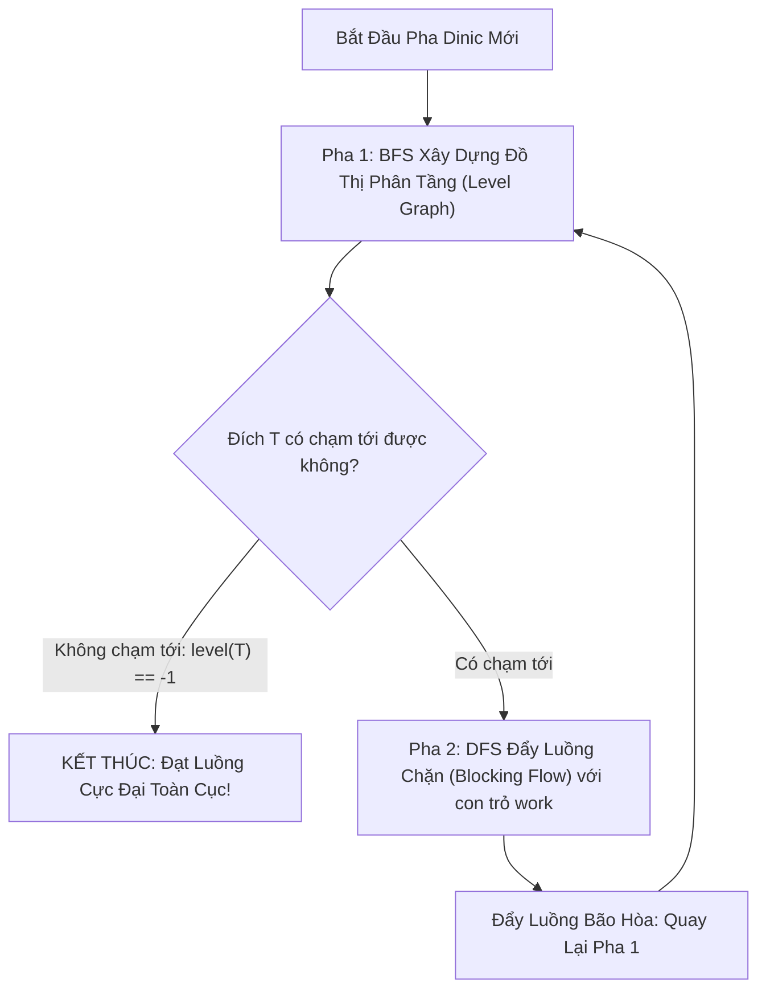

## Mô tả bài toán

Mặc dù thuật toán Edmonds-Karp đảm bảo tính đa thức với độ phức tạp `O(V x E²)`, nhưng trên các đồ thị có quy mô lớn trong thực tế (hàng chục nghìn đỉnh và hàng trăm nghìn cạnh), việc chạy lại toàn bộ thuật toán BFS từ đầu chỉ để tăng luồng trên *một con đường duy nhất* là một nút thắt cổ chai hiệu năng nghiêm trọng.

Nhà toán học Yefim A. Dinitz vào năm 1970 đã phát minh ra **Thuật toán Dinic (Dinitz's Algorithm)**. Thuật toán giới thiệu một bước nhảy vọt về tư duy: Thay vì tăng luồng đơn lẻ, Dinic xây dựng **Đồ thị phân tầng (Level Graph)** và đẩy đồng thời nhiều đường tăng luồng cùng lúc trong một pha duy nhất thông qua khái niệm **Luồng chặn (Blocking Flow)**.

Thuật toán đạt độ phức tạp xuất sắc `O(V² x E)` trên đồ thị tổng quát và đạt tốc độ không tưởng `O(E sqrtV)` trên mạng đơn vị (Unit Network - tương đương giải thuật Hopcroft-Karp trong bài toán Cặp ghép cực đại).

## Ý tưởng tiếp cận ban đầu

Sự khác biệt căn bản giữa Edmonds-Karp và Dinic nằm ở kiến trúc xử lý:

- **Edmonds-Karp:** Chạy 1 lần BFS &rarr; Tìm 1 đường tăng luồng &rarr; Cập nhật đồ thị dư &rarr; Lặp lại. Phải thực hiện tới `O(V x E)` lần BFS độc lập.
- **Dinic:** Chạy 1 lần BFS để phân tầng toàn bộ đồ thị theo khoảng cách ngắn nhất &rarr; Chạy DFS liên tục đẩy luồng qua tất cả các đường hợp lệ trên đồ thị phân tầng cho đến khi bị bão hòa hoàn toàn (Luồng chặn) &rarr; Tiến sang pha phân tầng kế tiếp. Số pha phân tầng bị chặn cứng ở `V - 1` pha.

## Tư duy tối ưu & Cấu trúc thuật toán

Thuật toán Dinic vận hành theo cấu trúc 2 pha lặp đi lặp lại:

1. **Pha 1: Xây dựng Đồ thị Phân tầng (Level Graph bằng BFS):**
  - Gán cấp độ cho đỉnh nguồn: `level[s] = 0`.
  - Dùng BFS lan truyền: Với mỗi cạnh `(u, v)` có dung lượng dư `capacity[u][v] > 0`, nếu `level[v] == -1` thì gán `level[v] = level[u] + 1`.
  - Nếu đỉnh đích `t` không thể chạm tới (`level[t] == -1`), thuật toán dừng ngay lập tức &rarr; Đã đạt luồng cực đại.
2. **Pha 2: Đẩy Luồng chặn (Blocking Flow bằng DFS):**
  - Chỉ cho phép đẩy luồng từ tầng `level[u]` sang tầng kế tiếp `level[u] + 1`: Tức là điều kiện duyệt cạnh hợp lệ là `level[v] == level[u] + 1` và `cap > 0`.
  - **Tối ưu hóa con trỏ nhánh cụt (Work Pointer / Head Optimization):** Duy trì mảng `work[u]` lưu chỉ số của cạnh kề đang xét. Khi một nhánh DFS từ đỉnh `u` bị nghẽn (không đẩy được thêm luồng), con trỏ `work[u]` tự động tăng lên để loại bỏ vĩnh viễn nhánh cụt đó trong pha hiện tại, tránh duyệt lại các cạnh vô ích.

## Triển khai mã nguồn & Dry Run

Sơ đồ kiến trúc 2 pha của Thuật toán Dinic:



**Mã nguồn C++ hoàn chỉnh (Dinic Thuật toán Luồng Cực đại Tối ưu hóa Con trỏ Work):**

```c++
#include <iostream>
#include <vector>
#include <queue>
#include <algorithm>

const long long INF = 1e18;

// Cấu trúc cạnh đồ thị mạng luồng Dinic
struct FlowEdge {
    int to;
    long long cap;
    long long flow = 0;
    int rev; // Chỉ số của cung ngược trong danh sách kề của đỉnh đích
};

class Dinic {
private:
    int n;
    int s, t;
    std::vector<std::vector<FlowEdge>> adj;
    std::vector<int> level;
    std::vector<int> work; // Con trỏ tối ưu hóa dead-end pruning

    // Pha 1: BFS gán nhãn phân tầng level graph
    bool bfs() {
        std::fill(level.begin(), level.end(), -1);
        level[s] = 0;
        std::queue<int> q;
        q.push(s);

        while (!q.empty()) {
            int u = q.front();
            q.pop();

            for (const auto& edge : adj[u]) {
                if (edge.cap - edge.flow > 0 && level[edge.to] == -1) {
                    level[edge.to] = level[u] + 1;
                    q.push(edge.to);
                }
            }
        }
        return level[t] != -1; // Trả về true nếu đích t chạm tới được
    }

    // Pha 2: DFS đẩy luồng chặn (blocking flow)
    long long dfs(int u, long long pushed) {
        if (pushed == 0) return 0;
        if (u == t) return pushed;

        for (int& cid = work[u]; cid < static_cast<int>(adj[u].size()); ++cid) {
            auto& edge = adj[u][cid];
            int v = edge.to;

            // Chỉ đi từ tầng level[u] sang đúng tầng level[u] + 1
            if (level[u] + 1 != level[v] || edge.cap - edge.flow <= 0) {
                continue;
            }

            long long tr = dfs(v, std::min(pushed, edge.cap - edge.flow));
            if (tr == 0) {
                continue; // Nhánh này không đẩy được luồng, work[u] sẽ tự tăng qua ++cid
            }

            edge.flow += tr;
            adj[v][edge.rev].flow -= tr; // Cập nhật cung ngược
            return tr;
        }
        return 0;
    }

public:
    Dinic(int numVertices, int source, int sink) 
        : n(numVertices), s(source), t(sink) {
        adj.resize(n);
        level.resize(n);
        work.resize(n);
    }

    void addEdge(int from, int to, long long cap) {
        FlowEdge a{to, cap, 0, static_cast<int>(adj[to].size())};
        FlowEdge b{from, 0, 0, static_cast<int>(adj[from].size())}; // Dung lượng cung ngược ban đầu = 0
        adj[from].push_back(a);
        adj[to].push_back(b);
    }

    long long maxFlow() {
        long long totalFlow = 0;
        while (bfs()) {
            std::fill(work.begin(), work.end(), 0);
            while (long long pushed = dfs(s, INF)) {
                totalFlow += pushed;
            }
        }
        return totalFlow;
    }
};

int main() {
    int V = 6;
    int S = 0, T = 5;
    Dinic dinic(V, S, T);

    dinic.addEdge(0, 1, 10);
    dinic.addEdge(0, 2, 10);
    dinic.addEdge(1, 2, 2);
    dinic.addEdge(1, 3, 4);
    dinic.addEdge(1, 4, 8);
    dinic.addEdge(2, 4, 9);
    dinic.addEdge(3, 5, 10);
    dinic.addEdge(4, 3, 6);
    dinic.addEdge(4, 5, 10);

    long long maxF = dinic.maxFlow();
    std::cout << "--- KET QUA DINIC MAXIMUM FLOW ---" << std::endl;
    std::cout << "Tong luong cuc dai: " << maxF << std::endl;

    return 0;
}
```

**Phân tích luồng thực thi chi tiết (Dry Run Trace):**

- *Pha 1 (BFS 1):* Gán nhãn tầng `level = [0, 1, 1, 2, 2, 3]`. `level[T=5] = 3`.
- *Pha 1 (DFS 1):* 
  - Đường `0 -> 1 -> 3 -> 5`: `pushed = min(10, 4, 10) = 4` &rarr; Luồng = 4.
  - Đường `0 -> 1 -> 4 -> 5`: `pushed = min(6, 8, 10) = 6` &rarr; Luồng = 4 + 6 = 10 (Đỉnh 1 bão hòa).
  - Đường `0 -> 2 -> 4 -> 5`: `pushed = min(10, 9, 4) = 4` &rarr; Luồng = 10 + 4 = 14 (Đỉnh 5 bão hòa tầng 3).
- *Pha 2 (BFS 2):* Đồ thị dư cập nhật &rarr; BFS gán lại tầng &rarr; DFS đẩy tiếp luồng qua đường `0 -> 2 -> 4 -> 3 -> 5` thêm `5` đơn vị &rarr; Luồng = `19`.
- *Pha 3 (BFS 3):* `level[T] = -1` (không còn đường) &rarr; Dừng ngay lập tức với kết quả luồng cực đại bằng `19`.

## Đánh giá độ phức tạp & Ứng dụng thực tế

Bảng tổng hợp chỉ số hiệu năng theo hệ quy chiếu chuẩn RAM Model:

- **Độ phức tạp Thời gian (Time Complexity):**
  - Đồ thị tổng quát: `O(V² x E)`. Có tối đa `V - 1` pha BFS, mỗi pha DFS đẩy luồng chặn tốn `O(V x E)` nhờ con trỏ `work[]` loại bỏ nhánh cụt.
  - Mạng đơn vị (Unit Network): `O(E sqrtV)` - Tốc độ xử lý hàng trăm nghìn đỉnh chỉ trong vài mili-giây.
  - Mạng có dung lượng đơn vị ở đỉnh (Bipartite Matching): `O(E sqrtV)` (Tương đương thuật toán Hopcroft-Karp).
- **Độ phức tạp Không gian (Space Complexity):** `O(V + E)` cho danh sách kề và mảng cấu trúc `FlowEdge` đối xứng.
- **Ứng dụng thực tế:**
  - **Bài toán Cặp ghép Cực đại trên Đồ thị Hai phía (Max Bipartite Matching):** Xếp lịch phân công giảng viên - môn học, tuyển dụng ứng viên - công việc.
  - **Bài toán Đóng dự án (Project Selection Problem):** Tối ưu hóa danh mục dự án đầu tư có điều kiện phụ thuộc tiên quyết.
  - **Hệ thống Phân phối Băng thông CDN:** Định tuyến luồng video streaming từ hàng nghìn máy chủ Edge đến người dùng cuối.
