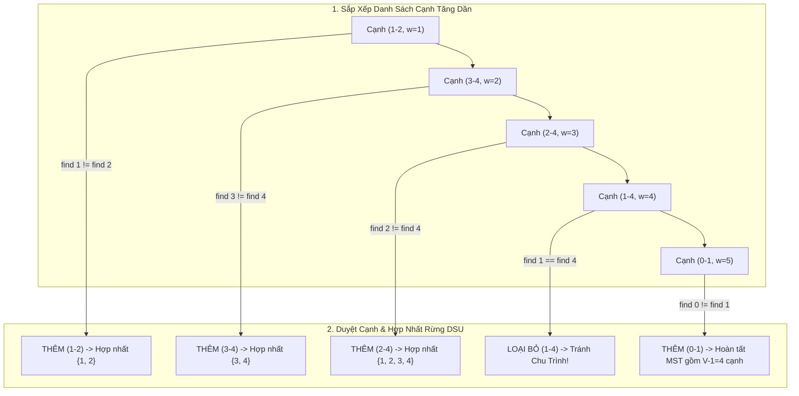

## 1. Mô tả bài toán

Khi thiết kế mạng lưới đường trục cáp quang viễn thông, hệ thống đường ống dẫn khí đốt liên đô thị hay lưới điện quốc gia, mục tiêu kinh tế hàng đầu là: *Làm sao để kết nối toàn bộ `V` đô thị lại với nhau sao cho tổng chi phí xây lắp là thấp nhất và không tồn tại bất kỳ chu trình lãng phí nào?*

Bài toán đặt ra: **Cây khung nhỏ nhất (Minimum Spanning Tree - MST)**. Cho đồ thị vô hướng, liên thông và có trọng số `G = (V, E)` gồm `V` đỉnh và `E` cạnh. Một Cây khung (Spanning Tree) là một đồ thị con liên thông chứa tất cả `V` đỉnh và đúng `V - 1` cạnh (không có chu trình). Hãy tìm một cây khung có **tổng trọng số các cạnh là nhỏ nhất**: `w(T) = sum_{(u, v) in T} w(u, v)`.

Thuật toán Kruskal do Joseph Kruskal phát minh năm 1956 là giải thuật kinh điển hàng đầu tiếp cận bài toán theo tư duy **Tham lam trên cạnh (Edge-Centric Greedy)**.

## 2. Ý tưởng tiếp cận ban đầu

Ý tưởng tham lam trực quan: Sắp xếp tất cả các cạnh theo trọng số tăng dần. Lần lượt duyệt từng cạnh từ nhỏ nhất đến lớn nhất, nếu thêm cạnh `(u, v)` vào mà không tạo thành chu trình thì ta chọn cạnh đó vào cây khung.

Thách thức cốt tử: *Làm thế nào để kiểm tra nhanh chóng việc thêm cạnh `(u, v)` có tạo ra chu trình hay không?*

Nếu dùng DFS hoặc BFS để kiểm tra chu trình mỗi lần xét một cạnh, chi phí kiểm tra sẽ là `O(V)`, khiến tổng thời gian thuật toán lên tới `O(E x V)` - quá chậm khi đồ thị có hàng trăm nghìn cạnh.

## 3. Tư duy tối ưu & Cấu trúc thuật toán

Thuật toán Kruskal đạt hiệu năng siêu việt nhờ kết hợp với cấu trúc dữ liệu **Các tập hợp rời nhau (Disjoint Set Union - DSU / Union-Find)**:

1. **Mô hình Rừng phân mảnh (Spanning Forest):** Ban đầu, mỗi đỉnh `v in V` tạo thành một cây độc lập gồm 1 nút (tương ứng với một tập hợp rời rạc). Cây khung hoàn chỉnh sẽ được tạo ra bằng cách hợp nhất dần các cây này thành một cây duy nhất gồm `V - 1` cạnh.
2. **Kiểm tra Chu trình trong `O(alpha(V))`:** Hai đỉnh `u` và `v` sẽ tạo thành chu trình khi và chỉ khi chúng đã thuộc về cùng một thành phần liên thông (tức là có cùng gốc đại diện: `find(u) == find(v)`).
3. **Hai Kỹ thuật Tối ưu DSU Thần thánh:**
  

- **Nén đường (Path Compression):** Trong hàm `find(u)`, trỏ trực tiếp tất cả các nút trên đường đi thẳng về nút gốc đại diện. Chiều cao cây bị triệt tiêu gần như bằng 1.
- **Hợp nhất theo Hạng (Union by Rank):** Luôn gắn cây có độ sâu/kích thước nhỏ hơn vào gốc của cây lớn hơn để ngăn cây bị biến dạng thành danh sách liên kết.

Nhờ DSU, mọi thao tác kiểm tra chu trình và hợp nhất tập hợp chỉ tiêu tốn thời gian **gần như hằng số** `O(alpha(V))` (với `alpha` là hàm Ackermann nghịch đảo, `alpha(V) <= 4` với mọi `V <= 10⁸⁰`). Tổng thời gian của Kruskal hoàn toàn bị chi phối bởi bước sắp xếp cạnh `O(E \log E) = O(E \log V)`.

## 4. Triển khai mã nguồn & Dry Run

Sơ đồ tiến trình chọn cạnh tham lam và cơ chế hợp nhất DSU:



**Mã nguồn C++ hoàn chỉnh (Kruskal với DSU Nén đường và Gộp theo hạng):**

```c++
#include <iostream>
#include <vector>
#include <algorithm>

// Cấu trúc dữ liệu Disjoint Set Union (DSU) chuẩn mực
class DisjointSet {
private:
    std::vector<int> parent;
    std::vector<int> rank;

public:
    DisjointSet(int n) {
        parent.resize(n);
        rank.assign(n, 0);
        for (int i = 0; i < n; ++i) {
            parent[i] = i; // Ban đầu mỗi nút là cha của chính nó
        }
    }

    // Tìm gốc đại diện kết hợp Nén đường (Path Compression)
    int find(int u) {
        if (parent[u] != u) {
            parent[u] = find(parent[u]); // Gán trực tiếp lên nút gốc
        }
        return parent[u];
    }

    // Hợp nhất 2 tập hợp theo Hạng (Union by Rank)
    bool unite(int u, int v) {
        int rootU = find(u);
        int rootV = find(v);

        if (rootU == rootV) {
            return false; // Cùng gốc -> Đã liên thông -> Sẽ tạo chu trình
        }

        if (rank[rootU] < rank[rootV]) {
            parent[rootU] = rootV;
        } else if (rank[rootU] > rank[rootV]) {
            parent[rootV] = rootU;
        } else {
            parent[rootV] = rootU;
            rank[rootU]++;
        }
        return true;
    }
};

struct Edge {
    int u, v;
    long long weight;

    // Toán tử so sánh để sắp xếp cạnh theo trọng số tăng dần
    bool operator<(const Edge& other) const {
        return weight < other.weight;
    }
};

struct MSTResult {
    long long totalWeight;
    std::vector<Edge> mstEdges;
};

MSTResult kruskalMST(int V, std::vector<Edge>& edges) {
    // Bước 1: Sắp xếp toàn bộ E cạnh theo trọng số tăng dần O(E log E)
    std::sort(edges.begin(), edges.end());

    DisjointSet dsu(V);
    long long totalWeight = 0;
    std::vector<Edge> mstEdges;

    // Bước 2: Duyệt từng cạnh và hợp nhất DSU
    for (const auto& edge : edges) {
        if (dsu.unite(edge.u, edge.v)) {
            totalWeight += edge.weight;
            mstEdges.push_back(edge);

            // Dừng sớm khi đã chọn đủ V - 1 cạnh
            if (static_cast<int>(mstEdges.size()) == V - 1) {
                break;
            }
        }
    }

    return {totalWeight, mstEdges};
}

int main() {
    int V = 5; // 5 đỉnh: 0, 1, 2, 3, 4
    std::vector<Edge> edges = {
        {0, 1, 9}, {0, 2, 75}, {1, 2, 95},
        {1, 3, 19}, {1, 4, 42}, {2, 3, 51},
        {3, 4, 31}
    };

    auto result = kruskalMST(V, edges);

    std::cout << "--- KET QUA CAY KHUNG NHO NHAT KRUSKAL ---" << std::endl;
    std::cout << "Tong trong so MST: " << result.totalWeight << std::endl;
    std::cout << "Cac canh duoc chon:" << std::endl;
    for (const auto& e : result.mstEdges) {
        std::cout << "Canh (" << e.u << " - " << e.v << ") voi trong so: " << e.weight << std::endl;
    }

    return 0;
}
```

**Phân tích luồng thực thi chi tiết (Dry Run Trace):**

- *Danh sách cạnh sau khi sort:* `(0-1: 9), (1-3: 19), (3-4: 31), (1-4: 42), (2-3: 51), (0-2: 75), (1-2: 95)`.
- *Cạnh 1 (0-1, w=9):* `find(0)!=find(1)` &rarr; Chọn! `total=9`, DSU gom `{0, 1}`.
- *Cạnh 2 (1-3, w=19):* `find(1)!=find(3)` &rarr; Chọn! `total=9+19=28`, DSU gom `{0, 1, 3}`.
- *Cạnh 3 (3-4, w=31):* `find(3)!=find(4)` &rarr; Chọn! `total=28+31=59`, DSU gom `{0, 1, 3, 4}`.
- *Cạnh 4 (1-4, w=42):* `find(1) == find(4)` (đều thuộc tập `{0, 1, 3, 4}`) &rarr; Bỏ qua để tránh tạo chu trình `1-3-4-1`.
- *Cạnh 5 (2-3, w=51):* `find(2)!=find(3)` &rarr; Chọn! `total=59+51=110`, gom đủ `V-1 = 4` cạnh &rarr; Thuật toán kết thúc với tổng trọng số `110`.

## 5. Đánh giá độ phức tạp & Ứng dụng thực tế

Bảng tổng hợp chỉ số hiệu năng theo hệ quy chiếu chuẩn RAM Model:

- **Độ phức tạp Thời gian (Time Complexity):** `O(E \log E) = O(E \log V)`. Thao tác sắp xếp `E` cạnh chiếm `O(E \log E)`, thao tác duyệt và thao tác DSU mất `O(E alpha(V))`.
- **Độ phức tạp Không gian (Space Complexity):** `O(V + E)` gồm `O(V)` cho cấu trúc DSU (mảng `parent` và `rank`) và `O(E)` lưu trữ mảng cạnh.
- **Ứng dụng thực tế:**
  - **Thiết kế hạ tầng mạng cáp viễn thông và lưới điện:** Kết nối toàn bộ các trạm biến áp hoặc trung tâm dữ liệu với tổng chiều dài cáp nhỏ nhất.
  - **Phân cụm dữ liệu trong Học máy (Single-Linkage Hierarchical Clustering):** Dừng quá trình Kruskal khi số thành phần liên thông bằng `K` để phân tách dữ liệu thành `K` cụm tối ưu.
  - **Thiết kế mạch tích hợp VLSI:** Đi dây đồng trên vi mạch (Routing) giảm thiểu diện tích và độ trễ tín hiệu.
