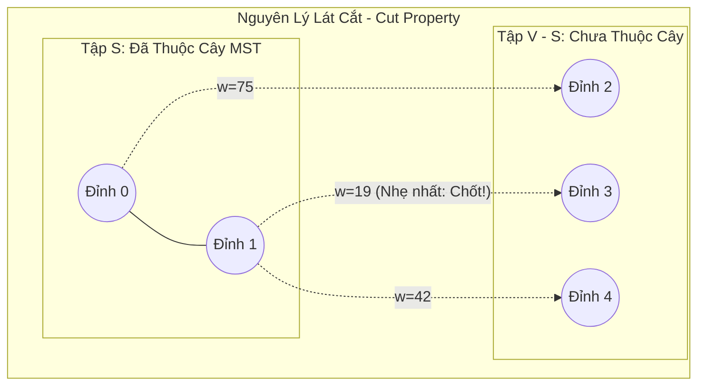

## Mô tả bài toán

Khác với thuật toán Kruskal xây dựng cây khung bằng cách gom nhặt các cạnh rời rạc trên toàn đồ thị tạo thành một rừng cây (Forest), thuật toán Prim (do Vojtěch Jarník tìm ra năm 1930 và Robert Prim tái khám phá năm 1957) tiếp cận bài toán Cây khung nhỏ nhất theo hướng **Phát triển Cây liên tục từ Đỉnh (Vertex-Centric Growth)**.

Bắt đầu từ một đỉnh nguồn tùy ý, thuật toán Prim liên tục mở rộng ranh giới của cây khung hiện tại bằng cách kết nạp thêm đỉnh gần nhất chưa thuộc cây, đảm bảo đồ thị con luôn giữ vững cấu trúc là một cây liên thông tại mọi thời điểm trong suốt quá trình chạy.

## Ý tưởng tiếp cận ban đầu

Phiên bản Prim ngây thơ sử dụng mảng tuyến tính: Tại mỗi bước, thuật toán quét qua toàn bộ các đỉnh chưa thuộc cây để tìm đỉnh có cạnh nối nhẹ nhất đến cây hiện tại. Độ phức tạp là `O(V²)`.

Với các đồ thị dày (Dense Graph có số cạnh `E ~ V²`), độ phức tạp `O(V²)` là tối ưu tuyệt đối. Tuy nhiên, trên các đồ thị thưa (Sparse Graph có `E ~ V`), việc quét mảng tạo ra độ trễ không cần thiết.

## Tư duy tối ưu & Cấu trúc thuật toán

Thuật toán Prim dựa trên định lý nền tảng của lý thuyết đồ thị: **Nguyên lý Lát cắt (Cut Property)**:

1. **Định lý Lát cắt:** Cho một lát cắt chia tập đỉnh `V` thành 2 tập rời nhau: Tập `S` (các đỉnh đã thuộc cây MST) và tập `V \ S` (các đỉnh chưa thuộc cây). Cạnh `(u, v)` có **trọng số nhỏ nhất** nối giữa một đỉnh trong `S` và một đỉnh trong `V \ S` (gọi là Cạnh nhẹ nhất cắt qua lát cắt) _chắc chắn thuộc về Cây khung nhỏ nhất_.
2. **Cơ chế Biên mở rộng (Frontier Expansion):** Duy trì một tập đỉnh `inMST[v]`. Ban đầu `inMST[0] = true`, các đỉnh còn lại là `false`.
3. **Tối ưu hóa Hàng đợi ưu tiên (Min-Heap Priority Queue):**

- Lưu trữ các cạnh vượt lát cắt trong `std::priority_queue`.
- Tại mỗi bước, lấy ra cạnh `(u, v, w)` có trọng số nhỏ nhất. Nếu `v` chưa thuộc cây, kết nạp `v` vào `inMST`, cộng trọng số `w` vào tổng chi phí, và đẩy tất cả các cạnh kề của `v` nối tới các đỉnh chưa thuộc cây vào Min-Heap.

Nhờ cấu trúc Min-Heap, độ phức tạp của Prim trên đồ thị thưa giảm mạnh xuống `O((V + E) \log V)`.

## Triển khai mã nguồn & Dry Run

Sơ đồ cơ chế Lát cắt (Cut Property) và sự mở rộng cây khung của Prim:



**Mã nguồn C++ hoàn chỉnh (Prim với std::priority_queue):**

```c++
#include <iostream>
#include <vector>
#include <queue>
#include <utility>

struct Edge {
    int to;
    long long weight;
};

// Cấu trúc trạng thái trong Min-Heap: {trọng số, đỉnh đích, đỉnh nguồn}
struct HeapNode {
    long long weight;
    int u;
    int parent;

    bool operator>(const HeapNode& other) const {
        return weight > other.weight;
    }
};

struct MSTEdge {
    int u, v;
    long long weight;
};

struct PrimResult {
    long long totalWeight;
    std::vector<MSTEdge> mstEdges;
};

PrimResult primMST(int V, const std::vector<std::vector<Edge>>& adj) {
    std::vector<bool> inMST(V, false);
    std::priority_queue<HeapNode, std::vector<HeapNode>, std::greater<HeapNode>> pq;

    // Bắt đầu từ đỉnh 0 với trọng số = 0, đỉnh cha = -1
    pq.push({0, 0, -1});

    long long totalWeight = 0;
    std::vector<MSTEdge> mstEdges;

    while (!pq.empty()) {
        auto [w, u, p] = pq.top();
        pq.pop();

        // Nếu đỉnh u đã được kết nạp vào cây thì bỏ qua
        if (inMST[u]) {
            continue;
        }

        // Kết nạp u vào MST
        inMST[u] = true;
        totalWeight += w;
        if (p != -1) {
            mstEdges.push_back({p, u, w});
        }

        // Đẩy tất cả các cạnh kề từ u nối tới các đỉnh chưa thuộc cây vào Min-Heap
        for (const auto& edge : adj[u]) {
            if (!inMST[edge.to]) {
                pq.push({edge.weight, edge.to, u});
            }
        }
    }

    return {totalWeight, mstEdges};
}

int main() {
    int V = 5;
    std::vector<std::vector<Edge>> adj(V);

    auto addUndirectedEdge = [&](int u, int v, long long w) {
        adj[u].push_back({v, w});
        adj[v].push_back({u, w});
    };

    addUndirectedEdge(0, 1, 9);
    addUndirectedEdge(0, 2, 75);
    addUndirectedEdge(1, 2, 95);
    addUndirectedEdge(1, 3, 19);
    addUndirectedEdge(1, 4, 42);
    addUndirectedEdge(2, 3, 51);
    addUndirectedEdge(3, 4, 31);

    auto result = primMST(V, adj);

    std::cout << "--- KET QUA CAY KHUNG NHO NHAT PRIM ---" << std::endl;
    std::cout << "Tong trong so MST: " << result.totalWeight << std::endl;
    for (const auto& e : result.mstEdges) {
        std::cout << "Canh (" << e.u << " - " << e.v << ") | Trong so: " << e.weight << std::endl;
    }

    return 0;
}
```

**Phân tích luồng thực thi chi tiết (Dry Run Trace):**

- _Bắt đầu:_ Đỉnh 0 được kết nạp. Đẩy cạnh `(0-1: 9)` và `(0-2: 75)` vào heap.
- _Bước 1:_ Pop `(w=9, u=1)` &rarr; Kết nạp đỉnh 1 vào cây. Đẩy các cạnh kề của 1: `(1-3: 19)`, `(1-4: 42)`, `(1-2: 95)`.
- _Bước 2:_ Pop `(w=19, u=3)` (nhẹ nhất vượt lát cắt) &rarr; Kết nạp đỉnh 3. Đẩy `(3-4: 31)`, `(3-2: 51)`.
- _Bước 3:_ Pop `(w=31, u=4)` &rarr; Kết nạp đỉnh 4.
- _Bước 4:_ Pop `(w=42, u=4)` &rarr; Đỉnh 4 đã có trong cây &rarr; Bỏ qua (Lazy Deletion).
- _Bước 5:_ Pop `(w=51, u=2)` &rarr; Kết nạp đỉnh 2. Đã kết nạp đủ 5 đỉnh &rarr; Tổng trọng số chốt `9 + 19 + 31 + 51 = 110` (đồng nhất với Kruskal).

## Đánh giá độ phức tạp & Ứng dụng thực tế

- **Độ phức tạp Thời gian (Time Complexity):**
  - Với Binary Min-Heap (`std::priority_queue`): `O((V + E) \log V)`.
  - Với Ma trận kề trên Đồ thị dày (`E ~ V²`): `O(V²)` (nhanh hơn Kruskal vì không tốn chi phí sắp xếp `V²` cạnh).
  - Với Fibonacci Heap (Lý thuyết): `O(E + V \log V)`.
- **Độ phức tạp Không gian (Space Complexity):** `O(V + E)` cho danh sách kề và hàng đợi ưu tiên.
- **Ứng dụng thực tế:**
  - **Giao thức Spanning Tree Protocol (STP - IEEE 802.1D):** Chống vòng lặp gói tin trong mạng chuyển mạch Ethernet cục bộ (Switching Loops).
  - **Thuật toán xấp xỉ bài toán Người du lịch (TSP 2-Approximation):** Dùng cây khung Prim để sinh hành trình xấp xỉ cho bài toán NP-Hard TSP.
  - **Cân bằng tải cây đa hướng (Multicast Routing Trees):** Thiết lập luồng phát sóng truyền hình số từ một máy chủ trung tâm tới hàng triệu thuê bao.
