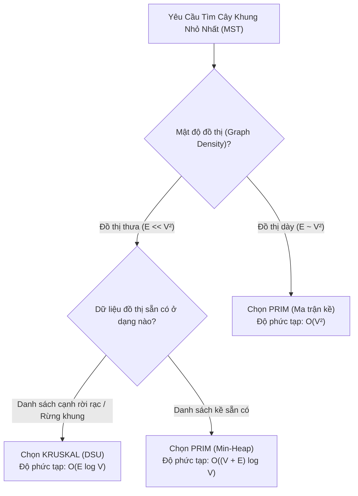

## Mô tả bài toán

Trong bài toán xây dựng Cây khung nhỏ nhất (MST), hai giải thuật kinh điển **Kruskal** và **Prim** cùng mang lại kết quả tối ưu toàn cục như nhau nhưng vận hành dựa trên hai mô hình kiến trúc hoàn toàn đối lập:

- **Kruskal:** Tiếp cận toàn cục trên tập cạnh (Edge-Centric), sắp xếp cạnh và hợp nhất rừng phân mảnh bằng DSU.
- **Prim:** Tiếp cận cục bộ trên tập đỉnh (Vertex-Centric), phát triển một cây liên tục từ một hạt nhân ban đầu bằng Min-Heap.

Việc hiểu rõ ranh giới hiệu năng giữa hai thuật toán dựa trên mật độ đồ thị (Graph Density) là kiến thức cốt tử của kỹ sư hệ thống.

## Ý tưởng tiếp cận ban đầu

Các sai lầm thực chiến thường gặp:

1. **Dùng Kruskal trên Đồ thị Dày (Dense Graph `E ~ V²`):** Sắp xếp `10⁶` cạnh tốn kém chi phí thời gian và bộ nhớ gấp nhiều lần so với việc chạy Prim bằng ma trận `O(V²)`.
2. **Dùng Prim trên Đồ thị Không Liên thông:** Prim chỉ tìm được cây khung của thành phần liên thông chứa đỉnh xuất phát, trong khi Kruskal tự động tìm ra **Rừng khung nhỏ nhất (Minimum Spanning Forest)** cho toàn bộ đồ thị mà không cần sửa đổi mã nguồn.

## Tư duy tối ưu & Cấu trúc thuật toán

**Bảng Ma trận So sánh Toàn diện giữa Kruskal và Prim:**

<table style="width:100%; border-collapse: collapse; margin-bottom: 20px;">
  <thead>
    <tr style="border-bottom: 2px solid #e2e8f0; text-align: left;">
      <th style="padding: 8px;">Tiêu chí So sánh</th>
      <th style="padding: 8px;">Thuật toán Kruskal</th>
      <th style="padding: 8px;">Thuật toán Prim</th>
    </tr>
  </thead>
  <tbody>
    <tr style="border-bottom: 1px solid #edf2f7;">
      <td style="padding: 8px"><b>Triết lý thiết kế</b></td>
      <td style="padding: 8px">Tham lam trên Cạnh (Edge-Centric)</td>
      <td style="padding: 8px">Tham lam trên Đỉnh (Vertex-Centric)</td>
    </tr>
    <tr style="border-bottom: 1px solid #edf2f7;">
      <td style="padding: 8px"><b>Cấu trúc dữ liệu chính</b></td>
      <td style="padding: 8px">Disjoint Set Union (DSU) + Sort</td>
      <td style="padding: 8px">Min-Heap Priority Queue / Ma trận</td>
    </tr>
    <tr style="border-bottom: 1px solid #edf2f7;">
      <td style="padding: 8px"><b>Độ phức tạp (Đồ thị thưa)</b></td>
      <td style="padding: 8px">`O(E \log V)` (Vượt trội)</td>
      <td style="padding: 8px">`O(E \log V)`</td>
    </tr>
    <tr style="border-bottom: 1px solid #edf2f7;">
      <td style="padding: 8px"><b>Độ phức tạp (Đồ thị dày)</b></td>
      <td style="padding: 8px">`O(V² \log V)` (Bị chậm do sort)</td>
      <td style="padding: 8px">`O(V²)` với ma trận (Tối ưu tuyệt đối)</td>
    </tr>
    <tr style="border-bottom: 1px solid #edf2f7;">
      <td style="padding: 8px"><b>Biểu diễn đồ thị</b></td>
      <td style="padding: 8px">Danh sách cạnh rời rạc (Edge List)</td>
      <td style="padding: 8px">Danh sách kề hoặc Ma trận kề</td>
    </tr>
    <tr style="border-bottom: 1px solid #edf2f7;">
      <td style="padding: 8px"><b>Đồ thị không liên thông</b></td>
      <td style="padding: 8px">Tự động sinh Rừng khung (MSF)</td>
      <td style="padding: 8px">Cần vòng lặp ngoài duyệt từng thành phần</td>
    </tr>
    <tr>
      <td style="padding: 8px"><b>Khả năng tính toán song song</b></td>
      <td style="padding: 8px">Dễ song song hóa bước Sort</td>
      <td style="padding: 8px">Tuần tự theo từng đỉnh kết nạp</td>
    </tr>
  </tbody>
</table>

## Triển khai mã nguồn & Dry Run

Cây quyết định lựa chọn thuật toán Cây khung nhỏ nhất:



**Mã nguồn C++ thực thi kiểm thử so sánh Kruskal vs Prim:**

```c++
#include <iostream>
#include <vector>
#include <algorithm>
#include <queue>

struct Edge {
    int u, v;
    long long weight;
    bool operator<(const Edge& o) const { return weight < o.weight; }
};

// DSU cho Kruskal
struct DSU {
    std::vector<int> p;
    DSU(int n) : p(n) { for (int i = 0; i < n; ++i) p[i] = i; }
    int find(int x) { return p[x] == x ? x : p[x] = find(p[x]); }
    bool unite(int a, int b) {
        a = find(a); b = find(b);
        if (a == b) return false;
        p[a] = b;
        return true;
    }
};

long long runKruskal(int V, std::vector<Edge> edges) {
    std::sort(edges.begin(), edges.end());
    DSU dsu(V);
    long long total = 0;
    int count = 0;
    for (const auto& e : edges) {
        if (dsu.unite(e.u, e.v)) {
            total += e.weight;
            if (++count == V - 1) break;
        }
    }
    return total;
}

long long runPrim(int V, const std::vector<std::vector<std::pair<int, long long>>>& adj) {
    std::vector<bool> vis(V, false);
    using State = std::pair<long long, int>;
    std::priority_queue<State, std::vector<State>, std::greater<State>> pq;
    pq.push({0, 0});
    long long total = 0;

    while (!pq.empty()) {
        auto [w, u] = pq.top();
        pq.pop();
        if (vis[u]) continue;
        vis[u] = true;
        total += w;
        for (const auto& edge : adj[u]) {
            if (!vis[edge.first]) {
                pq.push({edge.second, edge.first});
            }
        }
    }
    return total;
}

int main() {
    int V = 4;
    std::vector<Edge> edges = {
        {0, 1, 1}, {1, 2, 2}, {2, 3, 3}, {0, 3, 4}, {0, 2, 5}
    };

    std::vector<std::vector<std::pair<int, long long>>> adj(V);
    for (const auto& e : edges) {
        adj[e.u].push_back({e.v, e.weight});
        adj[e.v].push_back({e.u, e.weight});
    }

    std::cout << "Tong trong so MST (Kruskal): " << runKruskal(V, edges) << std::endl;
    std::cout << "Tong trong so MST (Prim):    " << runPrim(V, adj) << std::endl;

    return 0;
}
```

## Đánh giá độ phức tạp & Ứng dụng thực tế

Quy tắc ghi nhớ nhanh cho kỹ sư phần mềm:

1. **Chọn Kruskal:** Khi đồ thị là đồ thị thưa (như mạng lưới giao thông đường bộ, bản đồ topo), hoặc khi dữ liệu đầu vào đã ở dạng danh sách cạnh, hoặc cần tìm rừng khung cho đồ thị có thể bị phân mảnh thành nhiều cụm độc lập.
2. **Chọn Prim:** Khi đồ thị là đồ thị dày (như ma trận khoảng cách đầy đủ giữa tất cả các điểm, mạng lưới kết nối toàn phần), nơi giải thuật Prim với ma trận kề đạt `O(V²)` bỏ xa chi phí sắp xếp `O(V² \log V)` của Kruskal.
