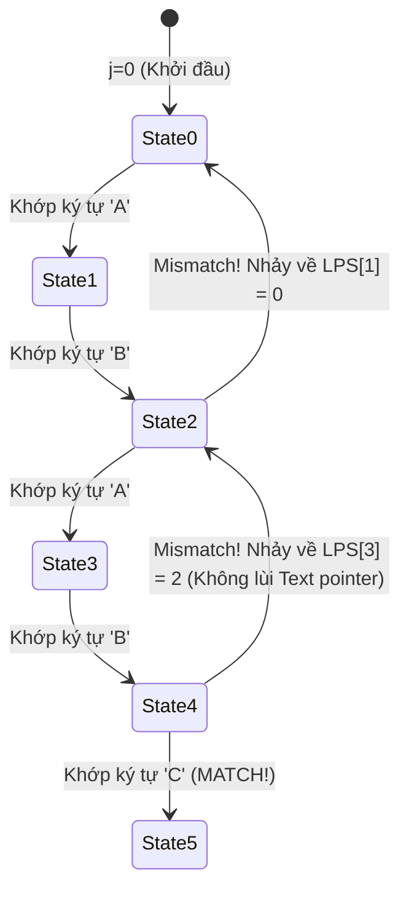

## Mô tả bài toán

Trong các công cụ soạn thảo mã nguồn (VS Code, Vim), công cụ tìm kiếm văn bản (grep, ripgrep), hệ thống phát hiện xâm nhập mạng (Snort) hay các phần mềm phân tích hệ gen sinh học (BLAST), thao tác phổ biến nhất là: _Tìm kiếm sự xuất hiện của một chuỗi mẫu con `Pattern` (độ dài `M`) bên trong một văn bản lớn `Text` (độ dài `N`)._

Bài toán đặt ra: **Đối sánh mẫu chính xác (Exact String Matching)**. Cho chuỗi văn bản `Text[0..N-1]` và chuỗi mẫu `Pattern[0..M-1]` (với `M <= N`). Hãy tìm tất cả các vị trí chỉ số `i` trong `Text` sao cho `Text[i .. i + M - 1] == Pattern[0 .. M - 1]`.

Hai giải thuật đỉnh cao thống trị lĩnh vực này là **Thuật toán Knuth-Morris-Pratt (KMP)** và **Thuật toán Rabin-Karp**.

## Ý tưởng tiếp cận ban đầu

Thuật toán ngây thơ (Naive String Matching) trượt mẫu `Pattern` qua từng vị trí `i` của `Text` và so khớp từng ký tự từ trái sang phải. Nếu gặp ký tự không khớp (Mismatch) ở vị trí `j`, thuật toán lùi con trỏ `Text` về `i + 1` và bắt đầu so khớp lại từ `Pattern[0]`.

Trường hợp xấu nhất xảy ra khi văn bản và mẫu chứa các ký tự lặp lại (ví dụ: `Text = "AAAAAAAAB"`, `Pattern = "AAAB"`). Mỗi lần mismatch, thuật toán phải so sánh `M` ký tự vô ích, đẩy độ phức tạp lên bậc hai `O(N x M)`. Khi `N = 10⁷` và `M = 10⁴`, thuật toán ngây thơ mất hàng trăm tỷ phép tính!

## Tư duy tối ưu & Cấu trúc thuật toán

**1. Thuật toán Knuth-Morris-Pratt (KMP - 1977):**

KMP đạt được bước đột phá `O(N + M)` bằng cách **không bao giờ lùi con trỏ trên chuỗi Text**. Khi xảy ra mismatch, KMP tận dụng thông tin tiền tố đã khớp trước đó để trượt mẫu `Pattern` sang phải nhiều bước nhất có thể thông qua mảng **LPS (Longest Proper Prefix which is also Suffix)**:

- `LPS[i]` lưu độ dài của tiền tố thực sự dài nhất của `Pattern[0..i]` mà đồng thời cũng là hậu tố của `Pattern[0..i]`.
- Khi mismatch tại `Pattern[j]`, thay vì quay về `Pattern[0]`, ta nhảy thẳng về `j = LPS[j - 1]` và tiếp tục so sánh với ký tự hiện tại của `Text`.

**2. Thuật toán Rabin-Karp (1987):**

Rabin-Karp biến đổi bài toán so khớp chuỗi thành bài toán so khớp số nguyên nhờ **Hàm băm cuộn đa thức (Polynomial Rolling Hash)**:

- Tính mã băm của `Pattern` trong `O(M)`: `H(P) = sum P[i] x B^{M - 1 - i} \pmod P`.
- Khi trượt cửa sổ kích thước `M` trên `Text` từ `i` sang `i + 1`, mã băm của cửa sổ mới được cập nhật trong `O(1)` bằng cách loại bỏ ký tự đầu `Text[i]` và thêm ký tự mới `Text[i + M]`:

```
H_{new} = (H_{old} - Text[i] x B^{M-1}) x B + Text[i + M] \pmod P
```

- Chỉ khi mã băm của cửa sổ trùng với mã băm của `Pattern`, ta mới thực hiện so sánh từng ký tự để loại trừ đụng độ băm (Hash Collision).

## Triển khai mã nguồn & Dry Run

Sơ đồ chuyển trạng thái tự động và bước nhảy LPS trong KMP:



**Mã nguồn C++ hoàn chỉnh (Triển khai đồng thời KMP và Rabin-Karp):**

```c++
#include <iostream>
#include <vector>
#include <string>

// --- 1. THUẬT TOÁN KNUTH-MORRIS-PRATT (KMP) ---

// Tiền tính toán bảng LPS (Longest Proper Prefix which is also Suffix)
std::vector<int> computeLPS(const std::string& pattern) {
    int m = static_cast<int>(pattern.size());
    std::vector<int> lps(m, 0);
    int len = 0; // Độ dài tiền tố dài nhất trước đó
    int i = 1;

    while (i < m) {
        if (pattern[i] == pattern[len]) {
            ++len;
            lps[i] = len;
            ++i;
        } else {
            if (len != 0) {
                len = lps[len - 1]; // Nhảy về tiền tố ngắn hơn trước đó
            } else {
                lps[i] = 0;
                ++i;
            }
        }
    }
    return lps;
}

std::vector<int> KMPSearch(const std::string& text, const std::string& pattern) {
    std::vector<int> matches;
    int n = static_cast<int>(text.size());
    int m = static_cast<int>(pattern.size());
    if (m == 0 || n < m) return matches;

    std::vector<int> lps = computeLPS(pattern);
    int i = 0; // Con trỏ trên text (KHÔNG BAO GIỜ LÙI)
    int j = 0; // Con trỏ trên pattern

    while (i < n) {
        if (text[i] == pattern[j]) {
            ++i;
            ++j;
        }

        if (j == m) {
            matches.push_back(i - j); // Tìm thấy vị trí khớp mẫu!
            j = lps[j - 1];           // Chuẩn bị tìm vị trí kế tiếp
        } else if (i < n && text[i] != pattern[j]) {
            if (j != 0) {
                j = lps[j - 1]; // Nhảy con trỏ pattern dựa trên bảng LPS
            } else {
                ++i;
            }
        }
    }
    return matches;
}

// --- 2. THUẬT TOÁN RABIN-KARP ROLLING HASH ---

std::vector<int> rabinKarpSearch(const std::string& text, const std::string& pattern) {
    std::vector<int> matches;
    int n = static_cast<int>(text.size());
    int m = static_cast<int>(pattern.size());
    if (m == 0 || n < m) return matches;

    const long long BASE = 256;
    const long long MOD = 1000000007;

    long long patternHash = 0;
    long long currentHash = 0;
    long long h = 1; // BASE^(M-1) % MOD

    for (int i = 0; i < m - 1; ++i) {
        h = (h * BASE) % MOD;
    }

    // Tính mã băm ban đầu cho pattern và cửa sổ đầu tiên của text
    for (int i = 0; i < m; ++i) {
        patternHash = (BASE * patternHash + pattern[i]) % MOD;
        currentHash = (BASE * currentHash + text[i]) % MOD;
    }

    for (int i = 0; i <= n - m; ++i) {
        // Nếu mã băm khớp, kiểm tra lại từng ký tự để tránh đụng độ
        if (patternHash == currentHash) {
            bool match = true;
            for (int j = 0; j < m; ++j) {
                if (text[i + j] != pattern[j]) {
                    match = false;
                    break;
                }
            }
            if (match) {
                matches.push_back(i);
            }
        }

        // Tính mã băm cuộn (Rolling Hash) cho cửa sổ kế tiếp trong O(1)
        if (i < n - m) {
            currentHash = (BASE * (currentHash - text[i] * h) + text[i + m]) % MOD;
            if (currentHash < 0) {
                currentHash += MOD;
            }
        }
    }
    return matches;
}

int main() {
    std::string text = "ABABDABACDABABCABAB";
    std::string pattern = "ABABCABAB";

    auto kmpMatches = KMPSearch(text, pattern);
    auto rkMatches = rabinKarpSearch(text, pattern);

    std::cout << "--- KET QUA TIM KIEM CHUOI CON ---" << std::endl;
    std::cout << "KMP tim thay tai index:        ";
    for (int idx : kmpMatches) std::cout << idx << " ";
    std::cout << std::endl;

    std::cout << "Rabin-Karp tim thay tai index: ";
    for (int idx : rkMatches) std::cout << idx << " ";
    std::cout << std::endl;

    return 0;
}
```

**Phân tích luồng thực thi chi tiết (Dry Run Trace KMP):**

- _Mẫu `Pattern = "ABABCABAB"`:_ Bảng `LPS = [0, 0, 1, 2, 0, 1, 2, 3, 4]`.
  - `LPS[3] = 2` vì chuỗi con `"ABAB"` có tiền tố `"AB"` trùng với hậu tố `"AB"`.
  - `LPS[8] = 4` vì chuỗi con `"ABABCABAB"` có tiền tố `"ABAB"` trùng hậu tố `"ABAB"`.
- _Quá trình so khớp trên `Text = "ABABDABACDABABCABAB"`:_
  - So khớp 4 ký tự đầu `"ABAB"` thành công (`j = 4`).
  - Tại ký tự thứ 5 (`Text[4] = 'D'`, `Pattern[4] = 'C'`) &rarr; Mismatch!
  - KMP không lùi `i` về 1, mà giữ nguyên `i = 4` và gán `j = LPS[3] = 2` (đại diện cho tiền tố `"AB"` đã khớp).
  - Tiếp tục so sánh `Text[4] = 'D'` với `Pattern[2] = 'A'` &rarr; Tiết kiệm 4 phép so sánh dư thừa!
  - Tại `i = 10`, toàn bộ mẫu khớp hoàn toàn &rarr; Ghi nhận vị trí xuất hiện tại `index = 10`.

## Đánh giá độ phức tạp & Ứng dụng thực tế

- **Độ phức tạp Thời gian (Time Complexity):**
  - **KMP:** `Θ(N + M)` trong mọi trường hợp. Pha tính LPS tốn `O(M)`, pha quét Text tốn `O(N)` không bao giờ quay lui.
  - **Rabin-Karp:** Trung bình `O(N + M)`. Trường hợp xấu nhất (nhiều đụng độ băm) là `O(N x M)`.
- **Độ phức tạp Không gian (Space Complexity):**
  - KMP: `O(M)` cho mảng tiền tố `LPS`.
  - Rabin-Karp: `O(1)` bộ nhớ phụ trợ chỉ với vài biến tích lũy mã băm.
- **Ứng dụng thực tế:**
  - **Trình tìm kiếm mã nguồn và văn bản:** Lõi của các lệnh tìm kiếm Regex và đối sánh từ khóa trong IDE.
  - **Phân tích hệ Gen sinh học:** Tìm kiếm các đoạn mã gen gây bệnh hoặc mẫu DNA đột biến trong chuỗi hàng tỷ nucleotide.
  - **Phát hiện đạo văn (Plagiarism Detection):** Rabin-Karp với Rolling Hash nhiều mẫu cho phép so khớp đồng thời hàng trăm đoạn văn bản ngắn cùng lúc.
  - **Tường lửa & Phát hiện xâm nhập mạng (IDS/IPS):** Quét các chữ ký độc hại (Malware Signature) trong payload của gói tin mạng TCP/IP theo thời gian thực.
