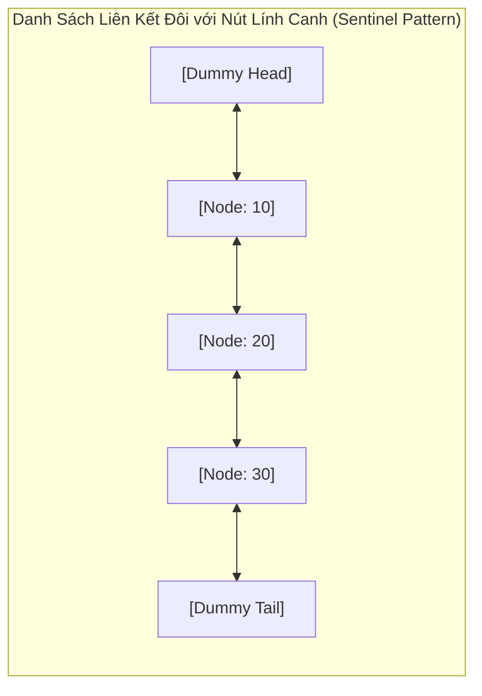

## 1. Mô tả bài toán

Trong khi Mảng (Array) đòi hỏi một khối bộ nhớ liền kề cố định và tốn chi phí `O(N)` khi chèn/xóa phần tử ở đầu hoặc giữa mảng, nhiều bài toán hệ thống (như quản lý tiến trình hệ điều hành, bộ đệm văn bản Text Buffer, hay bộ nhớ đệm LRU Cache) đòi hỏi một cấu trúc dữ liệu có khả năng **cấp phát bộ nhớ rời rạc linh hoạt** và cho phép **chèn/xóa phần tử trong thời gian hằng số `O(1)`** tại vị trí con trỏ biết trước.

**Danh sách liên kết (Linked List)** là giải pháp kinh điển giải quyết trọn vẹn yêu cầu này, tổ chức các phần tử dưới dạng các **Nút (Nodes)** phân tán trên bộ nhớ Heap, được liên kết với nhau thông qua các **Con trỏ (Pointers / References)**.

## 2. Ý tưởng tiếp cận ban đầu

Cách tiếp cận cơ bản nhất là **Danh sách liên kết đơn (Singly Linked List)**: Mỗi nút chứa giá trị dữ liệu và duy nhất một con trỏ `next` trỏ tới nút kế tiếp. Điểm yếu của danh sách đơn là chỉ có thể duyệt một chiều từ đầu đến cuối; muốn xóa một nút bất kỳ, ta bắt buộc phải tìm nút đứng ngay trước nó trong `O(N)`.

Để khắc phục, ta sử dụng **Danh sách liên kết đôi (Doubly Linked List)**: Mỗi nút duy trì cả 2 con trỏ `next` (trỏ tới nút kế sau) và `prev` (trỏ tới nút đứng trước), cho phép duyệt hai chiều và thực hiện thao tác xóa nút hiện tại trong `O(1)` tuyệt đối.

## 3. Tư duy tối ưu & Cấu trúc thuật toán

Khi thao tác trên con trỏ trong Danh sách liên kết, các lỗi kinh điển như _Null Pointer Dereference_ hoặc _Memory Leak_ thường phát sinh ở các trường hợp biên (danh sách rỗng, chèn vào đầu Head, xóa ở đuôi Tail). Kỹ sư chuyên nghiệp áp dụng kỹ thuật **Nút Lính canh (Sentinel / Dummy Node)**:

1. **Nút Lính canh (Sentinel Nodes):** Khởi tạo 2 nút giả cố định: `dummyHead` và `dummyTail`. Danh sách rỗng luôn có `dummyHead->next = dummyTail` và `dummyTail->prev = dummyHead`. Mọi nút dữ liệu thực tế đều nằm kẹp giữa 2 nút lính canh này.
2. **Loại bỏ hoàn toàn các nhánh `if (head == nullptr)`:** Thao tác chèn/xóa tại bất kỳ vị trí nào (đầu, giữa, cuối) đều tuân theo đúng một mẫu đổi trỏ duy nhất, loại bỏ 100% các điều kiện rẽ nhánh phức tạp.
3. **Đổi trỏ 4 bước khi chèn vào giữa:**

```c++
newNode->next = target;
newNode->prev = target->prev;
target->prev->next = newNode;
target->prev = newNode;
```

4. **Đổi trỏ 2 bước khi xóa nút:**

```c++
nodeToDelete->prev->next = nodeToDelete->next;
nodeToDelete->next->prev = nodeToDelete->prev;
delete nodeToDelete;
```

## 4. Triển khai mã nguồn & Dry Run

Sơ đồ cấu trúc Danh sách liên kết đôi với Nút lính canh (Dummy Head / Tail):



**Mã nguồn C++ hoàn chỉnh: Doubly Linked List với Nút lính canh an toàn bộ nhớ:**

```c++
#include <iostream>

template <typename T>
class DoublyLinkedList {
private:
    struct Node {
        T data;
        Node* prev;
        Node* next;
        Node(const T& val = T()) : data(val), prev(nullptr), next(nullptr) {}
    };

    Node* head; // Nút lính canh đầu (Dummy Head)
    Node* tail; // Nút lính canh đuôi (Dummy Tail)
    size_t count;

public:
    DoublyLinkedList() : count(0) {
        head = new Node();
        tail = new Node();
        head->next = tail;
        tail->prev = head;
    }

    ~DoublyLinkedList() {
        clear();
        delete head;
        delete tail;
    }

    // Chèn vào đầu danh sách: O(1)
    void pushFront(const T& val) {
        insertAfter(head, val);
    }

    // Chèn vào cuối danh sách: O(1)
    void pushBack(const T& val) {
        insertAfter(tail->prev, val);
    }

    // Chèn một giá trị mới ngay sau con trỏ prevNode: O(1)
    void insertAfter(Node* prevNode, const T& val) {
        Node* newNode = new Node(val);
        Node* nextNode = prevNode->next;

        newNode->next = nextNode;
        newNode->prev = prevNode;
        prevNode->next = newNode;
        nextNode->prev = newNode;

        ++count;
    }

    // Xóa một nút cụ thể trong O(1)
    void removeNode(Node* target) {
        if (target == head || target == tail || target == nullptr) return;

        target->prev->next = target->next;
        target->next->prev = target->prev;
        delete target;
        --count;
    }

    // Xóa phần tử đầu tiên: O(1)
    void popFront() {
        if (!empty()) {
            removeNode(head->next);
        }
    }

    // Xóa phần tử cuối cùng: O(1)
    void popBack() {
        if (!empty()) {
            removeNode(tail->prev);
        }
    }

    void clear() {
        while (!empty()) {
            popFront();
        }
    }

    size_t size() const { return count; }
    bool empty() const { return count == 0; }

    void printForward() const {
        std::cout << "Forward:  ";
        for (Node* curr = head->next; curr != tail; curr = curr->next) {
            std::cout << curr->data << " <-> ";
        }
        std::cout << "NULL" << std::endl;
    }
};

int main() {
    DoublyLinkedList<int> list;

    std::cout << "--- DEMO DANH SACH LIEN KET DOI (SENTINEL LIST) ---" << std::endl;
    list.pushBack(10);
    list.pushBack(20);
    list.pushBack(30);
    list.pushFront(5);

    list.printForward(); // 5 <-> 10 <-> 20 <-> 30 <-> NULL

    std::cout << "Xoa dau va xoa cuoi..." << std::endl;
    list.popFront();
    list.popBack();

    list.printForward(); // 10 <-> 20 <-> NULL
    std::cout << "Kich thuoc hien tai: " << list.size() << std::endl;

    return 0;
}
```

**Phân tích luồng thực thi chi tiết (Dry Run Trace):**

- _Khởi tạo:_ `head <-> tail`. `count = 0`.
- _`pushBack(10)`:_ Chèn sau `tail->prev (head)`: `head <-> [10] <-> tail`.
- _`pushBack(20)`:_ Chèn sau `tail->prev ([10])`: `head <-> [10] <-> [20] <-> tail`.
- _`pushFront(5)`:_ Chèn sau `head`: `head <-> [5] <-> [10] <-> [20] <-> tail`.
- _`popFront()`:_ Xóa nút `head->next ([5])`: Nối `head` trực tiếp sang `[10]` &rarr; `head <-> [10] <-> [20] <-> tail` trong đúng 2 phép đổi trỏ `O(1)`.

## 5. Đánh giá độ phức tạp & Ứng dụng thực tế

Bảng tổng hợp chỉ số hiệu năng theo hệ quy chiếu chuẩn RAM Model:

- **Chèn / Xóa tại vị trí biết trước (Insert / Delete with pointer):** `O(1)` tuyệt đối (không cần dịch chuyển các phần tử khác).
- **Chèn / Xóa ở đầu hoặc đuôi (Push / Pop Front/Back):** `O(1)` với danh sách liên kết đôi có con trỏ tail.
- **Tìm kiếm phần tử theo giá trị (Search by Value):** `O(N)` vì phải duyệt tuần tự qua từng nút con trỏ.
- **Truy xuất theo chỉ số (Access by Index):** `O(N)` (không hỗ trợ Random Access như Mảng).
- **Độ phức tạp Không gian (Space Complexity):** `O(N)` với chi phí phụ trội bộ nhớ (Memory Overhead) từ 8 đến 16 bytes cho mỗi nút để lưu con trỏ `prev` và `next` trên kiến trúc 64-bit.
- **Ứng dụng thực tế:**
  - **Thuật toán Bộ nhớ đệm LRU Cache (Least Recently Used):** Kết hợp Bảng băm với Danh sách liên kết đôi để đạt `O(1)` cho cả đọc và ghi.
  - **Hệ điều hành (OS Process Scheduler):** Quản lý danh sách các tiến trình sẵn sàng chạy (Ready Queue) và danh sách khối bộ nhớ trống (Free List Memory Allocator).
  - **Trình phát nhạc & Trình duyệt Web:** Nút chuyển bài kế tiếp/quay lại (Next / Prev Track) và lịch sử duyệt web (Back / Forward History).
