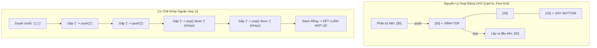

## 1. Mô tả bài toán

Trong kiến trúc phần mềm, rất nhiều tác vụ đòi hỏi khả năng **quay lui (Backtracking)**, **hoàn tác hành động (Undo/Redo)**, hoặc **ghi nhớ ngữ cảnh lồng nhau (Nested Context)** như quá trình phân tích cú pháp mã nguồn (Syntax Parsing) hay cơ chế gọi hàm trong CPU. Đặc điểm chung của các tác vụ này: *Thao tác nào diễn ra sau cùng sẽ là thao tác cần được xử lý và hoàn tất đầu tiên.*

**Ngăn xếp (Stack)** là cấu trúc dữ liệu tuyến tính trừu tượng hoạt động theo nguyên lý nghiêm ngặt **Vào sau - Ra trước (Last-In, First-Out - LIFO)**. Mọi thao tác thêm hoặc loại bỏ phần tử đều chỉ được phép diễn ra tại một đầu duy nhất gọi là **Đỉnh ngăn xếp (Top)**.

## 2. Ý tưởng tiếp cận ban đầu

Stack có thể được hiện thực hóa dựa trên hai cấu trúc nền tảng:

1. **Cài đặt bằng Mảng động (Dynamic Array Stack):** Lưu trữ các phần tử trong một vector. Đỉnh ngăn xếp tương ứng với chỉ số `size - 1`. Ưu điểm: Bộ nhớ liền kề, tối ưu Cache tuyệt đối. Thao tác `push()` và `pop()` đạt chi phí khấu hao `O(1)`.
2. **Cài đặt bằng Danh sách liên kết (Linked List Stack):** Mỗi phần tử là một nút trỏ tới nút bên dưới. Đỉnh ngăn xếp chính là `head`. Ưu điểm: Dung lượng mở rộng linh hoạt từng nút một mà không bao giờ tốn chi phí nhân đôi bộ nhớ.

## 3. Tư duy tối ưu & Cấu trúc thuật toán

Ba thao tác bất biến cốt lõi của Ngăn xếp:

- `push(x)`: Đẩy một phần tử mới lên trên đỉnh Stack trong `O(1)`.
- `pop()`: Loại bỏ và trả về phần tử đang nằm trên đỉnh Stack trong `O(1)`. Gặp lỗi *Stack Underflow* nếu thao tác trên Stack rỗng.
- `top() / peek()`: Xem giá trị của phần tử trên đỉnh mà không loại bỏ nó trong `O(1)`.

**Bài toán Ứng dụng Tiêu biểu: Kiểm tra Dấu ngoặc Hợp lệ (Valid Parentheses):**

Cho một chuỗi gồm các ký tự ngoặc: `'('`, `')'`, `'{'`, `'}'`, `'['`, `']'`. Chuỗi được coi là hợp lệ khi mọi dấu ngoặc mở đều được đóng bởi dấu ngoặc cùng loại theo đúng thứ tự lồng nhau.

- Khi gặp ngoặc mở (`(`, `{`, `[`): `push` vào Stack.
- Khi gặp ngoặc đóng (`)`, `}`, `]`): Kiểm tra Stack. Nếu Stack rỗng &rarr; Bất hợp lệ (thừa ngoặc đóng). Ngược lại, `pop` phần tử đỉnh ra và so sánh xem có khớp cặp với ngoặc đóng hiện tại không. Nếu không khớp &rarr; Bất hợp lệ.
- Kết thúc duyệt chuỗi: Nếu Stack rỗng hoàn toàn &rarr; Hợp lệ (Mọi ngoặc mở đều đã được đóng chính xác).

## 4. Triển khai mã nguồn & Dry Run

Sơ đồ cơ chế hoạt động LIFO và bài toán kiểm tra dấu ngoặc hợp lệ:



**Mã nguồn C++ hoàn chỉnh: Stack Generic và Hàm Kiểm tra Dấu ngoặc:**

```c++
#include <iostream>
#include <vector>
#include <string>
#include <stdexcept>

template <typename T>
class MyStack {
private:
    std::vector<T> storage;

public:
    void push(const T& value) {
        storage.push_back(value);
    }

    void pop() {
        if (empty()) {
            throw std::underflow_error("Stack rong, khong the pop!");
        }
        storage.pop_back();
    }

    T& top() {
        if (empty()) {
            throw std::underflow_error("Stack rong, khong the truy cap top!");
        }
        return storage.back();
    }

    const T& top() const {
        if (empty()) {
            throw std::underflow_error("Stack rong, khong the truy cap top!");
        }
        return storage.back();
    }

    bool empty() const { return storage.empty(); }
    size_t size() const { return storage.size(); }
};

// Ứng dụng: Kiểm tra dấu ngoặc hợp lệ
bool isValidParentheses(const std::string& s) {
    MyStack<char> st;

    for (char c : s) {
        if (c == '(' || c == '{' || c == '[') {
            st.push(c);
        } else if (c == ')' || c == '}' || c == ']') {
            if (st.empty()) return false; // Thừa ngoặc đóng

            char topChar = st.top();
            st.pop();

            if ((c == ')' && topChar != '(') ||
                (c == '}' && topChar != '{') ||
                (c == ']' && topChar != '[')) {
                return false; // Sai lệch loại ngoặc
            }
        }
    }

    return st.empty(); // Phải đóng hết tất cả ngoặc
}

int main() {
    std::string s1 = "{[()]}";
    std::string s2 = "{[(])}";
    std::string s3 = "((()";

    std::cout << "--- KIEM TRA DAU NGOAC HOP LE (STACK APPLICATION) ---" << std::endl;
    std::cout << s1 << " -> " << (isValidParentheses(s1) ? "HOP LE" : "KHONG HOP LE") << std::endl;
    std::cout << s2 << " -> " << (isValidParentheses(s2) ? "HOP LE" : "KHONG HOP LE") << std::endl;
    std::cout << s3 << " -> " << (isValidParentheses(s3) ? "HOP LE" : "KHONG HOP LE") << std::endl;

    return 0;
}
```

**Phân tích luồng thực thi chi tiết (Dry Run Trace):**

- *Chuỗi kiểm thử:* `s1 = "{[()]}"`.
- *Ký tự 1 (`'{'`):* Ngoặc mở &rarr; `push('{')`. Stack = `['{']`.
- *Ký tự 2 (`'['`):* Ngoặc mở &rarr; `push('[')`. Stack = `['{', '[']`.
- *Ký tự 3 (`'('`):* Ngoặc mở &rarr; `push('(')`. Stack = `['{', '[', '(']`.
- *Ký tự 4 (`')'`):* Ngoặc đóng &rarr; `pop()` lấy được `'('` &rarr; Khớp hoàn hảo. Stack = `['{', '[']`.
- *Ký tự 5 (`']'`):* Ngoặc đóng &rarr; `pop()` lấy được `'['` &rarr; Khớp hoàn hảo. Stack = `['{']`.
- *Ký tự 6 (`'}'`):* Ngoặc đóng &rarr; `pop()` lấy được `'{'` &rarr; Khớp hoàn hảo. Stack = `[]`.
- *Kết luận:* Chuỗi duyệt xong và Stack rỗng &rarr; Kết quả `true` (Hợp lệ).

## 5. Đánh giá độ phức tạp & Ứng dụng thực tế

Bảng tổng hợp chỉ số hiệu năng theo hệ quy chiếu chuẩn RAM Model:

- **Độ phức tạp Thời gian (Time Complexity):**
  - `push()`: `O(1)` Amortized với Mảng động, `O(1)` Worst-case với Danh sách liên kết.
  - `pop()`: `O(1)` tuyệt đối.
  - `top() / peek()`: `O(1)` tuyệt đối.
  - Tìm kiếm phần tử bất kỳ: `O(N)` (phải dỡ toàn bộ Stack).
- **Độ phức tạp Không gian (Space Complexity):** `O(N)` bộ nhớ tuyến tính lưu trữ các phần tử.
- **Ứng dụng thực tế:**
  - **Hệ thống thực thi Call Stack:** Quản lý các khung ngăn xếp (Stack Frames), lưu trữ biến cục bộ và địa chỉ trả về khi thực thi hàm đệ quy.
  - **Trình duyệt web và Ứng dụng văn phòng:** Tính năng Undo / Redo (Ctrl + Z) và nút lùi trang (Browser Back Button).
  - **Trình biên dịch (Compiler):** Đánh giá biểu thức toán học dạng Hậu tố (Reverse Polish Notation - RPN) và thuật toán Chuyển đổi Shunting-Yard.
  - **Thuật toán đồ thị:** Khử đệ quy cho thuật toán Tìm kiếm theo chiều sâu (Iterative DFS).
