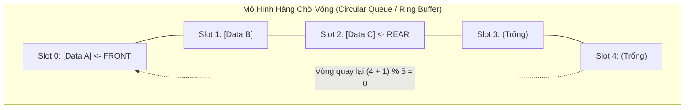

## Mô tả bài toán

Trong các hệ thống xử lý bất đồng bộ (Asynchronous Processing), máy chủ web đón nhận hàng nghìn kết nối đồng thời, hàng đợi in ấn (Print Spooler) hay hệ thống truyền thông điệp phân tán (Kafka, RabbitMQ), các yêu cầu cần được xử lý theo **đúng thứ tự thời gian chúng được gửi tới**: *Yêu cầu nào đến trước phải được phục vụ trước.*

**Hàng chờ (Queue)** là cấu trúc dữ liệu tuyến tính hoạt động theo nguyên tắc **Vào trước - Ra trước (First-In, First-Out - FIFO)**. Dữ liệu được thêm vào ở một đầu gọi là **Đuôi (Rear / Tail)** và được lấy ra ở đầu đối diện gọi là **Đầu (Front / Head)**.

## Ý tưởng tiếp cận ban đầu

Nếu cài đặt Queue bằng một Mảng tĩnh thông thường: Mỗi khi thêm phần tử, ta tăng con trỏ `rear`; mỗi khi lấy phần tử (`dequeue`), ta tăng con trỏ `front`.

Sau một số thao tác chèn và xóa, con trỏ `rear` sẽ chạm tới cuối mảng trong khi các ô nhớ phía trước `front` đã bị bỏ trống hoàn toàn. Mặc dù mảng còn rất nhiều chỗ trống, ta vẫn không thể chèn thêm phần tử mới. Hiện tượng này gọi là **Trôi chỉ số / Giả đầy hàng đợi (False Overflow)**.

## Tư duy tối ưu & Cấu trúc thuật toán

Để giải quyết triệt để vấn đề lãng phí bộ nhớ, giải pháp chuẩn mực là **Hàng chờ Vòng (Circular Queue / Ring Buffer)**:

1. **Không gian Vòng kín (Circular Indexing):** Xem mảng như một vòng tròn khép kín nối liền từ chỉ số cuối `capacity - 1` quay trở lại chỉ số đầu `0` bằng phép toán chia lấy dư (Modulo Arithmetic):

```
next_index = (current_index + 1) % capacity
```
2. **Phân biệt Trạng thái Rỗng và Đầy:** Có 2 kỹ thuật phổ biến:
  

- *Kỹ thuật Biến đếm:* Duy trì biến `count` lưu số lượng phần tử thực tế. Rỗng khi `count == 0`, Đầy khi `count == capacity`.
- *Kỹ thuật Bỏ trống 1 ô:* Rỗng khi `front == rear`, Đầy khi `(rear + 1) % capacity == front`.
3. **Hiệu năng Hằng số:** Cả thao tác thêm vào đuôi (`enqueue`) và lấy ra từ đầu (`dequeue`) đều chỉ tốn 1 vài phép toán số học đơn giản trong thời gian tuyệt đối **`O(1)`** mà không cần cấp phát lại hay sao chép bộ nhớ.

## Triển khai mã nguồn & Dry Run

Sơ đồ cơ chế hoạt động của Hàng chờ Vòng (Circular Ring Buffer):



**Mã nguồn C++ hoàn chỉnh: Triển khai Circular Queue Ring Buffer:**

```c++
#include <iostream>
#include <vector>
#include <stdexcept>

template <typename T>
class CircularQueue {
private:
    std::vector<T> buffer;
    size_t frontIdx;
    size_t rearIdx;
    size_t count;
    size_t capacity;

public:
    CircularQueue(size_t cap) 
        : buffer(cap), frontIdx(0), rearIdx(0), count(0), capacity(cap) {}

    // Thêm phần tử vào đuôi hàng đợi (Enqueue): O(1)
    bool enqueue(const T& value) {
        if (isFull()) {
            return false; // Hàng đợi đã đầy
        }
        buffer[rearIdx] = value;
        rearIdx = (rearIdx + 1) % capacity; // Quay vòng chỉ số
        ++count;
        return true;
    }

    // Lấy phần tử ra khỏi đầu hàng đợi (Dequeue): O(1)
    bool dequeue(T& outValue) {
        if (isEmpty()) {
            return false; // Hàng đợi rỗng
        }
        outValue = buffer[frontIdx];
        frontIdx = (frontIdx + 1) % capacity; // Quay vòng chỉ số
        --count;
        return true;
    }

    // Xem phần tử ở đầu hàng đợi mà không xóa: O(1)
    T front() const {
        if (isEmpty()) throw std::underflow_error("Queue rong!");
        return buffer[frontIdx];
    }

    bool isEmpty() const { return count == 0; }
    bool isFull() const { return count == capacity; }
    size_t size() const { return count; }
};

int main() {
    CircularQueue<int> q(4); // Hàng đợi vòng sức chứa 4 phần tử

    std::cout << "--- DEMO HANG CHO VONG (CIRCULAR QUEUE) ---" << std::endl;
    q.enqueue(10);
    q.enqueue(20);
    q.enqueue(30);
    q.enqueue(40);

    std::cout << "Hang doi day? " << (q.isFull() ? "DUNG" : "SAI") << std::endl;

    int val;
    q.dequeue(val);
    std::cout << "Da dequeue: " << val << std::endl; // Lấy 10 ra
    q.dequeue(val);
    std::cout << "Da dequeue: " << val << std::endl; // Lấy 20 ra

    // Thêm tiếp phần tử mới để kiểm tra tính năng quay vòng
    q.enqueue(50);
    q.enqueue(60);

    std::cout << "Phan tu dau hang doi hien tai: " << q.front() << std::endl; // Phải là 30

    return 0;
}
```

**Phân tích luồng thực thi chi tiết (Dry Run Trace):**

- *Khởi tạo:* `capacity = 4, frontIdx = 0, rearIdx = 0, count = 0`.
- *Enqueue 10, 20, 30, 40:* 
  - Chèn 10 tại index 0 &rarr; `rearIdx = 1`.
  - Chèn 20 tại index 1 &rarr; `rearIdx = 2`.
  - Chèn 30 tại index 2 &rarr; `rearIdx = 3`.
  - Chèn 40 tại index 3 &rarr; `rearIdx = (3 + 1) % 4 = 0`. `count = 4` (Full!).
- *Dequeue 2 lần:* Lấy ra 10 (`frontIdx = 1`), lấy ra 20 (`frontIdx = 2`). `count = 2`.
- *Enqueue 50:* Ghi tại `buffer[0] = 50` &rarr; `rearIdx = 1` (Quay vòng thành công mà không tràn bộ nhớ!).
- *Enqueue 60:* Ghi tại `buffer[1] = 60` &rarr; `rearIdx = 2`. `front()` vẫn trỏ chính xác về `buffer[2] = 30`.

## Đánh giá độ phức tạp & Ứng dụng thực tế

Bảng tổng hợp chỉ số hiệu năng theo hệ quy chiếu chuẩn RAM Model:

- **Thêm phần tử vào đuôi (Enqueue):** `O(1)` tuyệt đối.
- **Lấy phần tử ở đầu (Dequeue):** `O(1)` tuyệt đối.
- **Xem phần tử đầu (Front / Peek):** `O(1)` tuyệt đối.
- **Độ phức tạp Không gian (Space Complexity):** `O(K)` với `K` là dung lượng cố định của Ring Buffer, không bao giờ phát sinh cấp phát động.
- **Ứng dụng thực tế:**
  - **Thuật toán Tìm kiếm theo Chiều rộng (BFS):** Duyệt đồ thị và tìm đường đi ngắn nhất không trọng số theo từng lớp sóng lan truyền.
  - **Điều phối CPU trong Hệ điều hành (Round-Robin Scheduling):** Phân chia luân phiên các lát thời gian (Time Slices) cho các tiến trình.
  - **Mô hình Nhà sản xuất - Người tiêu dùng (Producer-Consumer Pattern):** Bộ đệm Ring Buffer không khóa (Lock-Free Ring Buffer) trong truyền thông điệp siêu tốc giữa các Thread.
  - **Xử lý Âm thanh Thời gian thực (Audio Streaming Buffers):** Truyền dữ liệu mẫu âm thanh liên tục đến card âm thanh mà không bị giật tiếng (Audio Dropouts).
