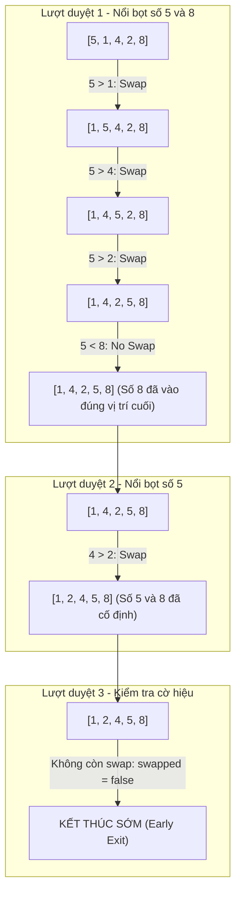

## 1. Mô tả bài toán

Sắp xếp danh sách là bài toán nền tảng trong khoa học máy tính. Đề bài đặt ra: Cho một mảng gồm N số nguyên chưa có thứ tự, hãy sắp xếp lại các phần tử theo thứ tự tăng dần sao cho `arr[0] <= arr[1] <= ... <= arr[N-1]`.

Thuật toán Sắp xếp Nổi bọt (Bubble Sort) là thuật toán sắp xếp kinh điển đầu tiên mà mọi kỹ sư phần mềm cần nắm vững để hiểu rõ cơ chế so sánh và hoán đổi lân cận (Adjacent Comparison &amp; Swapping).

## 2. Ý tưởng tiếp cận ban đầu

Cách tiếp cận nguyên bản không tối ưu:

- Sử dụng hai vòng lặp lồng nhau duyệt qua mảng N - 1 lần. Mỗi lượt, duyệt từ đầu đến cuối mảng và so sánh cặp phần tử liền kề `arr[j]` và `arr[j+1]`, nếu `arr[j] > arr[j+1]` thì hoán đổi.
- *Điểm yếu cốt tử:* Thuật toán luôn thực hiện đủ `N * (N - 1) / 2` phép so sánh kể cả khi mảng đầu vào *đã được sắp xếp hoàn hảo* ngay từ đầu, tiêu tốn lãng phí `O(N²)` chu kỳ CPU.

## 3. Tư duy tối ưu & Cấu trúc thuật toán

Tối ưu hóa Bubble Sort qua 2 cải tiến then chốt:

1. **Thu hẹp phạm vi quét sau mỗi Pass (Boundary Shrinking):** Sau lượt duyệt thứ `i`, đúng `i` phần tử lớn nhất chắc chắn đã nằm cố định ở cuối mảng. Do đó, vòng lặp trong chỉ cần quét đến chỉ số `N - 1 - i`.
2. **Cờ hiệu Dừng sớm (Swapped Flag Optimization):** Sử dụng cờ boolean `bool swapped = false` trước mỗi pass. Nếu sau một lượt quét mà không có bất kỳ thao tác hoán đổi nào diễn ra, mảng đã có thứ tự tuyệt đối &rarr; Ngắt vòng lặp ngay lập tức bằng `break`, đưa Best-case về mức lý tưởng `Ω(N)`.

## 4. Triển khai mã nguồn & Dry Run

Minh họa cơ chế nổi bọt của mảng mẫu `[5, 1, 4, 2, 8]` qua từng lượt duyệt:



**Triển khai mã nguồn C++ chuẩn hóa:**

```
#include <iostream>
#include <vector>
#include <utility>

// Thuật toán Bubble Sort tối ưu với cờ hiệu swapped
void bubbleSort(std::vector<int>& arr) {
    int n = static_cast<int>(arr.size());
    for (int i = 0; i < n - 1; ++i) {
        bool swapped = false;
        // Thu hẹp phạm vi quét đến n - 1 - i
        for (int j = 0; j < n - 1 - i; ++j) {
            if (arr[j] > arr[j + 1]) {
                std::swap(arr[j], arr[j + 1]);
                swapped = true;
            }
        }
        // Nếu không có hoán đổi nào, dừng sớm
        if (!swapped) {
            break;
        }
    }
}

int main() {
    std::vector<int> data = {5, 1, 4, 2, 8};
    bubbleSort(data);
    std::cout << "Mảng sau sắp xếp: ";
    for (int x : data) std::cout << x << " ";
    std::cout << std::endl;
    return 0;
}
```

**Phân tích luồng thực thi (Dry Run Trace):**

- *Đầu vào:* `data = {5, 1, 4, 2, 8}`, `N = 5`.
- *Pass 1 (`i = 0`):* So sánh `(5, 1) ->` Swap `{1, 5, 4, 2, 8}`; So sánh `(5, 4) ->` Swap `{1, 4, 5, 2, 8}`; So sánh `(5, 2) ->` Swap `{1, 4, 2, 5, 8}`; So sánh `(5, 8) ->` Giữ nguyên. Cờ `swapped = true`. Phần tử `8` đã khóa vị trí index 4.
- *Pass 2 (`i = 1`):* Quét đến index 2: So sánh `(1, 4) ->` Ok; `(4, 2) ->` Swap `{1, 2, 4, 5, 8}`; `(4, 5) ->` Ok. Cờ `swapped = true`. Phần tử `5` khóa index 3.
- *Pass 3 (`i = 2`):* Quét `(1, 2)` và `(2, 4)`, không có hoán đổi &rarr; `swapped = false` &rarr; `break` ngay lập tức! Tiết kiệm 40% số phép tính so với bản gốc.

## 5. Đánh giá độ phức tạp & Ứng dụng thực tế

**Đánh giá Hiệu năng theo Framework Chuẩn:**

1. **Worst-Case Time Complexity (`O`):** `O(N²)` khi mảng nghịch đảo hoàn toàn (ví dụ `[5, 4, 3, 2, 1]`).
2. **Best-Case Time Complexity (`Ω`):** `Ω(N)` khi mảng đã sắp xếp sẵn nhờ cờ hiệu `swapped` dừng sau đúng 1 pass.
3. **Average-Case Time Complexity (`Θ`):** `Θ(N²)` trên phân phối ngẫu nhiên.
4. **Auxiliary Space Complexity:** `O(1)` - Thuật toán thuần túy tại chỗ (In-place), chỉ dùng biến đếm và cờ nhớ.
5. **Tính ổn định (Stability):** Ổn định (Stable) vì điều kiện `arr[j] > arr[j+1]` giữ nguyên vị trí tương đối của các phần tử bằng nhau.

**Ứng dụng thực tế:** Kiểm tra tính có thứ tự của mảng với chi phí cực thấp, ứng dụng trong các vi điều khiển nhúng với RAM siêu nhỏ và làm thuật toán mẫu mực trong giáo trình khoa học máy tính.
