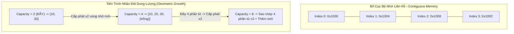

## 1. Mô tả bài toán

Trong kiến trúc phần cứng máy tính hiện đại (kiến trúc Von Neumann), bộ nhớ RAM được tổ chức như một mảng tuyến tính khổng lồ của các ô nhớ (Byte). **Mảng (Array)** là cấu trúc dữ liệu nguyên thủy và nền tảng nhất trong khoa học máy tính, đại diện cho một khối các phần tử có cùng kiểu dữ liệu được cấp phát tại một **vùng nhớ liên tục (Contiguous Memory Block)**.

Tuy nhiên, mảng tĩnh truyền thống (Static Array) có kích thước cố định tại thời điểm biên dịch. Trong thực tế phát triển phần mềm, số lượng phần tử cần lưu trữ thường biến động liên tục trong thời gian chạy (Runtime). Thách thức đặt ra: _Làm thế nào để thiết kế một **Mảng động (Dynamic Array - tương đương `std::vector` trong C++ hay `ArrayList` trong Java)** có khả năng tự động co giãn kích thước linh hoạt mà vẫn duy trì tốc độ truy xuất tức thời `O(1)` và tối ưu hóa hiệu năng bộ nhớ đệm CPU (CPU Cache Locality)?_

## 2. Ý tưởng tiếp cận ban đầu

Cách tiếp cận ngây thơ ban đầu khi mảng bị đầy: Mỗi khi thêm 1 phần tử mới (`push_back`), ta cấp phát một mảng mới có kích thước `N + 1`, sao chép toàn bộ `N` phần tử cũ sang và giải phóng mảng cũ.

Chiến lược tăng trưởng tuyến tính này (Linear Resizing) dẫn đến một thảm họa hiệu năng: Để thêm `N` phần tử, tổng số phép sao chép bộ nhớ sẽ là `1 + 2 + 3 + ... + N = (N x (N + 1)) / 2 = O(N²)`. Chi phí trung bình cho mỗi thao tác thêm phần tử vọt lên `O(N)` - hoàn toàn bất khả thi cho các hệ thống xử lý dữ liệu lớn.

## 3. Tư duy tối ưu & Cấu trúc thuật toán

Để giải quyết triệt để vấn đề này, các ngôn ngữ lập trình hiện đại áp dụng chiến lược **Phân bổ Mở rộng Hình học (Geometric / Exponential Resizing)**:

1. **Nhân đôi Dung lượng (Capacity Doubling):** Khi số lượng phần tử thực tế (`size`) chạm ngưỡng sức chứa tối đa (`capacity`), mảng sẽ cấp phát một vùng nhớ mới có kích thước gấp đôi (`capacity x 2`), sao chép các phần tử cũ sang và giải phóng vùng nhớ cũ.
2. **Phân tích Chi phí Khấu hao (Amortized Analysis):** Mặc dù thao tác mở rộng tại thời điểm đầy mảng tốn chi phí `O(N)`, nhưng sự kiện này chỉ xảy ra rất thưa thớt (sau mỗi `1, 2, 4, 8, 16, ...` phần tử). Tổng chi phí sao chép khi chèn `N` phần tử là `1 + 2 + 4 + ... + N <= 2N = O(N)`. Chia đều cho `N` thao tác, chi phí trung bình khấu hao (Amortized Cost) cho mỗi lần `push_back` là **hằng số `O(1)`**.
3. **Định vị Địa chỉ Trực tiếp (Direct Address Calculation):** Nhờ bố cục bộ nhớ liền kề, vị trí ô nhớ của phần tử thứ `i` được tính toán tức thời bằng công thức toán học số học con trỏ:

```
Address(arr[i]) = Base_Address + i x sizeof(ElementType)
```

Thao tác đọc/ghi ngẫu nhiên (Random Access) chỉ tốn đúng 1 chu kỳ xung nhịp CPU `O(1)`. 4. **Tối ưu hóa Bộ nhớ đệm (Cache Locality):** Khi CPU đọc một phần tử từ RAM, toàn bộ dòng đệm Cache Line (thường là 64 bytes) chứa các phần tử lân cận sẽ được tải đồng thời vào L1/L2 Cache, giúp tốc độ duyệt mảng nhanh gấp hàng chục lần so với danh sách liên kết.

## 4. Triển khai mã nguồn & Dry Run

Sơ đồ bố cục bộ nhớ liền kề và cơ chế nhân đôi dung lượng của Mảng động:



**Mã nguồn C++ hoàn chỉnh: Xây dựng Dynamic Vector tùy biến:**

```
#include <iostream>
#include <stdexcept>
#include <utility>

template <typename T>
class MyVector {
private:
    T* data;           // Con trỏ trỏ tới vùng nhớ động trên Heap
    size_t length;     // Số lượng phần tử hiện có (Size)
    size_t cap;        // Sức chứa tối đa hiện tại (Capacity)

    // Tái cấp phát bộ nhớ khi dung lượng đầy
    void reallocate(size_t newCapacity) {
        T* newBlock = new T[newCapacity];
        for (size_t i = 0; i < length; ++i) {
            newBlock[i] = std::move(data[i]); // Di chuyển dữ liệu sang vùng nhớ mới
        }
        delete[] data; // Giải phóng vùng nhớ cũ
        data = newBlock;
        cap = newCapacity;
    }

public:
    MyVector() : data(nullptr), length(0), cap(0) {
        reallocate(2); // Dung lượng khởi tạo ban đầu = 2
    }

    ~MyVector() {
        delete[] data;
    }

    // Thao tác chèn phần tử vào cuối mảng: Amortized O(1)
    void pushBack(const T& value) {
        if (length >= cap) {
            reallocate(cap * 2); // Nhân đôi dung lượng
        }
        data[length++] = value;
    }

    // Thao tác xóa phần tử cuối cùng: O(1)
    void popBack() {
        if (length > 0) {
            --length;
        }
    }

    // Truy xuất phần tử có kiểm tra biên (Bounds Checking): O(1)
    T& at(size_t index) {
        if (index >= length) {
            throw std::out_of_range("Chi so vuot qua gioi han mang!");
        }
        return data[index];
    }

    // Toán tử truy xuất ngẫu nhiên qua index: O(1)
    T& operator[](size_t index) {
        return data[index];
    }

    const T& operator[](size_t index) const {
        return data[index];
    }

    size_t size() const { return length; }
    size_t capacity() const { return cap; }
    bool empty() const { return length == 0; }
};

int main() {
    MyVector<int> vec;

    std::cout << "--- DEMO MANG DONG (DYNAMIC ARRAY) ---" << std::endl;
    for (int i = 1; i <= 5; ++i) {
        vec.pushBack(i * 10);
        std::cout << "Them " << (i * 10) << " | Size: " << vec.size()
                  << " | Capacity: " << vec.capacity() << std::endl;
    }

    std::cout << "\nCac phan tu trong mang: ";
    for (size_t i = 0; i < vec.size(); ++i) {
        std::cout << vec[i] << " ";
    }
    std::cout << std::endl;

    return 0;
}
```

**Phân tích luồng thực thi chi tiết (Dry Run Trace):**

- _Khởi tạo:_ `size = 0, capacity = 2`. Cấp phát mảng 2 phần tử trên Heap.
- _Thêm 10 (i=1):_ `size = 1 < 2` &rarr; `data[0] = 10`. `size = 1, capacity = 2`.
- _Thêm 20 (i=2):_ `size = 2 <= 2` &rarr; `data[1] = 20`. `size = 2, capacity = 2` (Đầy!).
- _Thêm 30 (i=3):_ `size = 2 == capacity = 2` &rarr; Kích hoạt `reallocate(4)`: Cấp phát mảng mới size 4, chép `[10, 20]` sang, gán `data[2] = 30` &rarr; `size = 3, capacity = 4`.
- _Thêm 40 (i=4):_ `size = 4, capacity = 4` (Đầy!).
- _Thêm 50 (i=5):_ Kích hoạt `reallocate(8)`: Cấp phát mảng mới size 8, chép 4 phần tử sang, gán `data[4] = 50` &rarr; `size = 5, capacity = 8`.

## 5. Đánh giá độ phức tạp & Ứng dụng thực tế

Bảng tổng hợp chỉ số hiệu năng theo hệ quy chiếu chuẩn RAM Model:

- **Truy xuất phần tử theo chỉ số (Access by Index):** `O(1)` tuyệt đối nhờ phép tính dịch chuyển địa chỉ con trỏ trực tiếp.
- **Thêm phần tử vào cuối (Append / push_back):** `O(1)` Khấu hao (Amortized Time), `O(N)` Worst-Case khi chạm ngưỡng nhân đôi dung lượng.
- **Chèn / Xóa ở đầu hoặc giữa mảng (Insert / Delete at index):** `O(N)` vì phải dịch chuyển toàn bộ các phần tử phía sau sang một vị trí.
- **Độ phức tạp Không gian (Space Complexity):** `O(N)` với hệ số sử dụng bộ nhớ thường dao động từ `50%` đến `100%` (do sức chứa luôn &ge; số lượng phần tử thực tế).
- **Ứng dụng thực tế:**
  <ul>
  **Cấu trúc nền tảng:** Làm khối xây dựng cơ sở để cài đặt Bảng băm (Hash Table), Hàng đợi ưu tiên (Binary Heap), Hàng chờ vòng (Ring Buffer).
- **Xử lý đồ họa & Game:** Ma trận biến đổi 3D (Transformation Matrix), bộ đệm đỉnh (Vertex Buffers) trong OpenGL/DirectX.
- **Hệ thống cơ sở dữ liệu:** Lưu trữ các trang dữ liệu (Database Pages) theo khối bộ nhớ liên tục để tăng tốc I/O ổ đĩa.

</li>
</ul>
