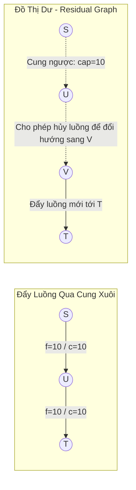

## 1. Mô tả bài toán

Trong các hệ thống phân phối dầu khí, mạng truyền tải điện, hạ tầng băng thông mạng Internet hay điều phối chuyến bay, bài toán cốt lõi đặt ra là: *Làm thế nào để vận chuyển khối lượng vật chất hoặc thông tin lớn nhất từ điểm phát đến điểm thu mà không làm quá tải bất kỳ đường ống/đường truyền nào?*

Đề bài đặt ra: **Bài toán Luồng Cực đại trên Mạng (Maximum Flow Problem)**. Cho mạng luồng `G = (V, E)` là một đồ thị có hướng, trong đó mỗi cạnh `(u, v)` có một dung lượng tải tối đa (Capacity) `c(u, v) >= 0`. Cho trước hai đỉnh đặc biệt: **Đỉnh nguồn (Source `s`)** và **Đỉnh thu (Sink `t`)**.

Hãy xác định một hàm luồng `f(u, v)` thỏa mãn hai điều kiện bất biến:

1. **Ràng buộc dung lượng (Capacity Constraint):** `0 <= f(u, v) <= c(u, v)` với mọi cạnh `(u, v)`.
2. **Bảo toàn luồng (Conservation of Flow):** Tổng luồng đi vào một đỉnh trung gian bất kỳ phải đúng bằng tổng luồng đi ra khỏi đỉnh đó (với mọi đỉnh ngoại trừ `s` và `t`).

Mục tiêu: Cực đại hóa tổng luồng đi từ nguồn `s` đến đích `t`: `|f| = sum f(s, v)`.

## 2. Ý tưởng tiếp cận ban đầu

Cách tiếp cận ngây thơ ban đầu là sử dụng giải thuật Tham lam (Greedy): Tìm một đường đi bất kỳ từ `s` đến `t` bằng DFS/BFS, đẩy luồng tối đa có thể qua đường đi này, giảm dung lượng của các cạnh đã đi qua và lặp lại cho đến khi không còn đường đi nào nối từ `s` đến `t`.

Chiến lược tham lam thuần túy này **thất bại** vì một khi luồng đã được đẩy vào một đường dẫn kém tối ưu, nó sẽ chiếm dụng dung lượng và vĩnh viễn chặn đứng các đường đi tối ưu khác mà không có cơ hội sửa sai.

Lester Ford Jr. và Delbert Fulkerson vào năm 1956 đã đưa ra giải pháp đột phá: **Cung ngược (Backward Edge)** trên **Đồ thị dư (Residual Graph)**, cho phép thuật toán &quot;hoàn trả luồng&quot; (Undo/Reroute flow) đã gửi sai trước đó.

## 3. Tư duy tối ưu & Cấu trúc thuật toán

Phương pháp Ford-Fulkerson vận hành dựa trên 3 trụ cột lý thuyết vững chắc:

1. **Đồ thị dư (Residual Graph `G_f`):** Với mỗi cạnh `(u, v)` có dung lượng `c` và luồng hiện thời `f`:
  

- *Cung xuôi (Forward Edge):* Có dung lượng dư là `c(u, v) - f(u, v)` (thể hiện khả năng đẩy thêm luồng).
- *Cung ngược (Backward Edge):* Có dung lượng dư là `f(u, v)` (thể hiện khả năng hủy luồng đã gửi qua `(u, v)` để chuyển hướng luồng đi nơi khác).
2. **Đường tăng luồng (Augmenting Path):** Một đường đi đơn từ nguồn `s` đến đích `t` trên đồ thị dư mà tất cả các cạnh trên đường đi đều có dung lượng dư `> 0`. Giá trị luồng tăng thêm (Bottleneck) chính là dung lượng dư nhỏ nhất trên đường đi đó.
3. **Định lý Luồng cực đại - Lát cắt cực tiểu (Max-Flow Min-Cut Theorem):** Giá trị luồng cực đại từ `s` đến `t` chính xác bằng tổng dung lượng của lát cắt nhỏ nhất (Min-Cut) phân tách đồ thị thành 2 tập đỉnh chứa `s` và `t`.
4. **Tối ưu hóa Edmonds-Karp (1972):** Thay vì dùng DFS có thể bị lặp vô hạn nếu dung lượng là số vô tỉ hoặc chạy rất chậm với `O(E x |f*|)`, Edmonds và Karp đề xuất luôn dùng **BFS** để tìm đường tăng luồng ngắn nhất (ít cạnh nhất). Điều này đảm bảo thuật toán đạt thời gian đa thức chặt chẽ `O(V x E²)`.

## 4. Triển khai mã nguồn & Dry Run

Sơ đồ cơ chế cung ngược và tiến trình tăng luồng trên đồ thị dư:



**Mã nguồn C++ hoàn chỉnh (Thuật toán Edmonds-Karp với BFS):**

```
#include <iostream>
#include <vector>
#include <queue>
#include <algorithm>

const long long INF = 1e18;

// Thuật toán Edmonds-Karp tìm Luồng cực đại
class EdmondsKarp {
private:
    int n; // Số lượng đỉnh
    std::vector<std::vector<long long>> capacity;
    std::vector<std::vector<int>> adj;

    // Tìm đường tăng luồng ngắn nhất từ s đến t bằng BFS
    long long bfs(int s, int t, std::vector<int>& parent) {
        std::fill(parent.begin(), parent.end(), -1);
        parent[s] = -2; // Đánh dấu đỉnh nguồn đã thăm

        // Hàng đợi lưu cặp {đỉnh hiện tại, luồng nghẽn nhỏ nhất tới đỉnh này}
        std::queue<std::pair<int, long long>> q;
        q.push({s, INF});

        while (!q.empty()) {
            auto [u, flow] = q.front();
            q.pop();

            for (int v : adj[u]) {
                if (parent[v] == -1 && capacity[u][v] > 0) {
                    parent[v] = u;
                    long long newFlow = std::min(flow, capacity[u][v]);
                    if (v == t) {
                        return newFlow; // Đã tìm thấy đường đi tới đích t
                    }
                    q.push({v, newFlow});
                }
            }
        }
        return 0; // Không còn đường tăng luồng
    }

public:
    EdmondsKarp(int vertices) : n(vertices) {
        capacity.assign(n, std::vector<long long>(n, 0));
        adj.resize(n);
    }

    void addEdge(int from, int to, long long cap) {
        capacity[from][to] += cap; // Hỗ trợ đa cạnh
        adj[from].push_back(to);
        adj[to].push_back(from); // Thêm cung ngược vào danh sách kề
    }

    long long maxFlow(int s, int t) {
        long long totalFlow = 0;
        std::vector<int> parent(n);
        long long newFlow = 0;

        // Lặp lại việc tìm đường tăng luồng cho đến khi BFS trả về 0
        while ((newFlow = bfs(s, t, parent)) > 0) {
            totalFlow += newFlow;
            int curr = t;
            // Cập nhật dung lượng dư dọc theo đường đi
            while (curr != s) {
                int prev = parent[curr];
                capacity[prev][curr] -= newFlow; // Giảm dung lượng cung xuôi
                capacity[curr][prev] += newFlow; // Tăng dung lượng cung ngược
                curr = prev;
            }
        }
        return totalFlow;
    }
};

int main() {
    int V = 6; // Đồ thị 6 đỉnh: 0 (Nguồn S), 5 (Đích T)
    EdmondsKarp ek(V);

    ek.addEdge(0, 1, 16);
    ek.addEdge(0, 2, 13);
    ek.addEdge(1, 2, 10);
    ek.addEdge(1, 3, 12);
    ek.addEdge(2, 1, 4);
    ek.addEdge(2, 4, 14);
    ek.addEdge(3, 2, 9);
    ek.addEdge(3, 5, 20);
    ek.addEdge(4, 3, 7);
    ek.addEdge(4, 5, 4);

    long long flow = ek.maxFlow(0, 5);
    std::cout << "--- KET QUA LUONG CUC DAI EDMONDS-KARP ---" << std::endl;
    std::cout << "Luong cuc dai tu 0 den 5: " << flow << std::endl;

    return 0;
}
```

**Phân tích luồng thực thi chi tiết (Dry Run Trace):**

- *Mạng luồng:* `S = 0, T = 5`.
- *Đường tăng luồng 1:* BFS tìm thấy `0 -> 1 -> 3 -> 5` với `bottleneck = min(16, 12, 20) = 12` &rarr; Luồng tăng lên `12`. Trừ dung lượng cung xuôi, tăng cung ngược.
- *Đường tăng luồng 2:* BFS tìm thấy `0 -> 2 -> 4 -> 5` với `bottleneck = min(13, 14, 4) = 4` &rarr; Luồng tăng lên `12 + 4 = 16`.
- *Đường tăng luồng 3:* BFS tìm thấy `0 -> 2 -> 4 -> 3 -> 5` với `bottleneck = min(9, 10, 7, 8) = 7` &rarr; Luồng tăng lên `16 + 7 = 23`.
- *Kết thúc:* BFS không còn tìm thấy đường nào có dung lượng &gt; 0 từ 0 đến 5 &rarr; Luồng cực đại chốt giá trị `23`.

## 5. Đánh giá độ phức tạp & Ứng dụng thực tế

Bảng tổng hợp chỉ số hiệu năng theo hệ quy chiếu chuẩn RAM Model:

- **Độ phức tạp Thời gian (Time Complexity):**
  <ul>
  Ford-Fulkerson nguyên bản (DFS): `O(E x |f*|)` với `|f*|` là giá trị luồng cực đại.
- Edmonds-Karp (BFS): `O(V x E²)`. Mỗi lần tìm đường mất `O(E)`, số lần tăng luồng bị chặn trên bởi `O(V x E)`.

</li>
<li>**Độ phức tạp Không gian (Space Complexity):** `O(V²)` ma trận dung lượng hoặc `O(V + E)` nếu sử dụng danh sách cạnh đối xứng.</li>
<li>**Ứng dụng thực tế:**
  

- **Mạng ống dẫn dầu và truyền tải nước:** Tính toán lưu lượng cấp nước tối đa của hệ thống thủy lợi đô thị.
- **Cắt ảnh trong Thị giác máy tính (Graph Cut Image Segmentation):** Phân tách tiền cảnh (Foreground) và hậu cảnh (Background) trong xử lý ảnh y tế.
- **Lập lịch phi hành đoàn hàng không:** Ghép cặp phi công - tiếp viên - chuyến bay tối ưu theo ràng buộc an toàn hàng không.

</li>
</ul>
