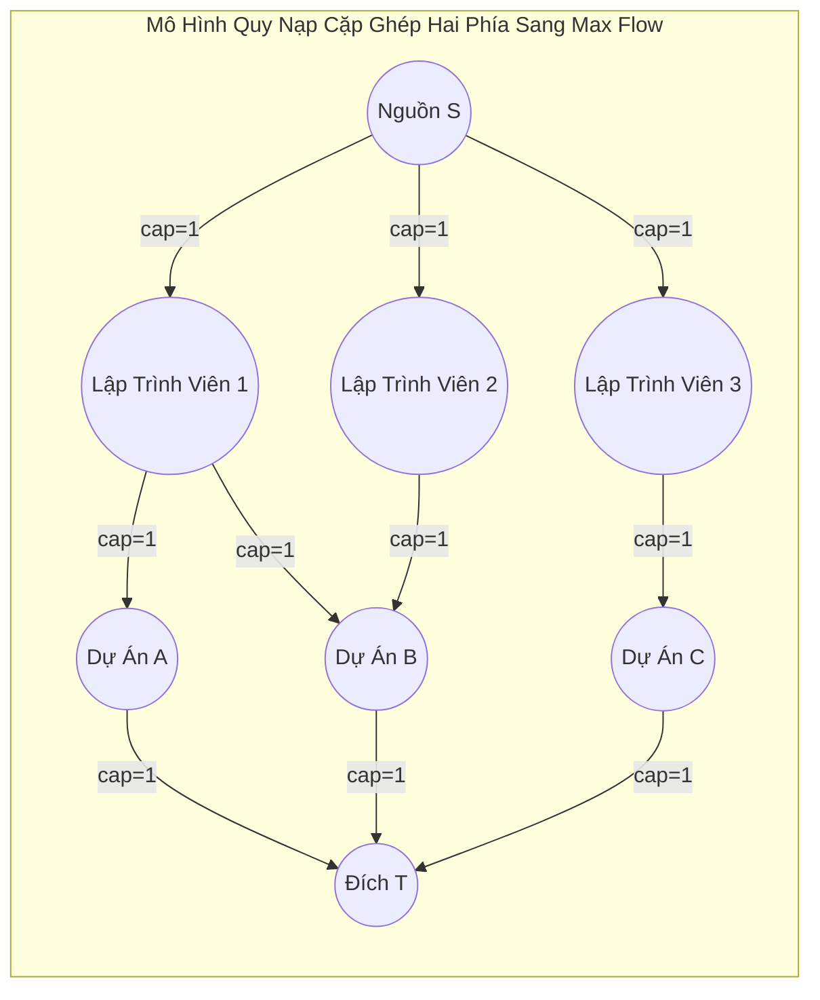

## 1. Mô tả bài toán

Lý thuyết Luồng trên Mạng (Network Flow) là một trong những phân nhánh quan trọng và ứng dụng sâu rộng nhất của khoa học máy tính ứng dụng. Khi đối mặt với các bài toán quy mô lớn, việc lựa chọn giữa giải thuật cổ điển **Ford-Fulkerson / Edmonds-Karp** và giải thuật hiện đại **Dinic** tạo ra sự cách biệt hiệu năng lên đến hàng nghìn lần.

Bài viết này phân tích bản chất kiến trúc của hai trường phái, đo lường điểm nghẽn hiệu năng thực nghiệm và trình bày phương pháp quy nạp các bài toán kinh điển (như Cặp ghép Cực đại - Bipartite Matching) về bài toán Luồng cực đại.

## 2. Ý tưởng tiếp cận ban đầu

Tại sao Edmonds-Karp lại trở nên chậm chạp trên mạng lưới dày?

- Mỗi lần chạy BFS, Edmonds-Karp tìm ra 1 đường đi ngắn nhất duy nhất, tăng một lượng luồng `bottleneck` rất nhỏ, rồi phá hủy toàn bộ cây BFS và quét lại từ đầu.
- Nếu mạng luồng có 10,000 đường tăng luồng độc lập có cùng độ dài, Edmonds-Karp phải thực thi 10,000 lần BFS lặp đi lặp lại.
- Dinic khắc phục triệt để sự lãng phí này bằng cách gom toàn bộ 10,000 đường đi đó vào cùng một **Đồ thị Phân tầng (Level Graph)** và dùng DFS quét sạch sẽ (Blocking Flow) chỉ trong 1 pha duy nhất.

## 3. Tư duy tối ưu & Cấu trúc thuật toán

**Ma trận So sánh Chuyên sâu giữa Edmonds-Karp và Dinic:**

<table style="width:100%; border-collapse: collapse; margin-bottom: 20px;">
  <thead>
    <tr style="border-bottom: 2px solid #e2e8f0; text-align: left;">
      <th style="padding: 8px;">Tiêu chí Đánh giá</th>
      <th style="padding: 8px;">Edmonds-Karp (Ford-Fulkerson BFS)</th>
      <th style="padding: 8px;">Thuật toán Dinic</th>
    </tr>
  </thead>
  <tbody>
    <tr style="border-bottom: 1px solid #edf2f7;">
      <td style="padding: 8px;">**Cơ chế tăng luồng**</td>
      <td style="padding: 8px;">Đơn luồng (1 đường đi mỗi lần BFS)</td>
      <td style="padding: 8px;">Đa luồng đồng thời (Blocking Flow qua DFS)</td>
    </tr>
    <tr style="border-bottom: 1px solid #edf2f7;">
      <td style="padding: 8px;">**Độ phức tạp (Tổng quát)**</td>
      <td style="padding: 8px;">`O(V x E²)`</td>
      <td style="padding: 8px;">`O(V² x E)` (Nhanh hơn từ 10x - 1000x)</td>
    </tr>
    <tr style="border-bottom: 1px solid #edf2f7;">
      <td style="padding: 8px;">**Mạng Đơn vị (Unit Network)**</td>
      <td style="padding: 8px;">`O(V x E)`</td>
      <td style="padding: 8px;">`O(E sqrtV)` (Cực hạn tốc độ)</td>
    </tr>
    <tr style="border-bottom: 1px solid #edf2f7;">
      <td style="padding: 8px;">**Kỹ thuật Tối ưu cốt lõi**</td>
      <td style="padding: 8px;">BFS tìm đường ngắn nhất (Shortest Path)</td>
      <td style="padding: 8px;">Level Graph + Con trỏ `work[]` tỉa nhánh cụt</td>
    </tr>
    <tr style="border-bottom: 1px solid #edf2f7;">
      <td style="padding: 8px;">**Độ phức tạp Không gian**</td>
      <td style="padding: 8px;">`O(V + E)`</td>
      <td style="padding: 8px;">`O(V + E)`</td>
    </tr>
    <tr>
      <td style="padding: 8px;">**Khuyến nghị Sử dụng**</td>
      <td style="padding: 8px;">Mạng nhỏ, minh họa học thuật (`V <= 100`)</td>
      <td style="padding: 8px;">Môi trường Production thực tế & Thi đấu lập trình</td>
    </tr>
  </tbody>
</table>

## 4. Triển khai mã nguồn & Dry Run

Sơ đồ quy nạp bài toán Cặp ghép cực đại (Bipartite Matching) về Mạng luồng cực đại:



**Mã nguồn C++ thực tế: Giải bài toán Cặp ghép Cực đại bằng Dinic:**

```
#include <iostream>
#include <vector>
#include <queue>
#include <algorithm>

const int INF = 1e9;

// Giải bài toán Phân công công việc (Bipartite Matching) qua Dinic
class BipartiteMatcher {
private:
    struct Edge {
        int to, cap, flow, rev;
    };
    int n, s, t;
    std::vector<std::vector<Edge>> adj;
    std::vector<int> level, work;

    bool bfs() {
        std::fill(level.begin(), level.end(), -1);
        level[s] = 0;
        std::queue<int> q;
        q.push(s);
        while (!q.empty()) {
            int u = q.front(); q.pop();
            for (const auto& e : adj[u]) {
                if (e.cap - e.flow > 0 && level[e.to] == -1) {
                    level[e.to] = level[u] + 1;
                    q.push(e.to);
                }
            }
        }
        return level[t] != -1;
    }

    int dfs(int u, int pushed) {
        if (!pushed || u == t) return pushed;
        for (int& cid = work[u]; cid < static_cast<int>(adj[u].size()); ++cid) {
            auto& e = adj[u][cid];
            int v = e.to;
            if (level[u] + 1 != level[v] || e.cap - e.flow <= 0) continue;
            int tr = dfs(v, std::min(pushed, e.cap - e.flow));
            if (!tr) continue;
            e.flow += tr;
            adj[v][e.rev].flow -= tr;
            return tr;
        }
        return 0;
    }

public:
    BipartiteMatcher(int numWorkers, int numJobs) {
        n = numWorkers + numJobs + 2;
        s = 0;
        t = n - 1;
        adj.resize(n);
        level.resize(n);
        work.resize(n);
    }

    void addMatchingEdge(int workerId, int jobId, int numWorkers) {
        int u = workerId;
        int v = numWorkers + jobId;
        addEdge(u, v, 1);
    }

    void addEdge(int from, int to, int cap) {
        adj[from].push_back({to, cap, 0, static_cast<int>(adj[to].size())});
        adj[to].push_back({from, 0, 0, static_cast<int>(adj[from].size()) - 1});
    }

    int solve(int numWorkers, int numJobs) {
        // Nối Source đến tất cả workers với cap = 1
        for (int i = 1; i <= numWorkers; ++i) addEdge(s, i, 1);
        // Nối tất cả jobs đến Sink với cap = 1
        for (int j = 1; j <= numJobs; ++j) addEdge(numWorkers + j, t, 1);

        int maxMatch = 0;
        while (bfs()) {
            std::fill(work.begin(), work.end(), 0);
            while (int pushed = dfs(s, INF)) {
                maxMatch += pushed;
            }
        }
        return maxMatch;
    }
};

int main() {
    int workers = 3; // 3 lập trình viên
    int jobs = 3;    // 3 dự án
    BipartiteMatcher matcher(workers, jobs);

    // Lập trình viên 1 có thể làm Job 1, Job 2
    matcher.addMatchingEdge(1, 1, workers);
    matcher.addMatchingEdge(1, 2, workers);
    // Lập trình viên 2 có thể làm Job 2
    matcher.addMatchingEdge(2, 2, workers);
    // Lập trình viên 3 có thể làm Job 3
    matcher.addMatchingEdge(3, 3, workers);

    int result = matcher.solve(workers, jobs);
    std::cout << "So cap ghep cong viec cuc dai: " << result << std::endl;

    return 0;
}
```

## 5. Đánh giá độ phức tạp & Ứng dụng thực tế

Kết luận kiến trúc dành cho hệ thống phân tán:

1. **Chuẩn hóa Thuật toán Dinic làm mặc định:** Trong mọi ứng dụng thực tế đòi hỏi xử lý mạng luồng, Dinic vượt trội hoàn toàn so với Edmonds-Karp về cả tốc độ lẫn khả năng mở rộng.
2. **Khả năng quy nạp vạn năng:** Hàng loạt bài toán tưởng chừng không liên quan (Cặp ghép cực đại, Lát cắt cực tiểu phân vùng mạng, Bài toán lựa chọn dự án ROI, Cân bằng tải máy chủ) đều có thể được mô hình hóa và giải quyết thanh lịch trong thời gian `O(E \sqrt{V})` bằng Dinic.
