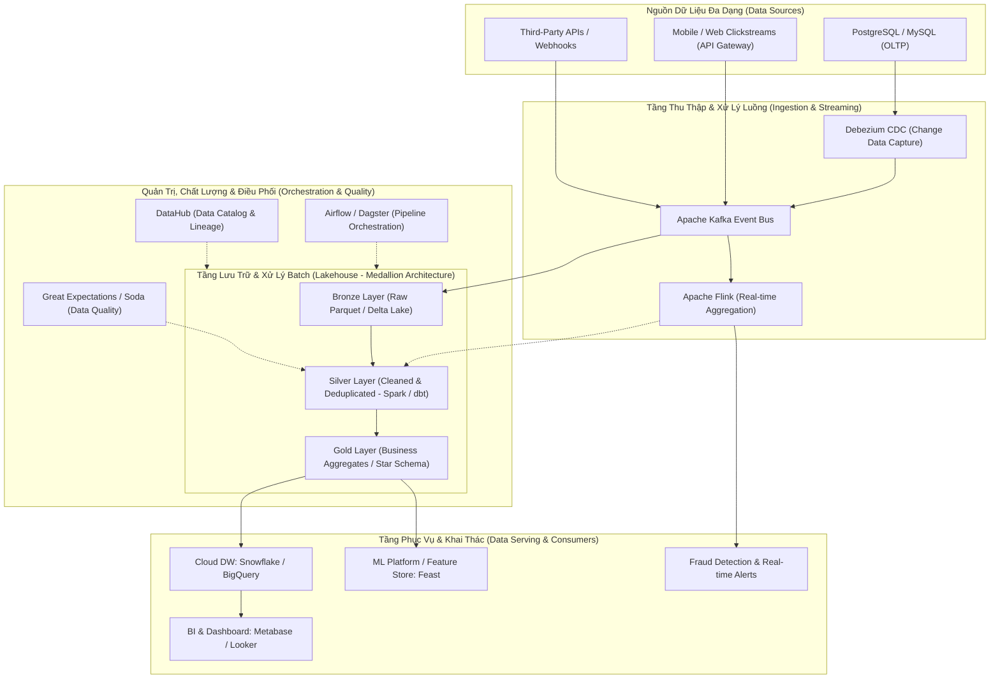

## 1. Đặt vấn đề & Tổng quan

Trong kỷ nguyên bùng nổ của Trí tuệ nhân tạo (AI), Học máy (Machine Learning) và Dữ liệu lớn (Big Data), có một câu châm ngôn kinh điển trong giới công nghệ: _'Without reliable data pipelines, AI is just math on a whiteboard'_ (Nếu không có những đường ống dữ liệu tin cậy, AI chỉ là những công thức toán học trên bảng trắng). Mọi mô hình Deep Learning tối tân, mọi thuật toán gợi ý hay bảng điều khiển kinh doanh (BI Dashboard) đều trở nên vô nghĩa nếu dữ liệu đầu vào bị sai lệch, phân mảnh hoặc chậm trễ.

**Kỹ sư Dữ liệu (Data Engineer - DE)** chính là những kiến trúc sư và thợ xây hạ tầng đứng sau bức màn đó. Nhiệm vụ cốt lõi của Data Engineer là thiết kế, xây dựng, vận hành và tối ưu hóa các hệ thống phân tán để thu thập, lưu trữ, chuyển đổi và phục vụ khối lượng dữ liệu khổng lồ (từ Gigabyte đến Petabyte) một cách **chính xác (Accurate)**, **tin cậy (Reliable)**, **bảo mật (Secure)** và **độ trễ thấp (Low-Latency)**.

Bài viết này sẽ mang đến một góc nhìn toàn cảnh về bức tranh nghề nghiệp Data Engineering, giải mã sự chuyển dịch từ các hệ thống Data Warehouse truyền thống sang **Modern Data Stack (Lakehouse Architecture)** và cung cấp một lộ trình năng lực chuẩn mực cho các kỹ sư phần mềm muốn làm chủ lĩnh vực này.

## 2. Đánh giá đa chiều / So sánh đối chuẩn

Để hiểu rõ vị trí của Data Engineer trong hệ sinh thái công nghệ, ta cần phân tích qua 2 lăng kính: Phân định vai trò nhân sự và So sánh các mô hình kiến trúc xử lý dữ liệu.

**1. Phân định Vai trò: Data Engineer vs Data Scientist vs Backend Engineer:**

<table style="width:100%; border-collapse: collapse; margin-bottom: 20px;">
  <thead>
    <tr style="border-bottom: 2px solid #e2e8f0; text-align: left;">
      <th style="padding: 8px;">Tiêu chí</th>
      <th style="padding: 8px;">Backend Engineer</th>
      <th style="padding: 8px;">Data Engineer</th>
      <th style="padding: 8px;">Data Scientist</th>
    </tr>
  </thead>
  <tbody>
    <tr style="border-bottom: 1px solid #edf2f7;">
      <td style="padding: 8px"><b>Mục tiêu cốt lõi</b></td>
      <td style="padding: 8px">Xây dựng nghiệp vụ ứng dụng OLTP, API, Microservices</td>
      <td style="padding: 8px">Xây dựng hạ tầng xử lý dữ liệu OLAP, Data Pipelines, Lakehouse</td>
      <td style="padding: 8px">Xây dựng mô hình thống kê, Machine Learning, trích xuất Insight</td>
    </tr>
    <tr style="border-bottom: 1px solid #edf2f7;">
      <td style="padding: 8px"><b>Kiểu hệ thống</b></td>
      <td style="padding: 8px">OLTP (Giao dịch ACID, CRUD từng bản ghi)</td>
      <td style="padding: 8px">OLAP / Streaming (Xử lý hàng tỷ bản ghi hàng loạt hoặc luồng)</td>
      <td style="padding: 8px">Thực nghiệm (Jupyter Notebook, Model Training, R&D)</td>
    </tr>
    <tr style="border-bottom: 1px solid #edf2f7;">
      <td style="padding: 8px"><b>Hộp công cụ chính</b></td>
      <td style="padding: 8px">Java/Go/Node.js, PostgreSQL, Redis, Docker, k8s</td>
      <td style="padding: 8px">Python/Scala, Spark, Kafka, Iceberg, dbt, Airflow, Snowflake</td>
      <td style="padding: 8px">Python/R, PyTorch, TensorFlow, Scikit-learn, Pandas</td>
    </tr>
    <tr>
      <td style="padding: 8px"><b>Thước đo thành công</b></td>
      <td style="padding: 8px">API Latency (p99 &lt; 50ms), Uptime 99.99%, Throughput</td>
      <td style="padding: 8px">Data Freshness, SLA Pipeline, Data Quality, Compute Cost</td>
      <td style="padding: 8px">Model Accuracy, F1-Score, Business Lift, ROI dự báo</td>
    </tr>
  </tbody>
</table>

**2. Sự Tiến hóa của Kiến trúc Xử lý Dữ liệu:**

- **ETL Truyền thống (Extract &rarr; Transform &rarr; Load):** Dữ liệu từ các database nguồn được trích xuất, chuyển đổi nghiệp vụ nặng nề trên các máy chủ trung gian (Informatica, SSIS), sau đó nạp vào kho Data Warehouse. _Điểm nghẽn:_ Server xử lý dễ quá tải khi dữ liệu tăng nhanh, chu kỳ triển khai kéo dài hàng tháng.
- **ELT Hiện đại (Extract &rarr; Load &rarr; Transform):** Nhờ sức mạnh tính toán mở rộng theo chiều ngang (Massively Parallel Processing - MPP) của Cloud Data Warehouses (Snowflake, BigQuery), dữ liệu thô được nạp thẳng vào kho trước (Load Raw), sau đó mới sử dụng SQL và **dbt (data build tool)** để biến đổi dữ liệu trực tiếp trong kho.
- **Kiến trúc Lakehouse (Data Lake + Data Warehouse):** Kết hợp dung lượng lưu trữ giá rẻ không giới hạn của Object Storage (S3, GCS) dưới định dạng mở (Apache Parquet, Apache Iceberg, Delta Lake) với khả năng thực thi giao dịch ACID và truy vấn SQL siêu tốc.

## 3. Kinh nghiệm thực chiến / Case Study

Để minh họa thực tế công việc của Data Engineer, dưới đây là kiến trúc nền tảng dữ liệu hiện đại (Modern Data Platform) xử lý hơn 100 triệu sự kiện/ngày trong một hệ sinh thái Thương mại điện tử & Fintech:

**Những bài học kỹ thuật xương máu khi xây dựng Data Pipeline:**

1. **Tính Bất biến & Khả năng Thực thi lại (Idempotency):** Một pipeline hoàn hảo phải đảm bảo: Khi chạy lại một tác vụ (Backfill hoặc Retry) với cùng một khoảng thời gian dữ liệu, kết quả cuối cùng trong kho không bao giờ bị nhân đôi (Duplicate) hay sai lệch số liệu. Kỹ thuật Partition Overwrite và Merge-on-Read là chìa khóa.
2. **Hợp đồng Dữ liệu (Data Contracts):** Tránh việc các kỹ sư Backend tự ý đổi tên cột hoặc kiểu dữ liệu trong cơ sở dữ liệu làm sập toàn bộ hệ thống báo cáo phía sau. Áp dụng Schema Registry (Avro / Protobuf) để quản lý phiên bản schema chặt chẽ.
3. **Chiến lược Phân tầng Medallion (Bronze &rarr; Silver &rarr; Gold):** Luôn lưu trữ nguyên vẹn dữ liệu thô (Bronze) để có thể phục hồi trong mọi tình huống thảm họa, làm sạch và chuẩn hóa ở tầng Silver, và chỉ cung cấp các bảng tổng hợp nghiệp vụ đã tối ưu cho người dùng cuối ở tầng Gold.

## 4. Gợi ý hành động

Bản đồ lộ trình kỹ năng (Skill Matrix) dành cho kỹ sư muốn chuyển hướng hoặc phát triển chuyên sâu trong ngành Data Engineering:

1. **Kỹ năng Lập trình & Khoa học Máy tính Nền tảng:**

- Thành thạo **Python** (xử lý dữ liệu, scripting, tương tác API) và **SQL nâng cao** (Window functions, CTEs, tối ưu Explain Plan).
- Hiểu sâu về Thuật toán, Cấu trúc dữ liệu và Kiến trúc bộ nhớ (Memory/CPU cache, I/O bound vs CPU bound).
- Khuyến khích học thêm **Scala/Java** hoặc **Rust** để làm việc với các hệ thống phân tán lõi.

2. **Mô hình hóa Dữ liệu (Data Modeling):**

- Nắm vững phương pháp mô hình hóa chiều Kimball Dimensional Modeling (Fact Tables, Dimension Tables, Star Schema, Snowflake Schema).
- Hiểu rõ kiến trúc Data Vault và kỹ thuật Slow Changing Dimensions (SCD Type 1, 2, 3).

3. **Tính toán Phân tán & Công cụ Xử lý Dữ liệu Lớn:**

- Làm chủ **Apache Spark**: Hiểu rõ cơ chế RDD, DataFrame, cơ chế tối ưu hóa Catalyst Optimizer, bộ quản lý bộ nhớ Tungsten và cách giải quyết hiện tượng Data Skew (lệch dữ liệu giữa các partition).
- Làm chủ công cụ chuyển đổi hiện đại: **dbt (data build tool)** kết hợp với kho dữ liệu Snowflake/BigQuery.

4. **Hệ thống Xử lý Luồng & Điều phối (Streaming & Orchestration):**

- Xây dựng đường ống sự kiện với **Apache Kafka** (Topics, Partitions, Consumer Groups, Exactly-Once Semantics).
- Lập lịch và quản lý DAG phụ thuộc phức tạp với **Apache Airflow** hoặc **Dagster**.

5. **Văn hóa DataOps & Chất lượng Dữ liệu:**

- Tự động hóa kiểm thử dữ liệu với `dbt test`, `Great Expectations` hoặc `Soda`.
- Thiết lập hệ thống CI/CD cho mã nguồn data pipeline và theo dõi nguồn gốc dữ liệu (Data Lineage).

## 5. Câu hỏi mở, thảo luận

Những xu hướng công nghệ nổi bật đang định hình lại tương lai của Data Engineering mà cộng đồng đang thảo luận sôi nổi:

- **Data Mesh vs Centralized Lakehouse:** Doanh nghiệp nên tiếp tục duy trì một đội ngũ dữ liệu tập trung (Centralized Team) quản lý toàn bộ Data Platform hay phân quyền quyền sở hữu dữ liệu (Domain-Driven Data Ownership) về từng phòng ban nghiệp vụ độc lập?
- **Ảnh hưởng của Generative AI lên Data Engineering:** AI có thể tự động viết các câu lệnh SQL và pipeline dbt, nhưng vai trò của Data Engineer sẽ dịch chuyển mạnh mẽ sang việc định nghĩa **Semantic Layer**, thiết lập **Data Quality Guardrails** và xây dựng hạ tầng **RAG / Vector Database Pipelines** phục vụ các mô hình LLM.
- **Sự thống trị của định dạng bảng mở (Open Table Formats):** Liệu cuộc cạnh tranh giữa Apache Iceberg, Delta Lake và Apache Hudi sẽ kết thúc bằng sự hội tụ về chuẩn Apache Iceberg trên toàn bộ các nền tảng đám mây lớn (AWS, GCP, Snowflake, Databricks)?

**Góc thảo luận:** _Theo bạn, thách thức lớn nhất khi xây dựng một hệ thống dữ liệu quy mô lớn trong thực tế nằm ở khía cạnh công nghệ (Tools/Frameworks) hay ở khía cạnh quy trình quản trị dữ liệu (Data Governance & Data Culture)? Hãy chia sẻ góc nhìn của bạn!_
