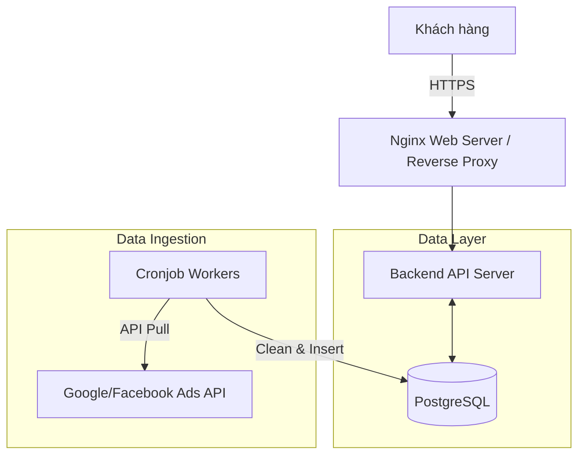

## Bối cảnh & Vấn đề

Một digital agency vừa ra mắt nền tảng portal cho phép khách hàng tự đăng nhập để theo dõi hiệu quả các chiến dịch quảng cáo (Google Ads, Facebook Ads) hàng ngày. Nhu cầu ban đầu không quá lớn, dự kiến hệ thống phục vụ khoảng 100 người dùng truy cập đồng thời (CCU) vào các khung giờ cao điểm (sáng sớm hoặc đầu tháng). Vấn đề cốt lõi là xây dựng một hệ thống đủ nhanh, chi phí vận hành thấp và thời gian ra mắt ngắn nhất có thể.

## Yêu cầu hệ thống

- **Hiệu năng:** Thời gian tải dashboard báo cáo dưới 2 giây.
- **Khả năng chịu tải:** 100 CCU, trung bình mỗi user gọi 3-5 API requests để load các biểu đồ khác nhau.
- **Dữ liệu:** Không yêu cầu real-time. Dữ liệu được phép trễ (delay) từ 1 đến 24 giờ (cập nhật theo batch).
- **Độ sẵn sàng (Availability):** 99%, có thể chấp nhận downtime ngắn vào ban đêm để bảo trì hoặc chạy batch job nặng.

## Thiết kế kiến trúc

Với quy mô 100 CCU, kiến trúc Monolithic kết hợp với một cơ sở dữ liệu quan hệ truyền thống là lựa chọn tối ưu.

- **Web Server / Proxy:** Nginx xử lý HTTPS termination và serve các static assets của frontend.
- **Backend API:** Một instance chạy framework backend chịu trách nhiệm xác thực, phân quyền và query dữ liệu báo cáo.
- **Database:** PostgreSQL được sử dụng làm cơ sở dữ liệu duy nhất (OLTP lẫn OLAP nhẹ). Dữ liệu quảng cáo được bóc tách và lưu vào các bảng đã được chuẩn hóa.
- **Data Ingestion:** Các script chạy qua Cronjob theo lịch định kỳ (ví dụ: mỗi 4 tiếng) gọi API từ các nền tảng quảng cáo, xử lý và ghi vào PostgreSQL.

## Phân tích đánh đổi

- **Chi phí vs. Khả năng mở rộng:** Kiến trúc này cực kỳ tiết kiệm, có thể chạy toàn bộ trên 1 hoặc 2 VPS nhỏ. Tuy nhiên, khi dữ liệu lịch sử phình to ra hàng chục triệu dòng, việc query trực tiếp bằng câu lệnh SQL thông thường sẽ bắt đầu gây quá tải CPU của database.
- **Đơn giản vs. Điểm chết duy nhất (SPOF):** Hệ thống gom chung mọi thứ (API, Database, Worker) dẫn đến rủi ro. Nếu một worker chạy lỗi gây rò rỉ bộ nhớ hoặc full disk, toàn bộ API sẽ sập theo.

## Bài học thực tế & Best Practices

1.  **Dùng Materialized Views:** Không query trực tiếp các hàm `SUM()`, `COUNT()` trên bảng raw data (dữ liệu thô) khi user mở dashboard. Hãy tạo các Materialized Views tổng hợp sẵn dữ liệu theo từng ngày/từng chiến dịch và refresh chúng trong background.
2.  **Đánh Index đúng chuẩn:** Ánh xạ các query pattern của dashboard để tạo Composite Index. Ví dụ: Index trên `(client_id, campaign_id, date)` sẽ cứu hệ thống khỏi cảnh Full Table Scan.
3.  **Tách riêng Worker:** Dù hệ thống nhỏ, tiến trình gọi API quảng cáo (Cronjob) cần được cô lập tài nguyên để không tranh giành CPU với tiến trình phục vụ API cho end-user.
