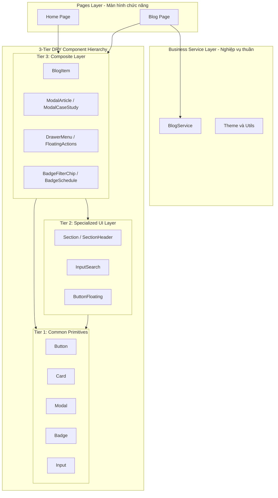

## Bối cảnh & Vấn đề

Khi ứng dụng Single Page Application (SPA) phát triển quy mô tính năng, một hội chứng kiến trúc rất phổ biến là 'Component Thần thánh' (God Component) hoặc việc pha trộn lẫn lộn giữa logic giao diện (Presentation), logic trạng thái (State) và logic xử lý dữ liệu (Data Hydration/Fetching).

Trong codebase ban đầu, component `BlogSection` và `App.tsx` phải gánh vác quá nhiều trọng trách: vừa quản lý routing, theme, vừa xử lý logic bóc tách thẻ HTML, lọc bài viết, vừa render danh sách card trực tiếp. Điều này dẫn đến sự lặp lại mã nguồn (WET), phá vỡ nguyên lý Đơn nhiệm (Single Responsibility Principle) và khiến các bài kiểm thử tự động (Unit Tests) trở nên cồng kềnh, dễ gãy.

## Yêu cầu hệ thống

Để giải quyết dứt điểm các điểm nghẽn kiến trúc trên, hệ thống cần đáp ứng các yêu cầu thiết kế cốt lõi:

1. **Phân tầng rõ ràng (Separation of Concerns):** Tách biệt rạch ròi giữa UI nguyên tử (Primitives), UI chuyên biệt (Specialized UI), Component phức hợp (Composite), Dịch vụ nghiệp vụ (Business Services) và Màn hình chính (Pages).
2. **Áp dụng triệt để nguyên lý DRY:** Loại bỏ các đoạn mã HTML/CSS lặp lại thông qua kỹ thuật Component Composition (Lắp ghép component nhỏ).
3. **Decoupled Business Service Layer:** Toàn bộ logic bóc tách archive theo tháng/năm, hydration bài viết và thuật toán lọc/sắp xếp phải được đưa vào tầng Service thuần TypeScript, không phụ thuộc vào React Component Lifecycle.
4. **Type Safety & High Testability:** 100% thành phần có interface tường minh và có thể viết unit test độc lập mà không cần mock cây DOM phức tạp.

## Thiết kế kiến trúc

Tôi xây dựng mô hình kiến trúc phân tầng 3 lớp UI kết hợp Service Layer độc lập theo sơ đồ chuẩn:

**Chi tiết vai trò của từng tầng kiến trúc:**

- **Tier 1 - Common Primitives (`src/components/common`):** Các thành phần nền móng (`Button`, `Card`, `Badge`, `Input`, `Modal`) hoàn toàn phi trạng thái (stateless) hoặc chỉ chứa UI-state tối thiểu, tuân thủ nghiêm ngặt Design Tokens và semantic HTML.
- **Tier 2 - Specialized UI (`src/components/ui`):** Kế thừa từ Tier 1 nhưng được chuyên biệt hóa cao độ (ví dụ: `InputSearch` tích hợp icon kính lúp và nút xóa nhanh, `ButtonFloating` tích hợp hiệu ứng phát sáng neon glow).
- **Tier 3 - Composite Components (`src/components/composite`):** Lắp ghép nhiều thành phần Tier 1 & Tier 2 để tạo thành widget chức năng hoàn chỉnh. Điển hình như `BlogItem` đóng gói `Card` + `Badge` + `TechTagList` + `Button` đọc bài; `ModalArticle` tích hợp `Modal` + `TocSidebar` scrollspy.
- **Business Services (`src/services`):** Chứa toàn bộ nghiệp vụ (dynamic import glob, date parsing, section assembling), giúp UI component chỉ tập trung vào việc hiển thị.
- **Pages Layer (`src/pages`):** Đóng gói các màn hình hoàn chỉnh (`Home.tsx`, `Blog.tsx`), giúp `App.tsx` trở thành Root Router cực kỳ tinh gọn.

## Phân tích đánh đổi

**Lợi ích đạt được:**

- _Tính tái sử dụng cực cao:_ Mọi thay đổi về giao diện nút bấm hoặc thẻ card chỉ cần cập nhật tại 1 nơi duy nhất trong `common/`.
- _Khả năng bảo trì & mở rộng:_ Thêm mới trang hoặc chuyên đề blog không làm ảnh hưởng đến mã nguồn hiện tại.
- _Testability:_ Dễ dàng viết unit test cho từng tầng với độ phủ 100%.

**Chi phí đánh đổi:**

- _Số lượng file tăng lên:_ Cần quản lý cấu trúc thư mục phân tầng chặt chẽ và tạo các barrel export (`index.ts`) tương ứng.
- _Kỷ luật đội ngũ:_ Đòi hỏi mọi thành viên tuân thủ nghiêm ngặt quy tắc: không import ngược từ tầng dưới lên tầng trên.

## Bài học thực tế & Best Practices

- **Ưu tiên Composition thay vì Inheritance:** Sử dụng cấu trúc Compound Components (như `Card.Header`, `Card.Body`, `Card.Footer`) thay vì truyền quá nhiều props cấu hình phức tạp.
- **Quy ước đặt tên nhất quán:** Áp dụng tiền tố kế thừa rõ ràng như `ModalCaseStudy`, `BadgeSchedule`, `ButtonFloatingScrollTop` giúp bất kỳ ai nhìn vào tên file cũng nhận diện được vai trò và nguồn gốc component.
- **Triệt tiêu coupling trong CSS:** Loại bỏ các thuộc tính layout cứng (inline styles) trên component dùng chung để component con hoàn toàn linh hoạt theo layout cha (Flexbox/Grid).
