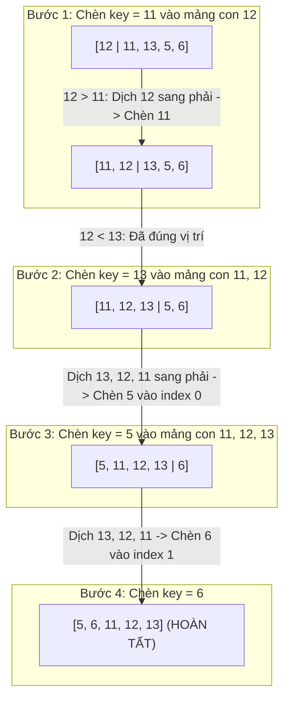

## Mô tả bài toán

Trong xử lý luồng dữ liệu thời gian thực (Data Streaming), dữ liệu đến từng phần tử một và cần được duy trì trạng thái đã sắp xếp liên tục. Đề bài đặt ra: Làm sao để chèn một phần tử mới vào mảng con đã có thứ tự với chi phí tính toán thấp nhất?

Sắp xếp Chèn (Insertion Sort) mô phỏng chính xác hành vi sắp xếp các quân bài trên tay của con người: Rút từng quân bài mới và chèn vào đúng vị trí thích hợp trong bộ bài đã sắp xếp trước đó.

## Ý tưởng tiếp cận ban đầu

Cách tiếp cận ngây thơ:

- Mỗi khi lấy phần tử mới `arr[i]`, hoán đổi liên tục lùi dần về đầu mảng bằng hàm `std::swap`.
- _Điểm nghẽn:_ Mỗi phép `std::swap` tốn 3 phép gán bộ nhớ (sử dụng biến tạm), dẫn đến lãng phí tài nguyên CPU khi phải dời nhiều phần tử.

## Tư duy tối ưu & Cấu trúc thuật toán

Cơ chế Dịch chuyển (Shifting) và Tính thích ứng của Insertion Sort:

1. **Kỹ thuật Dịch chuyển một chiều (Subarray Shifting):** Thay vì swap liên tục, lưu giá trị cần chèn vào biến `key = arr[i]`. Chỉ dịch chuyển các phần tử lớn hơn `key` sang phải 1 vị trí (`arr[j + 1] = arr[j]`), sau đó đặt `key` vào vị trí trống duy nhất `arr[j + 1] = key`. Tiết kiệm 66% thao tác gán bộ nhớ.
2. **Tính thích ứng cao (Adaptive Sorting):** Với các mảng gần như đã sắp xếp (Nearly Sorted Arrays), vòng lặp trong dừng gần như ngay lập tức sau 1 phép so sánh &rarr; Thời gian thực thi đạt tuyến tính siêu tốc `Ω(N)`.
3. **Thuật toán trực tuyến (Online Algorithm):** Có thể sắp xếp dữ liệu ngay khi đang nhận từng phần tử từ luồng mạng mà không cần biết trước toàn bộ kích thước N.

## Triển khai mã nguồn & Dry Run

Minh họa quá trình dịch chuyển và chèn phần tử `key` trong mảng `[12, 11, 13, 5, 6]`:



**Mã nguồn C++ chuẩn hóa:**

```c++
#include <iostream>
#include <vector>

// Thuật toán Insertion Sort: Kỹ thuật dịch chuyển mảng con thích ứng
void insertionSort(std::vector<int>& arr) {
    int n = static_cast<int>(arr.size());
    for (int i = 1; i < n; ++i) {
        int key = arr[i];
        int j = i - 1;
        // Dịch các phần tử lớn hơn key sang phải 1 vị trí
        while (j >= 0 && arr[j] > key) {
            arr[j + 1] = arr[j];
            --j;
        }
        // Đặt key vào khoảng trống thích hợp
        arr[j + 1] = key;
    }
}

int main() {
    std::vector<int> data = {12, 11, 13, 5, 6};
    insertionSort(data);
    std::cout << "Mảng sau sắp xếp: ";
    for (int x : data) std::cout << x << " ";
    std::cout << std::endl;
    return 0;
}
```

**Phân tích luồng thực thi (Dry Run Trace):**

- _Khởi tạo:_ `data = {12, 11, 13, 5, 6}` (`N = 5`). Mảng con đã sắp ban đầu là `{12}`.
- _Pass `i = 1`:_ `key = 11`. `j = 0`: `arr[0] = 12 > 11` `->` Gán `arr[1] = 12`, `j = -1` (dừng). Gán `arr[0] = 11` `->` Mảng: `{11, 12, 13, 5, 6}`.
- _Pass `i = 2`:_ `key = 13`. `j = 1`: `arr[1] = 12 < 13` (dừng ngay). Gán `arr[2] = 13` `->` Mảng: `{11, 12, 13, 5, 6}`.
- _Pass `i = 3`:_ `key = 5`. Dịch lần lượt 13, 12, 11 sang phải `->` Gán `arr[0] = 5` `->` Mảng: `{5, 11, 12, 13, 6}`.
- _Pass `i = 4`:_ `key = 6`. Dịch 13, 12, 11 sang phải `->` Gán `arr[1] = 6` `->` Mảng: `{5, 6, 11, 12, 13}`.

## Đánh giá độ phức tạp & Ứng dụng thực tế

**Đánh giá Hiệu năng theo Framework Chuẩn:**

1. **Worst-Case Time Complexity (`O`):** `O(N²)` khi mảng nghịch đảo hoàn toàn.
2. **Best-Case Time Complexity (`Ω`):** `Ω(N)` khi mảng đã sắp xếp (vòng lặp while chỉ chạy 1 lần so sánh mỗi pass).
3. **Average-Case Time Complexity (`Θ`):** `Θ(N²)` trên phân phối ngẫu nhiên.
4. **Auxiliary Space Complexity:** `O(1)` - In-place thuần túy.
5. **Tính ổn định (Stability):** Ổn định (Stable).

**Ứng dụng thực tế:** Là thuật toán con cốt lõi trong các thuật toán lai tiêu chuẩn công nghiệp như **TimSort** (trong Python, Java) và **Introsort** (trong C++ `std::sort`) khi kích thước mảng con giảm xuống `N <= 16 - 32`.
