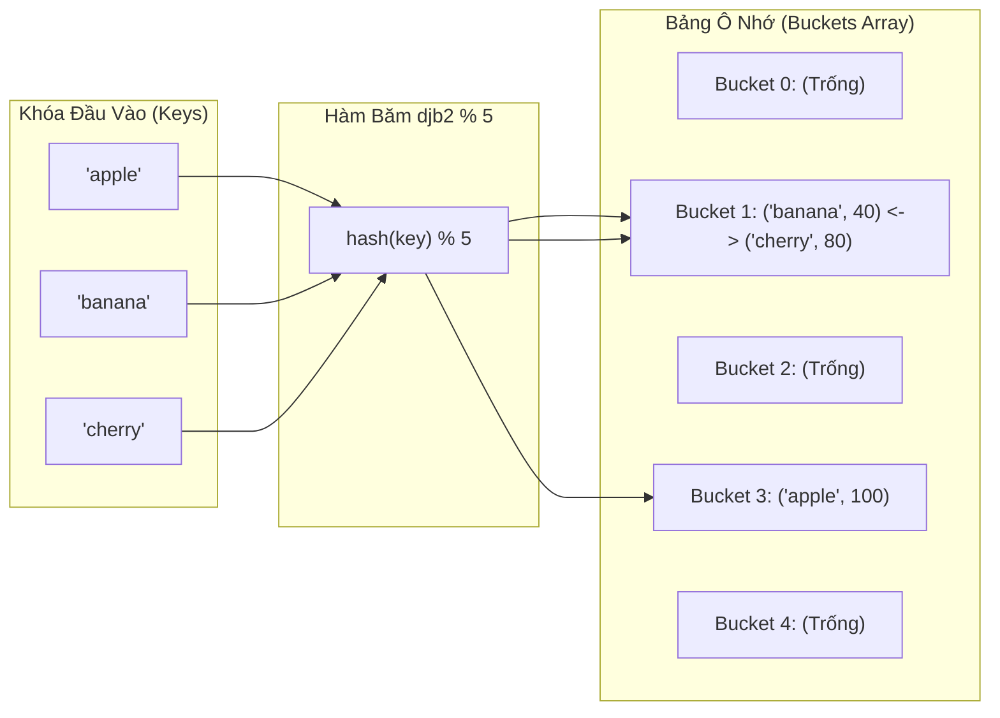

## Mô tả bài toán

Trong các ứng dụng hiệu năng cao (như hệ thống quản lý phiên người dùng User Session Store, chỉ mục cơ sở dữ liệu Database Indexing, hay bộ nhớ đệm phân tán Redis), thao tác tra cứu dữ liệu theo Khóa (Key-Value Lookup) diễn ra hàng triệu lần mỗi giây. Nếu sử dụng Mảng hoặc Danh sách liên kết, chi phí tìm kiếm tuyến tính `O(N)` sẽ làm sập toàn bộ hệ thống khi quy mô dữ liệu vượt quá hàng triệu bản ghi.

**Bảng băm (Hash Table / Hash Map)** là cấu trúc dữ liệu mang tính cách mạng, cho phép thực hiện cả 3 thao tác **Thêm (Insert)**, **Xóa (Delete)** và **Tra cứu (Lookup)** trong **thời gian trung bình hằng số `O(1)`**, bất kể kích thước tập dữ liệu lớn đến mức nào.

## Ý tưởng tiếp cận ban đầu

Bản chất của Bảng băm là sử dụng một **Hàm băm (Hash Function)** để chuyển đổi khóa đầu vào (chuỗi ký tự, đối tượng phức tạp) thành một chỉ số số nguyên đại diện cho vị trí ô nhớ (Bucket) trong mảng:

```
bucket_index = hash(key) % capacity
```

Thách thức toán học cốt tử: Theo _Nguyên lý chuồng bồ câu (Pigeonhole Principle)_, vì không gian các khóa có thể có là vô hạn trong khi kích thước mảng băm là hữu hạn, luôn luôn tồn tại trường hợp **hai khóa khác nhau cùng sinh ra một chỉ số ô nhớ (`hash(k₁) % M == hash(k₂) % M`)**. Hiện tượng này gọi là **Đụng độ băm (Hash Collision)**.

## Tư duy tối ưu & Cấu trúc thuật toán

Để giải quyết đụng độ và duy trì hiệu năng `O(1)`, hai chiến lược kiến trúc kinh điển được áp dụng:

1. **Phương pháp Dây chuyền Tách biệt (Separate Chaining):**

- Mỗi ô nhớ (Bucket) của bảng băm là một Danh sách liên kết (Linked List) hoặc Cây đỏ đen (Red-Black Tree khi chuỗi dài &gt; 8).
- Khi xảy ra đụng độ, cặp `{key, value}` mới chỉ việc được thêm vào danh sách tại bucket đó trong `O(1)`.
- Đây là cơ chế mặc định trong `std::unordered_map` của C++ và `HashMap` của Java.

2. **Phương pháp Địa chỉ Mở (Open Addressing / Linear Probing):**

- Mọi phần tử đều nằm trực tiếp trong mảng. Khi ô `bucket` bị chiếm dụng, thuật toán dò tiếp các ô lân cận `(bucket + 1) % capacity` cho đến khi tìm thấy ô trống.

3. **Kiểm soát Hệ số tải & Tái băm (Load Factor & Dynamic Rehashing):**

- Hệ số tải `alpha = N / capacity` biểu thị mức độ đầy của bảng.
- Khi `alpha >= 0.75`, bảng băm tự động cấp phát mảng mới có kích thước gấp đôi (`capacity x 2`) và băm lại toàn bộ các phần tử (Rehashing) để bảo toàn độ phức tạp trung bình `O(1)`.

## Triển khai mã nguồn & Dry Run

Sơ đồ ánh xạ hàm băm và giải quyết đụng độ bằng Separate Chaining:



**Mã nguồn C++ hoàn chỉnh: HashTable tùy biến với Separate Chaining:**

```c++
#include <iostream>
#include <vector>
#include <list>
#include <string>
#include <utility>

template <typename K, typename V>
class HashTable {
private:
    struct Entry {
        K key;
        V value;
    };

    std::vector<std::list<Entry>> table;
    size_t numElements;
    size_t capacity;

    // Hàm băm polynomial djb2 cho kiểu std::string
    size_t hashFunction(const std::string& key) const {
        unsigned long hash = 5381;
        for (char c : key) {
            hash = ((hash << 5) + hash) + static_cast<unsigned char>(c);
        }
        return hash % capacity;
    }

    void rehash() {
        size_t oldCapacity = capacity;
        capacity *= 2;
        std::vector<std::list<Entry>> oldTable = std::move(table);
        table.resize(capacity);
        numElements = 0;

        for (size_t i = 0; i < oldCapacity; ++i) {
            for (const auto& entry : oldTable[i]) {
                insert(entry.key, entry.value);
            }
        }
    }

public:
    HashTable(size_t initialCapacity = 7)
        : numElements(0), capacity(initialCapacity) {
        table.resize(capacity);
    }

    void insert(const K& key, const V& value) {
        if (static_cast<double>(numElements) / capacity >= 0.75) {
            rehash();
        }

        size_t bucket = hashFunction(key);
        for (auto& entry : table[bucket]) {
            if (entry.key == key) {
                entry.value = value; // Cập nhật nếu khóa đã tồn tại
                return;
            }
        }
        table[bucket].push_back({key, value});
        ++numElements;
    }

    bool get(const K& key, V& outValue) const {
        size_t bucket = hashFunction(key);
        for (const auto& entry : table[bucket]) {
            if (entry.key == key) {
                outValue = entry.value;
                return true;
            }
        }
        return false;
    }

    bool remove(const K& key) {
        size_t bucket = hashFunction(key);
        for (auto it = table[bucket].begin(); it != table[bucket].end(); ++it) {
            if (it->key == key) {
                table[bucket].erase(it);
                --numElements;
                return true;
            }
        }
        return false;
    }

    size_t size() const { return numElements; }
};

int main() {
    HashTable<std::string, int> ht;

    std::cout << "--- DEMO BANG BAM (HASH TABLE SEPARATE CHAINING) ---" << std::endl;
    ht.insert("apple", 100);
    ht.insert("banana", 40);
    ht.insert("cherry", 80);

    int val;
    if (ht.get("banana", val)) {
        std::cout << "Gia tri cua 'banana': " << val << std::endl;
    }

    ht.remove("banana");
    std::cout << "Tim lai 'banana' sau khi xoa: "
              << (ht.get("banana", val) ? "TIM THAY" : "KHONG TIM THAY") << std::endl;

    return 0;
}
```

**Phân tích luồng thực thi chi tiết (Dry Run Trace):**

- _Khởi tạo:_ `capacity = 7, numElements = 0`.
- _Thêm "apple" (val 100):_ `hash("apple") % 7 = 3` &rarr; Đưa vào `table[3]`. `numElements = 1`.
- _Thêm "banana" (val 40):_ `hash("banana") % 7 = 1` &rarr; Đưa vào `table[1]`. `numElements = 2`.
- _Thêm "cherry" (val 80):_ `hash("cherry") % 7 = 1` (Đụng độ với banana!) &rarr; Thêm vào danh sách liên kết tại `table[1]`. `table[1] = [banana, cherry]`.
- _Tra cứu "banana":_ Băm ra bucket 1 &rarr; Quét phần tử đầu tiên của danh sách, thấy khóa "banana" &rarr; Trả về `40` trong `O(1)`.

## Đánh giá độ phức tạp & Ứng dụng thực tế

- **Thao tác Trung bình (Average Case):** `O(1)` cho cả Insert, Delete, và Lookup khi hàm băm phân phối đồng đều.
- **Trường hợp Xấu nhất (Worst Case):** `O(N)` khi tất cả các khóa đều bị băm về cùng một bucket (được khắc phục bằng cách dùng Red-Black Tree nâng cấp lên `O(\log N)`).
- **Độ phức tạp Không gian (Space Complexity):** `O(N + M)` với `N` là số phần tử và `M` là kích thước mảng bucket.
- **Ứng dụng thực tế:**
  - **Hệ thống Database Indexing:** Hash Indexes trong PostgreSQL / MySQL Memory Engine cho các phép so sánh bằng (`=`).
  - **Bộ nhớ đệm trong Bộ nhớ (In-Memory Cache):** Redis và Memcached lưu trữ cặp Key-Value siêu tốc.
  - **Trình biên dịch & Thông dịch viên:** Bảng ký hiệu (Symbol Table) quản lý tên biến, hàm và phạm vi tầm vực (Scope).
