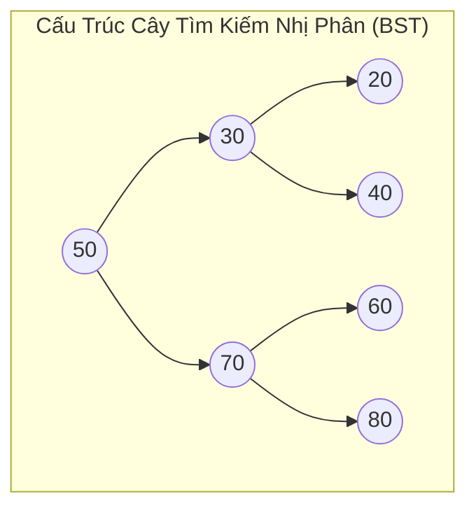

## Mô tả bài toán

Các cấu trúc dữ liệu tuyến tính (Mảng, Danh sách liên kết, Ngăn xếp, Hàng chờ) chỉ biểu diễn dữ liệu theo một chiều tuần tự. Tuy nhiên, trong thế giới thực, thông tin thường có **mối quan hệ phân cấp có thứ bậc (Hierarchical Relationships)** - như cấu trúc thư mục tệp tin (File System Hierarchy), cây phân tích cú pháp DOM trong trình duyệt (HTML DOM Tree), hay cây quyết định trong trí tuệ nhân tạo.

**Cây (Tree)** là cấu trúc dữ liệu phi tuyến tính gồm một tập hợp các nút được kết nối bởi các cạnh có hướng, bắt đầu từ một nút duy nhất gọi là **Nút gốc (Root)** và không chứa bất kỳ chu trình nào.

Cấu trúc cây quan trọng bậc nhất là **Cây Tìm kiếm Nhị phân (Binary Search Tree - BST)**: Mỗi nút có tối đa 2 nút con (Con trái `left` và Con phải `right`), thỏa mãn **Bất biến BST (BST Invariant)**:

```
Mọi nút trong cây con Trái < Nút Gốc < Mọi nút trong cây con Phải
```

## Ý tưởng tiếp cận ban đầu

Tại sao BST lại vượt trội hơn Mảng và Danh sách liên kết?

- Mảng đã sắp xếp: Tìm kiếm nhanh `O(\log N)` qua Binary Search, nhưng Chèn/Xóa cực kỳ chậm `O(N)`.
- Danh sách liên kết: Chèn/Xóa nhanh `O(1)` tại nút biết trước, nhưng Tìm kiếm chậm `O(N)`.
- **BST kết hợp hoàn hảo ưu điểm của cả hai:** Cung cấp khả năng Tìm kiếm `O(\log N)`, Chèn `O(\log N)` và Xóa `O(\log N)` trong điều kiện cây cân bằng.

## Tư duy tối ưu & Cấu trúc thuật toán

**Bốn Thuật toán Duyệt Cây Chuẩn mực (Tree Traversals):**

1. **Duyệt Trung thứ tự (In-order Traversal: Left &rarr; Root &rarr; Right):** Thăm cây con trái, thăm gốc, thăm cây con phải. _Tính chất kỳ diệu:_ Phép duyệt In-order trên cây BST luôn sinh ra một dãy giá trị **được sắp xếp tăng dần hoàn hảo**.
2. **Duyệt Tiền thứ tự (Pre-order Traversal: Root &rarr; Left &rarr; Right):** Thăm gốc trước, dùng để sao chép cây hoặc tuần tự hóa (Serialization).
3. **Duyệt Hậu thứ tự (Post-order Traversal: Left &rarr; Right &rarr; Root):** Thăm hai con trước, thăm gốc sau cùng, bắt buộc dùng khi giải phóng bộ nhớ (hủy cây từ lá lên gốc) hoặc tính dung lượng thư mục.
4. **Duyệt Theo Tầng (Level-order Traversal / BFS):** Duyệt từng tầng từ trên xuống dưới bằng Hàng chờ (Queue).

**Thao tác Xóa nút trên BST (BST Deletion - 3 kịch bản):**

- _Kịch bản 1 (Nút lá - 0 con):_ Xóa trực tiếp và gán con trỏ cha về `nullptr`.
- _Kịch bản 2 (Nút có 1 con):_ Nối trực tiếp nút con duy nhất vào nút cha của nút bị xóa.
- _Kịch bản 3 (Nút có đủ 2 con):_ Tìm **Phần tử Kế tiếp theo thứ tự (In-order Successor)** - tức là nút nhỏ nhất trong cây con Phải. Sao chép giá trị của Successor vào nút hiện tại, sau đó xóa đệ quy Successor khỏi cây con Phải.

## Triển khai mã nguồn & Dry Run

Sơ đồ cấu trúc Cây tìm kiếm nhị phân và thứ tự duyệt In-Order:



**Mã nguồn C++ hoàn chỉnh: Binary Search Tree đầy đủ Chèn, Xóa, Tìm kiếm & Duyệt:**

```c++
#include <iostream>
#include <queue>

class BinarySearchTree {
private:
    struct TreeNode {
        int val;
        TreeNode* left;
        TreeNode* right;
        TreeNode(int x) : val(x), left(nullptr), right(nullptr) {}
    };

    TreeNode* root;

    // Chèn đệ quy
    TreeNode* insertInternal(TreeNode* node, int val) {
        if (node == nullptr) return new TreeNode(val);
        if (val < node->val) {
            node->left = insertInternal(node->left, val);
        } else if (val > node->val) {
            node->right = insertInternal(node->right, val);
        }
        return node;
    }

    // Tìm kiếm đệ quy
    bool searchInternal(TreeNode* node, int val) const {
        if (node == nullptr) return false;
        if (node->val == val) return true;
        if (val < node->val) return searchInternal(node->left, val);
        return searchInternal(node->right, val);
    }

    // Tìm nút có giá trị nhỏ nhất trong cây con
    TreeNode* findMin(TreeNode* node) const {
        while (node && node->left != nullptr) {
            node = node->left;
        }
        return node;
    }

    // Xóa đệ quy
    TreeNode* removeInternal(TreeNode* node, int val) {
        if (node == nullptr) return nullptr;

        if (val < node->val) {
            node->left = removeInternal(node->left, val);
        } else if (val > node->val) {
            node->right = removeInternal(node->right, val);
        } else {
            // Đã tìm thấy nút cần xóa!
            // Trường hợp 1 & 2: Có 0 hoặc 1 con
            if (node->left == nullptr) {
                TreeNode* temp = node->right;
                delete node;
                return temp;
            } else if (node->right == nullptr) {
                TreeNode* temp = node->left;
                delete node;
                return temp;
            }
            // Trường hợp 3: Có đủ 2 con -> Tìm In-order Successor
            TreeNode* successor = findMin(node->right);
            node->val = successor->val;
            node->right = removeInternal(node->right, successor->val);
        }
        return node;
    }

    void inOrderInternal(TreeNode* node) const {
        if (node == nullptr) return;
        inOrderInternal(node->left);
        std::cout << node->val << " ";
        inOrderInternal(node->right);
    }

    void destroyTree(TreeNode* node) {
        if (node == nullptr) return;
        destroyTree(node->left);
        destroyTree(node->right);
        delete node;
    }

public:
    BinarySearchTree() : root(nullptr) {}
    ~BinarySearchTree() { destroyTree(root); }

    void insert(int val) { root = insertInternal(root, val); }
    bool search(int val) const { return searchInternal(root, val); }
    void remove(int val) { root = removeInternal(root, val); }

    void printInOrder() const {
        std::cout << "In-Order Traversal (Sorted): ";
        inOrderInternal(root);
        std::cout << std::endl;
    }
};

int main() {
    BinarySearchTree bst;

    std::cout << "--- DEMO CAY TIM KIEM NHI PHAN (BST) ---" << std::endl;
    bst.insert(50);
    bst.insert(30);
    bst.insert(70);
    bst.insert(20);
    bst.insert(40);
    bst.insert(60);
    bst.insert(80);

    bst.printInOrder(); // 20 30 40 50 60 70 80

    std::cout << "Tim kiem gia tri 40: " << (bst.search(40) ? "TIM THAY" : "KHONG") << std::endl;

    std::cout << "Xoa nut goc 50 (Nut co 2 con)..." << std::endl;
    bst.remove(50);
    bst.printInOrder(); // 20 30 40 60 70 80

    return 0;
}
```

**Phân tích luồng thực thi chi tiết (Dry Run Trace):**

- _Chèn các giá trị:_ `50, 30, 70, 20, 40, 60, 80`.
  - `30 < 50` &rarr; Con trái của 50. `70 > 50` &rarr; Con phải của 50.
  - `40 > 30` &rarr; Con phải của 30. `60 < 70` &rarr; Con trái của 70.
- _Duyệt In-order:_ Thăm cây con trái của 50 (`20, 30, 40`) &rarr; Gốc `50` &rarr; Cây con phải (`60, 70, 80`) &rarr; Xuất chuỗi đã sắp xếp hoàn hảo `[20, 30, 40, 50, 60, 70, 80]`.
- _Xóa gốc 50:_ 50 có 2 con &rarr; Tìm In-order Successor trong cây con phải (nút nhỏ nhất của `{70, 60, 80}` là `60`) &rarr; Gán `root->val = 60`, xóa nút 60 cũ ở lá phải &rarr; Cây vẫn bảo toàn tuyệt đối bất biến BST.

## Đánh giá độ phức tạp & Ứng dụng thực tế

- **Tìm kiếm, Chèn, Xóa (Trường hợp Trung bình / Cây cân bằng):** `O(\log N)` tỷ lệ thuận với chiều cao của cây `h ~ \log₂ N`.
- **Trường hợp Xấu nhất (Cây bị suy biến thành danh sách liên kết):** `O(N)` khi chèn dãy số đã có thứ tự sẵn (được giải quyết triệt để bởi Cây Tự cân bằng như AVL Tree và Red-Black Tree trong `std::map` / `std::set`).
- **Duyệt toàn bộ cây (All Traversals):** `Θ(N)` thời gian và `O(h)` không gian Call Stack.
- **Ứng dụng thực tế:**
  - **Cấu trúc dữ liệu std::map / std::set trong C++:** Được cài đặt bằng Cây Đỏ Đen (Red-Black BST) đảm bảo thời gian `O(\log N)` trong mọi trường hợp.
  - **Cơ sở dữ liệu B-Tree & B+ Tree:** Mở rộng của cây nhị phân sang cây đa phân nhiều nhánh để tối ưu hóa chỉ mục ổ cứng trong MySQL InnoDB và PostgreSQL.
  - **Thuật toán Nén Dữ liệu Huffman Coding:** Sử dụng Cây nhị phân để sinh mã tiền tố có độ dài biến thiên tối ưu dung lượng tệp.
