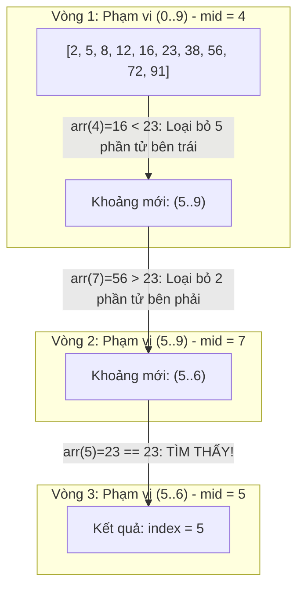

## Mô tả bài toán

Khi khối lượng dữ liệu phình to lên hàng triệu bản ghi (`N = 10⁷`), tìm kiếm tuyến tính với thời gian `O(N)` sẽ làm tê liệt hệ thống. Đề bài đặt ra: Cho một mảng số nguyên `N` phần tử **đã được sắp xếp tăng dần**, hãy tìm chỉ số của giá trị `target` trong thời gian ngắn nhất.

Tìm kiếm Nhị phân (Binary Search) áp dụng mô hình Chia để Trị (Divide and Conquer) để giảm thời gian tìm kiếm từ tuyến tính `O(N)` xuống thang đo logarit `O(log₂ N)`.

## Ý tưởng tiếp cận ban đầu

Cách tiếp cận ngây thơ:

- Sử dụng vòng lặp duyệt tuần tự từ đầu mảng `for (int i = 0; i < n; ++i)`.
- _Lãng phí:_ Hoàn toàn bỏ qua thuộc tính vô giá rằng mảng _đã có thứ tự sẵn_, dẫn đến việc phải duyệt qua hàng triệu phần tử vô ích.

## Tư duy tối ưu & Cấu trúc thuật toán

Tư duy Chia để Trị và các kỹ thuật cốt lõi của Binary Search:

1. **Loại trừ 50% Không gian sau mỗi bước:** So sánh `arr[mid]` với `target`:

- Nếu `arr[mid] == target`: Tìm thấy ngay lập tức.
- Nếu `arr[mid] < target`: Toàn bộ nửa trái chắc chắn nhỏ hơn target &rarr; Thu hẹp tìm kiếm về nửa phải `[mid + 1, right]`.
- Nếu `arr[mid] > target`: Toàn bộ nửa phải chắc chắn lớn hơn &rarr; Thu hẹp về nửa trái `[left, mid - 1]`.

2. **Phòng chống Cạm bẫy Tràn số nguyên (Integer Overflow):** Công thức `mid = (left + right) / 2` có thể tràn số nguyên 32-bit có dấu khi `left + right > 2^31 - 1`. _Kỹ thuật chuẩn:_ Luôn viết `mid = left + (right - left) / 2`.
3. **Mở rộng Tìm kiếm Biên (Lower Bound):** Tìm phần tử đầu tiên `>= target`, nền tảng của các chỉ mục cơ sở dữ liệu B-Tree.

## Triển khai mã nguồn & Dry Run

Minh họa không gian tìm kiếm bị thu hẹp 50% sau mỗi vòng lặp với `target = 23`:



**Mã nguồn C++ hoàn chỉnh:**

```c++
#include <iostream>
#include <vector>

// 1. Binary Search dạng Vòng lặp: O(1) Bộ nhớ phụ trợ
int binarySearch(const std::vector<int>& arr, int target) {
    int left = 0;
    int right = static_cast<int>(arr.size()) - 1;

    while (left <= right) {
        // Tránh tràn số nguyên 32-bit (Integer Overflow)
        int mid = left + (right - left) / 2;

        if (arr[mid] == target) {
            return mid; // Tìm thấy phần tử tại chỉ số mid
        } else if (arr[mid] < target) {
            left = mid + 1; // Thu hẹp không gian tìm kiếm sang nửa phải
        } else {
            right = mid - 1; // Thu hẹp không gian tìm kiếm sang nửa trái
        }
    }
    return -1; // Không tìm thấy
}

// 2. Tìm kiếm Cận dưới (Lower Bound): Tìm phần tử đầu tiên >= target
int lowerBound(const std::vector<int>& arr, int target) {
    int left = 0;
    int right = static_cast<int>(arr.size());
    while (left < right) {
        int mid = left + (right - left) / 2;
        if (arr[mid] >= target) {
            right = mid;
        } else {
            left = mid + 1;
        }
    }
    return left;
}

int main() {
    std::vector<int> data = {2, 5, 8, 12, 16, 23, 38, 56, 72, 91};
    int target = 23;
    int idx = binarySearch(data, target);
    std::cout << "Vi tri cua " << target << ": " << idx << std::endl;
    return 0;
}
```

**Phân tích luồng thực thi chi tiết (Dry Run Trace):**

- _Dữ liệu đầu vào:_ `data = {2, 5, 8, 12, 16, 23, 38, 56, 72, 91}`, `N = 10`, `target = 23`.
- _Lần lặp 1:_ `left = 0`, `right = 9` &rarr; `mid = 0 + (9 - 0) / 2 = 4`. Giá trị `data[4] = 16 < 23` &rarr; `left = mid + 1 = 5`. Loại bỏ 5 phần tử nửa trái.
- _Lần lặp 2:_ `left = 5`, `right = 9` &rarr; `mid = 5 + (9 - 5) / 2 = 7`. Giá trị `data[7] = 56 > 23` &rarr; `right = mid - 1 = 6`. Loại bỏ 2 phần tử nửa phải.
- _Lần lặp 3:_ `left = 5`, `right = 6` &rarr; `mid = 5 + (6 - 5) / 2 = 5`. Giá trị `data[5] = 23 == 23` &rarr; Khớp chính xác! Trả về chỉ số `5` chỉ sau đúng 3 phép so sánh.

## Đánh giá độ phức tạp & Ứng dụng thực tế

**Đánh giá Hiệu năng theo Framework Chuẩn:**

1. **Worst-Case Time Complexity (`O`):** `O(log₂ N)` - Với `N = 1,000,000`, Binary Search chỉ mất tối đa **20 phép so sánh** (so với 1,000,000 của Linear Search &rarr; tăng tốc **50,000 lần**).
2. **Best-Case Time Complexity (`Ω`):** `Ω(1)` khi target nằm ngay chính giữa mảng ở lần chia đầu tiên.
3. **Average-Case Time Complexity (`Θ`):** `Θ(log₂ N)`.
4. **Auxiliary Space Complexity:** `O(1)` cho bản Iterative (vòng lặp không tiêu tốn Call Stack frame).

**Ứng dụng thực tế:** Chỉ mục cơ sở dữ liệu (B-Tree / LSM-Tree Indexing), `std::lower_bound` trong C++ STL, lệnh `git bisect` để truy vết commit gây lỗi, và kỹ thuật Tìm kiếm Nhị phân trên miền kết quả (Binary Search on Answer).
