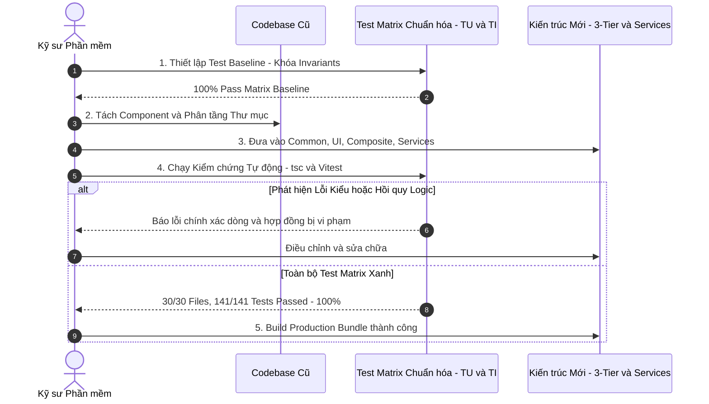

## Đặt vấn đề & Tổng quan

Trong hành trình phát triển nghề nghiệp của một kỹ sư phần mềm (Software Engineer), việc đối mặt với các codebase ngày càng phình to, phức tạp và xuất hiện nợ kỹ thuật (Technical Debt) là điều không thể tránh khỏi. Nhu cầu tái cấu trúc (Refactoring) để chuẩn hóa kiến trúc, loại bỏ trùng lặp mã nguồn (DRY) và nâng cao hiệu năng luôn hiện hữu.

Tuy nhiên, nỗi ám ảnh lớn nhất của bất kỳ lập trình viên nào khi chạm vào mã nguồn cũ là: _'Liệu thay đổi này có vô tình làm hỏng một tính năng nào đó ở màn hình khác hay không?'_. Khái niệm 'Lưới an toàn' (Safety Net) và tư duy Refactoring dựa trên Test Matrix đa tầng chính là chìa khóa phân định giữa một kỹ sư chuyên nghiệp và một người sửa code dựa trên may rủi.

## Đánh giá đa chiều / So sánh đối chuẩn

Để hiểu rõ giá trị của chiến lược Refactoring có phương pháp, hãy cùng so sánh hai trường phái tiếp cận phổ biến trong các dự án thực tế:

- **Trường phái 'Cowboy Refactoring' (Tái cấu trúc theo cảm tính):** Nhà phát triển thay đổi trực tiếp file, đổi tên biến và di chuyển các component lớn mà không có bộ test tự động bảo vệ. Việc kiểm thử chủ yếu dựa vào 'bằng mắt' (manual visual check) trên trình duyệt. _Hệ quả:_ Dễ bỏ sót các edge-case trên mobile, sai lệch kiểu dữ liệu ngầm định (type regression), và gây ra lỗi âm thầm khi lên môi trường Production.
- **Trường phái 'Test-Driven Refactoring' (Tái cấu trúc có lưới an toàn):** Trước khi di chuyển bất kỳ dòng code nào, toàn bộ hợp đồng hành vi (behavioral contracts) và trạng thái bất biến (invariants) đều được khóa lại bằng hệ thống Unit Test và Integration Test toàn diện. Bất kỳ sự thay đổi nào gây lệch hợp đồng đều bị phát hiện tự động trong vài mili-giây.

## Kinh nghiệm thực chiến / Case Study

Trong đợt tái cấu trúc toàn diện hệ thống UI Portfolio & Tech Blog vừa qua, tôi đã áp dụng quy trình kiểm thử và chuyển đổi tuần tự theo đường ống tự động:

**Bài học đắt giá từ thực tế:**

- **Chuẩn hóa mã định danh (Test IDs):** Phân chia rõ ràng mã định danh `TU-<GROUP>-XX` cho Unit Test (ví dụ: `TU-COMMON-01` cho Button, `TU-SERVICES-01` cho BlogService) và `TI-XX` cho Integration Test. Điều này giúp toàn đội ngũ dễ dàng đối chiếu phạm vi kiểm thử với tài liệu kiến trúc.
- **Cấu trúc thư mục Test đối xứng 1-1 với Source Code:** Tổ chức `tests/unit/common/`, `tests/unit/ui/`, `tests/unit/composite/`, `tests/unit/services/` giúp việc tìm kiếm và cập nhật test diễn ra tức thì.

## Gợi ý hành động

Để thực hiện các chiến dịch tái cấu trúc an toàn, hãy luôn tuân thủ 4 nguyên tắc vàng sau:

1. **Khóa Typescript Typecheck:** Chạy `npx tsc --noEmit` song song với test runner. Việc loại bỏ các alias không cần thiết và sử dụng relative import chuẩn xác giúp trình biên dịch phát hiện đường dẫn gãy ngay tại thời điểm lưu file.
2. **Quy tắc Atomic Refactoring:** Chỉ thực hiện một loại thay đổi trong mỗi bước (ví dụ: chỉ đổi tên component, hoặc chỉ di chuyển service). Tránh việc vừa di chuyển file vừa thay đổi logic nghiệp vụ trong cùng một lần chỉnh sửa.
3. **Tránh can thiệp inline styles khi kế thừa:** Luôn kiểm soát độ đặc hiệu của CSS (CSS Specificity). Việc lạm dụng inline style (như `style={{ display: 'flex' }}`) ở component cha có thể ghi đè và làm hỏng các quy tắc CSS Grid của component con.
4. **Tự động hóa Pipeline kiểm thử:** Đóng gói môi trường kiểm thử trong Docker để đảm bảo kết quả chạy trên máy cá nhân và CI/CD hoàn toàn đồng nhất.

## Câu hỏi mở, thảo luận

Refactoring không chỉ là hoạt động kỹ thuật đơn thuần mà là một bài toán cân đối giữa tốc độ phát triển và chất lượng mã nguồn. Một số câu hỏi mở đáng để chúng ta cùng suy ngẫm:

- Khi nào nên quyết định tái cấu trúc từng phần (Incremental Refactoring) và khi nào nên viết lại mới hoàn toàn (Greenfield Rewrite)?
- Làm thế nào để truyền thông giá trị của việc Refactoring với các bên liên quan (Product Manager, Business Stakeholders) khi không có tính năng người dùng mới nào được thêm vào?
- Chiến lược nào giúp duy trì độ bao phủ test (Test Coverage) ở mức 100% trong môi trường dự án có nhịp độ phát hành nhanh?
