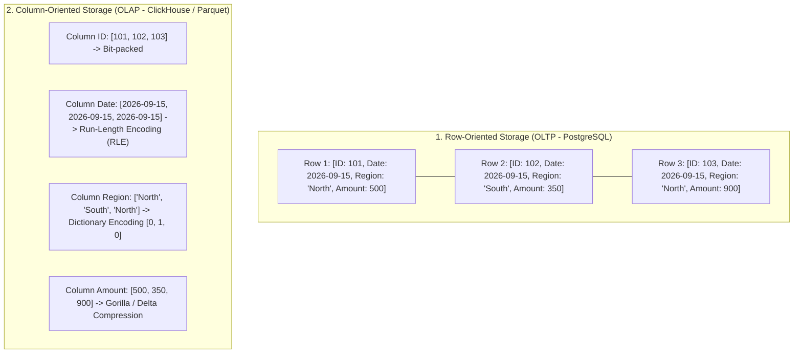
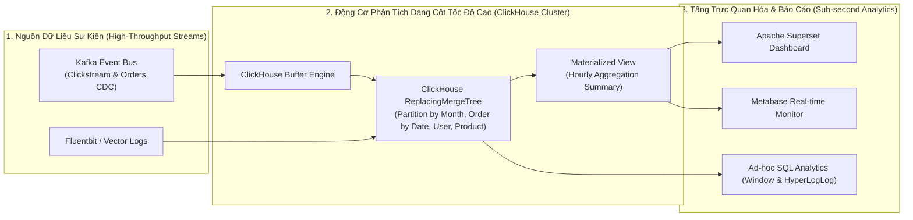

## Đề bài kinh doanh / Yêu cầu dữ liệu

Trong khi các hệ thống OLTP được xây dựng để xử lý hàng triệu giao dịch ghi đơn lẻ với độ trễ tính bằng mili-giây, các nhà phân tích dữ liệu (Data Analysts) và các nhà khoa học dữ liệu (Data Scientists) lại đối mặt với một bài toán hoàn toàn trái ngược: **Làm thế nào để quét, lọc và tính toán tổng hợp trên hàng tỷ bản ghi lịch sử trong thời gian thực để trả về biểu đồ phân tích kinh doanh tức thì?**

Hãy xem xét các bài toán kinh doanh đòi hỏi năng lực xử lý phân tích quy mô lớn:

1. **Phân tích Hành vi Người dùng Thời gian thực (Clickstream Analytics):** Theo dõi luồng sự kiện (Pageviews, Clicks, Add-to-Cart) của hàng chục triệu người dùng hoạt động hàng ngày, phát hiện các điểm rơi phễu chuyển đổi (Funnel Drop-off) và đề xuất sản phẩm theo thời gian thực.
2. **Báo cáo Tài chính & Doanh thu Hợp nhất Đa chiều (Multi-dimensional Financial BI):** Tính toán doanh thu thuần, tỷ suất lợi nhuận và tăng trưởng so với cùng kỳ (YoY, MoM) trên hàng trăm triệu giao dịch đơn hàng qua 10 năm lịch sử, cho phép lãnh đạo cắt lát dữ liệu theo vùng miền, danh mục và kênh bán hàng.
3. **Giám sát Hệ thống & Phát hiện Gian lận (Observability & Fraud Detection):** Phân tích hàng terabyte logs mạng và số liệu thanh toán mỗi giờ để phát hiện các mẫu tấn công DDoS hoặc giao dịch gian lận trong vòng vài giây.

**Tại sao Cơ sở Dữ liệu Dạng Dòng (Row-oriented) Bất lực trước Bài toán Phân tích?**

Trong cơ sở dữ liệu dạng dòng (như PostgreSQL, MySQL), toàn bộ các cột của một bản ghi được lưu trữ liền kề nhau trên đĩa cứng. Khi bạn chạy câu lệnh `SELECT AVG(total_amount) FROM orders WHERE order_date >= '2026-01-01';`, database bắt buộc phải đọc toàn bộ dung lượng của tất cả các cột (tên khách hàng, địa chỉ, ghi chú, mã thanh toán) lên bộ nhớ đệm, gây lãng phí tới 95-99% băng thông I/O đĩa cứng. Để giải quyết triệt để bài toán này, **Cơ sở dữ liệu OLAP dạng cột (Column-Oriented Architecture)** đã ra đời.

## Mô hình hóa dữ liệu

Để xây dựng và khai thác hệ thống OLAP đạt hiệu năng cao nhất, kỹ sư dữ liệu cần hiểu rõ sự tiến hóa của các mô hình OLAP và cơ chế vật lý của công nghệ lưu trữ dạng cột.

**1. Bốn Thế hệ Kiến trúc OLAP: MOLAP vs ROLAP vs HOLAP vs Modern Real-Time OLAP:**

<table style="width:100%; border-collapse: collapse; margin-bottom: 20px;">
  <thead>
    <tr style="border-bottom: 2px solid #e2e8f0; text-align: left;">
      <th style="padding: 8px;">Mô hình OLAP</th>
      <th style="padding: 8px;">Nguyên lý Hoạt động</th>
      <th style="padding: 8px;">Ưu Điểm</th>
      <th style="padding: 8px;">Nhược Điểm & Hạn Chế</th>
    </tr>
  </thead>
  <tbody>
    <tr style="border-bottom: 1px solid #edf2f7;">
      <td style="padding: 8px"><b>MOLAP (Multidimensional)</b></td>
      <td style="padding: 8px">Tính toán trước và lưu trữ kết quả trong các khối đa chiều (Cubes - SSAS, Apache Kylin)</td>
      <td style="padding: 8px">Tốc độ truy vấn siêu nhanh trên các chiều cố định</td>
      <td style="padding: 8px">Bùng nổ dung lượng lưu trữ (Cube Explosion), không linh hoạt khi thêm chiều mới</td>
    </tr>
    <tr style="border-bottom: 1px solid #edf2f7;">
      <td style="padding: 8px"><b>ROLAP (Relational)</b></td>
      <td style="padding: 8px">Lưu trữ dữ liệu dạng bảng quan hệ (Star/Snowflake Schema) và tính toán động qua SQL</td>
      <td style="padding: 8px">Linh hoạt tuyệt đối, hỗ trợ truy vấn Ad-hoc phong phú</td>
      <td style="padding: 8px">Tốn tài nguyên tính toán nếu không có cơ chế tối ưu cột</td>
    </tr>
    <tr style="border-bottom: 1px solid #edf2f7;">
      <td style="padding: 8px"><b>HOLAP (Hybrid)</b></td>
      <td style="padding: 8px">Kết hợp lưu trữ tóm tắt trong MOLAP và dữ liệu chi tiết trong ROLAP</td>
      <td style="padding: 8px">Cân bằng giữa tốc độ báo cáo tổng quan và khả năng khoan sâu (Drill-down)</td>
      <td style="padding: 8px">Kiến trúc phức tạp, khó đồng bộ dữ liệu</td>
    </tr>
    <tr style="border-bottom: 1px solid #edf2f7;">
      <td style="padding: 8px"><b>Modern Real-Time OLAP (ClickHouse, Snowflake, DuckDB)</b></td>
      <td style="padding: 8px">Lưu trữ dạng cột tự nhiên (Columnar), nén dữ liệu cực đại và xử lý Vector hóa (SIMD)</td>
      <td style="padding: 8px">Hiệu năng quét hàng tỷ dòng trong mili-giây, nén đĩa 90%, nạp dữ liệu Real-time</td>
      <td style="padding: 8px">Hạn chế trong các giao dịch ghi cập nhật từng dòng nhỏ lẻ (Single-row UPDATEs)</td>
    </tr>
  </tbody>
</table>

**2. Bản chất Cơ chế Lưu trữ Dạng Cột & Các Thuật toán Nén Dữ liệu Đỉnh cao:**

Thay vì xếp các dòng cạnh nhau, cơ sở dữ liệu OLAP chia nhỏ bảng thành các khối dữ liệu (Data Blocks / Row Groups) và lưu trữ từng cột trong các file vật lý riêng biệt:



**3. Kỹ thuật Thực thi Truy vấn Vector Hóa (Vectorized SIMD Query Execution):**

Trong các CSDL truyền thống (Volcano Iterator Model), mỗi dòng dữ liệu được gọi hàm `next()` lần lượt từng bản ghi một, gây tắc nghẽn CPU Cache và overhead gọi hàm. Ngược lại, **Vectorized Engine** tải một mảng gồm 1.024 hoặc 2.048 giá trị của cùng một cột vào trực tiếp các thanh ghi CPU (Registers) và sử dụng tập lệnh **SIMD (Single Instruction, Multiple Data - AVX2/AVX-512)** để tính toán song song hàng chục phép cộng/lọc chỉ trong một chu kỳ xung nhịp CPU.

## Xây dựng Pipeline / Script xử lý

Để minh họa việc triển khai hệ thống OLAP hiện đại, dưới đây là kiến trúc luồng dữ liệu thời gian thực và mã nguồn tạo bảng **ClickHouse MergeTree Engine** kết hợp với câu lệnh SQL phân tích nâng cao.

**1. Sơ đồ Luồng Dữ liệu Nền tảng OLAP Thời gian thực (Real-Time Modern OLAP Stack):**



**2. Mã nguồn ClickHouse DDL Thiết kế Bảng OLAP Tối ưu (MergeTree Engine):**

```sql
-- Tạo bảng ClickHouse tối ưu hóa cho phân tích hành vi người dùng và đơn hàng
CREATE TABLE analytics.fact_user_events_hourly
(
    event_timestamp DateTime64(3, 'UTC') CODEC(DoubleDelta, LZ4),
    event_date Date DEFAULT toDate(event_timestamp) CODEC(DoubleDelta, LZ4),
    user_id UInt64 CODEC(DoubleDelta, LZ4),
    session_id UUID CODEC(ZSTD),
    event_type LowCardinality(String) CODEC(ZSTD), -- Áp dụng Dictionary Compression
    page_url String CODEC(ZSTD(3)),
    referrer_domain LowCardinality(String) CODEC(ZSTD),
    device_type LowCardinality(String) CODEC(ZSTD),
    country LowCardinality(String) CODEC(ZSTD),
    cart_total_amount Decimal(18, 4) CODEC(T64, ZSTD),
    processing_time_ms UInt32 CODEC(Gorilla, ZSTD)
)
ENGINE = ReplacingMergeTree(event_timestamp)
-- Phân vùng dữ liệu theo Tháng để dễ quản lý vòng đời và Pruning
PARTITION BY toYYYYMM(event_date)
-- Khóa sắp xếp vật lý (Sorting Key / Primary Index): Đặt cột có lực lượng thấp trước
PRIMARY KEY (event_date, event_type, user_id)
ORDER BY (event_date, event_type, user_id, event_timestamp)
-- Tự động dọn dẹp dữ liệu cũ sau 365 ngày (TTL Retention Policy)
TTL event_date + INTERVAL 365 DAY
SETTINGS index_granularity = 8192;
```

**3. Câu lệnh SQL Phân tích Đa chiều Tận dụng Thuật toán Ước lượng HyperLogLog & Window Functions:**

```sql
-- Truy vấn phân tích tỷ lệ chuyển đổi phễu và đếm người dùng duy nhất siêu tốc trên 1 tỷ dòng
SELECT
    event_date,
    country,
    device_type,
    -- Đếm chính xác số lượng sự kiện
    count() AS total_events,
    -- Thuật toán HyperLogLog ước lượng số người dùng duy nhất với sai số < 1% trong vài mili-giây
    uniqCombined64(user_id) AS approx_unique_users,
    -- Đếm số người dùng thêm vào giỏ hàng
    uniqCombined64If(user_id, event_type = 'ADD_TO_CART') AS cart_users,
    -- Đếm số người dùng thanh toán thành công
    uniqCombined64If(user_id, event_type = 'PURCHASE') AS paying_users,
    -- Tính tỷ lệ chuyển đổi thanh toán (Conversion Rate)
    ROUND(
        uniqCombined64If(user_id, event_type = 'PURCHASE')
        / NULLIF(uniqCombined64If(user_id, event_type = 'ADD_TO_CART'), 0) * 100,
        2
    ) AS cart_to_purchase_cvr_pct,
    -- Tổng giá trị giao dịch
    SUM(cart_total_amount) AS gross_merchandise_value,
    -- Window Function tính tỷ trọng đóng góp doanh thu của từng quốc gia trong ngày
    ROUND(
        SUM(cart_total_amount)
        / SUM(SUM(cart_total_amount)) OVER (PARTITION BY event_date) * 100,
        2
    ) AS country_revenue_contribution_pct
FROM analytics.fact_user_events_hourly
WHERE event_date >= today() - INTERVAL 30 DAY
GROUP BY event_date, country, device_type
ORDER BY event_date DESC, gross_merchandise_value DESC;
```

## Kiểm thử dữ liệu & Tối ưu hiệu năng

Để đạt được tốc độ phản hồi truy vấn dưới 100ms trên các tập dữ liệu khổng lồ (Petabyte-scale), Data Engineer cần làm chủ các kỹ thuật tối ưu hóa vật lý chuyên sâu sau:

**1. Thiết kế Khóa Sắp xếp Vật lý (Sorting Keys & Sparse Primary Index):**

- **Quy tắc Thứ tự Cột trong ORDER BY:** Luôn đặt các cột thường xuyên xuất hiện trong mệnh đề `WHERE` và có lực lượng giá trị (Cardinality) từ thấp đến cao ở đầu khóa sắp xếp (ví dụ: `(event_date, country, event_type, user_id)`). Cách sắp xếp này giúp nén dữ liệu tốt nhất và loại bỏ tối đa các khối dữ liệu không khớp (MinMax Data Skipping).
- **Sparse Index Granularity:** Chỉ mục sơ cấp dạng thưa (mỗi 8.192 dòng chỉ lưu 1 điểm đánh dấu) giúp toàn bộ chỉ mục của bảng hàng tỷ dòng nằm gọn trong RAM chỉ với vài megabyte bộ nhớ.

**2. Sử dụng Thuật toán Xác suất & Cấu trúc Dữ liệu Phác thảo (Approximate & Sketch Algorithms):**

- Khi số lượng người dùng lên tới hàng trăm triệu, việc chạy `COUNT(DISTINCT user_id)` truyền thống đòi hỏi chi phí bộ nhớ khổng lồ để lưu trữ toàn bộ ID phục vụ loại trùng lặp.
- Sử dụng các thuật toán xấp xỉ như **HyperLogLog (HLL)** và **t-Digest (tính phân vị Percentile p95, p99)** giúp giảm 99% RAM và tăng tốc độ xử lý lên gấp 50 lần với độ chính xác trên 99%.

**3. Bảng Benchmark Đánh giá Hiệu năng Truy vấn Thực tế (Dataset: 1.000.000.000 Bản ghi - 1 Tỷ dòng Sự kiện):**

<table style="width:100%; border-collapse: collapse; margin-bottom: 20px;">
  <thead>
    <tr style="border-bottom: 2px solid #e2e8f0; text-align: left;">
      <th style="padding: 8px;">Kiến Trúc Cơ Sở Dữ Liệu</th>
      <th style="padding: 8px">Thời Gian Truy Vấn Quét & Gom Nhóm</th>
      <th style="padding: 8px">Dung Lượng Quét Đĩa</th>
      <th style="padding: 8px">Tỷ Lệ Nén Dữ Liệu Đĩa Cứng</th>
    </tr>
  </thead>
  <tbody>
    <tr style="border-bottom: 1px solid #edf2f7;">
      <td style="padding: 8px"><b>Cơ sở Dữ liệu Dạng Dòng (PostgreSQL 16)</b></td>
      <td style="padding: 8px">340.000ms (Hơn 5.6 phút)</td>
      <td style="padding: 8px">142 GB (Quét toàn bộ hàng)</td>
      <td style="padding: 8px">1.2x (Nén dòng thông thường)</td>
    </tr>
    <tr style="border-bottom: 1px solid #edf2f7;">
      <td style="padding: 8px"><b>Hệ Thống Phân Tán ROLAP Truyền Thống</b></td>
      <td style="padding: 8px">12.500ms (12.5 giây)</td>
      <td style="padding: 8px">18.5 GB</td>
      <td style="padding: 8px">3.5x (Nén Snappy cơ bản)</td>
    </tr>
    <tr style="border-bottom: 1px solid #edf2f7;">
      <td style="padding: 8px"><b>Cloud MPP DWH (Snowflake Standard)</b></td>
      <td style="padding: 8px">420ms</td>
      <td style="padding: 8px">1.4 GB (Micro-partition pruning)</td>
      <td style="padding: 8px">6.0x (Proprietary Columnar)</td>
    </tr>
    <tr>
      <td style="padding: 8px"><b>Real-Time Vectorized OLAP (ClickHouse Cluster)</b></td>
      <td style="padding: 8px"><b>28ms</b></td>
      <td style="padding: 8px"><b>180 MB (MinMax Skip + SIMD)</b></td>
      <td style="padding: 8px"><b>10.5x (ZSTD + LowCardinality Codec)</b></td>
    </tr>
  </tbody>
</table>

## Tổng kết & Khuyến nghị

Cơ sở dữ liệu OLAP dạng cột đại diện cho đỉnh cao của kỹ thuật tối ưu hóa phần cứng và thuật toán xử lý dữ liệu lớn hiện đại.

**Lựa chọn Động cơ OLAP Phù hợp với Bối cảnh Doanh nghiệp:**

- Sử dụng **ClickHouse / StarRocks** khi cần phân tích thời gian thực với độ trễ truy vấn dưới 100ms trên luồng dữ liệu nạp liên tục (Clickstream, Log Analytics, Real-time Dashboard).
- Sử dụng **Snowflake / BigQuery** khi cần xây dựng kho dữ liệu doanh nghiệp toàn diện (Enterprise DWH / BI) phục vụ đa phòng ban với khả năng mở rộng điện toán không giới hạn.
- Sử dụng **DuckDB** khi cần một động cơ phân tích dạng cột siêu nhẹ, nhúng trực tiếp trong ứng dụng Python / Data Science mà không cần dựng cụm server phức tạp.

**Luôn Tận dụng Nén Dữ liệu Chuyên biệt theo Kiểu Dữ liệu:** Sử dụng `LowCardinality` hoặc Dictionary Encoding cho các cột chuỗi lặp lại, `DoubleDelta` cho chuỗi thời gian và `T64/Gorilla` cho số thập phân.

**Ứng dụng Thuật toán Phác thảo (Sketching) Cho Tập Dữ Liệu Lớn:** Đào tạo đội ngũ Data Analyst chuyển từ việc dùng `COUNT(DISTINCT)` chính xác tuyệt đối sang `HyperLogLog (HLL)` khi làm việc với các chỉ số ước lượng (Reach, Active Users) để tăng tốc độ phân tích lên hàng chục lần.

> **Lời kết:** _Làm chủ cơ chế hoạt động của OLAP từ tầng lưu trữ dạng cột đến tập lệnh SIMD giúp Data Engineer tự tin biến hàng chục terabyte dữ liệu phức tạp thành những câu trả lời kinh doanh tức thì trong chớp mắt!_
