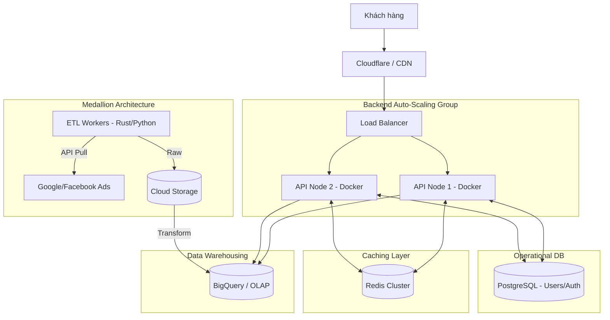

## Bối cảnh & Vấn đề

Nền tảng báo cáo thành công rực rỡ và lượng khách hàng tăng vọt. Vào các dịp cuối tháng, có tới 1000 CCU cùng truy cập để xuất báo cáo, xem các phân tích tùy chỉnh (Custom Dimensions) trên lượng dữ liệu lịch sử khổng lồ.
Hệ thống cũ bắt đầu bộc lộ tử huyệt: Load biểu đồ mất hơn 10 giây, Database liên tục báo 100% CPU, các batch job cập nhật dữ liệu chạy lấn sang cả giờ làm việc do quá nhiều dữ liệu cần xử lý.

## Yêu cầu hệ thống

- **Hiệu năng:** Dashboard load dưới 1 giây, kể cả khi query dữ liệu của nhiều tháng.
- **Khả năng chịu tải:** 1000 CCU, có khả năng auto-scale khi traffic đột biến.
- **Dữ liệu:** Dữ liệu phân tích cực lớn, hỗ trợ query đa chiều (OLAP).
- **Độ sẵn sàng (Availability):** 99.9%, hệ thống phục vụ 24/7, không có single point of failure (SPOF).

## Thiết kế kiến trúc

Kiến trúc lúc này bắt buộc phải tách biệt hoàn toàn giữa luồng ghi (Data Pipeline) và luồng đọc (API / Dashboard).

- **Load Balancing & Backend Cluster:** Request đi qua Load Balancer và được phân phối đến các Backend Node chạy trong các Docker container để dễ dàng auto-scale.
- **Caching Layer (Redis):** Mọi kết quả query báo cáo tĩnh được hash theo tham số và lưu vào Redis. 80% request của user sẽ trả về trực tiếp từ Redis mà không cần chạm tới Database.
- **Data Warehouse (BigQuery):** Chịu trách nhiệm lưu trữ và xử lý các câu truy vấn phân tích (OLAP). BigQuery được thiết kế để quét hàng TB dữ liệu trong vài giây.
- **Data Pipeline (ETL):** Sử dụng các ngôn ngữ hiệu năng cao (như Rust hoặc Python) để trích xuất dữ liệu, đổ vào Data Lake trước khi transform và load vào BigQuery theo chuẩn kiến trúc Medallion.

## Phân tích đánh đổi

- **Performance vs. Độ trễ dữ liệu (Data Stale):** Việc dùng Cache (Redis) giúp hệ thống chịu tải xuất sắc, nhưng user có thể nhìn thấy dữ liệu "cũ" vài phút. Cần thiết kế chiến lược Cache Invalidation hợp lý.
- **Chi phí vận hành:** Việc sử dụng Data Warehouse như BigQuery tính phí theo lượng dữ liệu được quét. Nếu backend không kiểm soát tốt và query trực tiếp những truy vấn không có bộ lọc (WHERE), hóa đơn hạ tầng sẽ tăng phi mã.

## Bài học thực tế & Best Practices

1.  **Chặn đứng bão Query (Query Throttling/Debouncing):** Khi 1000 user nhấn F5 liên tục, nếu không có Cache, Data Warehouse sẽ quá tải. Redis phải đóng vai trò khiên chắn thép. Cần kết hợp thêm cơ chế Rate Limiting trên API server.
2.  **Tối ưu Data Model trên OLAP:** Dữ liệu trên Data Warehouse cần được làm phẳng (Denormalized) và phân vùng (Partitioning/Clustering) theo ngày và `client_id`. Điều này giúp giảm tới 90% lượng dữ liệu bị quét khi query, vừa tăng tốc độ vừa giảm chi phí.
3.  **Tách bạch Service:** Sử dụng PostgreSQL chuyên biệt cho các nghiệp vụ CRUD (tạo user, phân quyền, cấu hình chiến dịch) và để BigQuery thuần túy lo việc tính toán metric. Tuyệt đối không thực hiện query trực tiếp chéo (cross-database query) ở tầng API.
