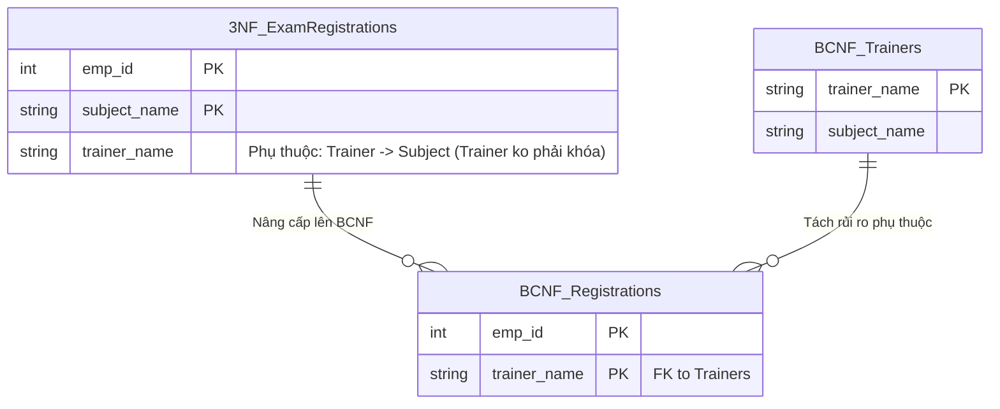

## Đề bài kinh doanh / Yêu cầu dữ liệu

Hệ thống ERP tích hợp thêm **Module Đào tạo & Chứng chỉ nội bộ (Training & Certifications)**.
Ta có bảng `Exam_Registrations` lưu thông tin: `emp_id`, `subject_name` (môn học), và `trainer_name` (giảng viên nội bộ).

Quy tắc nghiệp vụ của công ty như sau:

1. Một nhân viên có thể học nhiều môn. Một môn có nhiều giảng viên dạy các lớp khác nhau.
2. Một nhân viên chỉ đăng ký học một giảng viên cho một môn cụ thể.
3. **Mỗi giảng viên chỉ chuyên dạy ĐÚNG MỘT môn học.**

Khóa ứng viên (Candidate Keys) xác định duy nhất 1 dòng có thể là: `(emp_id, subject_name)` hoặc `(emp_id, trainer_name)`. Tất cả các cột đều nằm trong khóa ứng viên, nên bảng này **đã đạt chuẩn 3NF**.
Nhưng rủi ro là: `subject_name` phụ thuộc vào `trainer_name` (vì giảng viên chỉ dạy 1 môn). Nếu tất cả nhân viên hủy đăng ký lớp của "Trainer Bob", dữ liệu bị xóa, hệ thống sẽ quên luôn thông tin "Trainer Bob dạy môn AWS" (Delete Anomaly).

## Mô hình hóa dữ liệu

Chuẩn BCNF yêu cầu: **Đạt 3NF và với mọi phụ thuộc hàm X -> Y, X phải là một Siêu khóa (Superkey).**
Ở đây, `trainer_name -> subject_name`, nhưng `trainer_name` đứng một mình không phải là khóa của bảng (nó không đại diện cho toàn bộ dòng). Do đó, vi phạm BCNF.



## Xây dựng Pipeline / Script xử lý

Ta tách giảng viên và môn học thành một danh mục riêng:

```sql
-- 1. Tạo bảng Trainers (Chứa phụ thuộc Trainer -> Subject)
CREATE TABLE trainers_bcnf AS
SELECT DISTINCT trainer_name, subject_name
FROM exam_registrations_3nf;

ALTER TABLE trainers_bcnf ADD PRIMARY KEY (trainer_name);

-- 2. Tạo bảng Đăng ký học (Loại bỏ cột Subject)
CREATE TABLE exam_registrations_bcnf AS
SELECT emp_id, trainer_name
FROM exam_registrations_3nf;

ALTER TABLE exam_registrations_bcnf ADD PRIMARY KEY (emp_id, trainer_name);
ALTER TABLE exam_registrations_bcnf
ADD FOREIGN KEY (trainer_name) REFERENCES trainers_bcnf(trainer_name);
```

## Kiểm thử dữ liệu & Tối ưu hiệu năng

- **Data Integrity:** Ta có thể khai báo một Giảng viên mới cùng môn họ dạy (INSERT vào bảng `trainers_bcnf`) ngay cả khi chưa có nhân sự nào đăng ký học lớp đó.
- **Thiết kế không lỗ hổng:** BCNF bít lại lỗ hổng cuối cùng của các bảng có logic khóa ghép phức tạp.

## Tổng kết & Khuyến nghị

Trong ERP, các nghiệp vụ như Phân công ca trực, Lịch học, hay Lịch sử dụng thiết bị rất dễ rơi vào trường hợp "3NF nhưng vi phạm BCNF". Hãy luôn dùng BCNF làm bài test độ bền bỉ cho các bảng dữ liệu có Composite Keys (khóa ghép nhiều cột).
