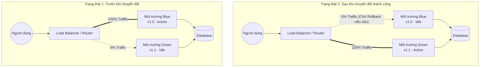

## Mục tiêu bài viết

Trong môi trường phần mềm hiện đại, việc gián đoạn dịch vụ (downtime) khi cập nhật phiên bản mới là điều tối kỵ. Bài viết này thuộc chuyên đề **DevOps, Cloud & Tooling**, tập trung phân tích và hướng dẫn áp dụng chiến lược **Blue-Green Deployment** vào quy trình CI/CD.

Bài viết sẽ giải quyết hai câu hỏi cốt lõi:

- **Khi nào dùng?** Sử dụng khi hệ thống yêu cầu **zero-downtime** (không có thời gian chết), cần khả năng **rollback (hoàn tác) tức thì** nếu có lỗi, và ứng dụng là các hệ thống mission-critical (tài chính, y tế, thương mại điện tử lớn).

- **Dùng như thế nào?** Thông qua việc duy trì hai môi trường độc lập nhưng giống hệt nhau về hạ tầng, kết hợp với cơ chế điều hướng traffic (lưu lượng) linh hoạt ở tầng Load Balancer/Router.

## Kiến trúc / Nguyên lý hoạt động

Nguyên lý của Blue-Green Deployment xoay quanh việc vận hành song song hai môi trường hạ tầng giống hệt nhau:

- **Môi trường Blue (Active):** Đang chạy phiên bản hiện tại và phục vụ 100% traffic từ người dùng.

- **Môi trường Green (Idle):** Môi trường tĩnh, được dùng để triển khai và kiểm thử phiên bản mới (vNext).

Khi phiên bản mới trên Green đã vượt qua mọi bài kiểm thử (Health checks, Integration tests), bộ định tuyến (Load Balancer, API Gateway, hoặc Ingress) sẽ chuyển hướng toàn bộ traffic từ Blue sang Green. Lúc này, Green trở thành Active, và Blue trở thành Idle (chờ để hủy hoặc dùng cho lần deploy tiếp theo).



## Từng bước thiết lập

Dưới đây là luồng CI/CD tiêu chuẩn sử dụng các công cụ phổ biến (như GitLab CI/GitHub Actions, Docker, và Nginx làm Load Balancer).

### Bước 1: Chuẩn bị hạ tầng (Infrastructure as Code)

Đảm bảo bạn có khả năng định tuyến lưu lượng linh hoạt. Ví dụ cấu hình Nginx upstream:

```nginx
# nginx.conf
upstream backend_servers {
    # Biến này sẽ được CI/CD thay đổi khi swap
    server 10.0.0.1:8080; # Blue IP
    # server 10.0.0.2:8080; # Green IP
}

server {
    listen 80;
    location / {
        proxy_pass http://backend_servers;
    }
}
```

### Bước 2: Continuous Integration (CI - Tích hợp liên tục)

Khi Developer push code mới (v1.1):

1. **Build:** Đóng gói source code (ví dụ: build Docker image).
2. **Test:** Chạy Unit Test, Linting.
3. **Push:** Đẩy Image lên Container Registry (Docker Hub, GCR, AWS ECR).

### Bước 3: Continuous Deployment (CD - Triển khai lên Green)

1. **Xác định môi trường Idle:** Script CD kiểm tra xem môi trường nào đang Active. Nếu Blue đang Active -> mục tiêu deploy là Green.
2. **Deploy:** Pull Docker image mới nhất và khởi chạy các container trên môi trường Green.
3. **Pre-flight Checks:** Chạy Integration Test và API Health Check trực tiếp vào IP nội bộ của môi trường Green (không qua Load Balancer bên ngoài).

### Bước 4: Chuyển đổi Traffic (Cutover)

1. **Cập nhật Router:** Nếu các bài test ở Bước 3 pass, pipeline sẽ cập nhật file cấu hình Nginx (trỏ `backend_servers` sang IP của Green).
2. **Reload Service:** Gọi lệnh reload Router (ví dụ: `nginx -s reload`) để áp dụng thay đổi mà không làm rớt các kết nối hiện tại.
3. **Xác nhận:** Giám sát lỗi (HTTP 5xx) trong vài phút đầu. Nếu hệ thống ổn định, quá trình hoàn tất.

## Khắc phục sự cố và các lỗi thường gặp

1. Xung đột Database (Database Schema Changes)

- **Vấn đề:** Cả Blue và Green đều dùng chung một Database. Nếu bản cập nhật v1.1 xóa một cột mà v1.0 (đang phục vụ user) vẫn cần, hệ thống v1.0 sẽ crash ngay lập tức.
- **Khắc phục:** Luôn áp dụng **Forward/Backward Compatible Migrations**. Phân tách việc đổi schema ra thành 2 bước: _Deploy v1.1_, thêm cột mới, code hỗ trợ cả cột cũ và mới; _Deploy v1.2_, xóa hẳn cột cũ khi v1.0 không còn tồn tại.

2. Mất Session của người dùng khi Swap

- **Vấn đề:** Khi traffic chuyển từ Blue sang Green, user bị đăng xuất hoặc gián đoạn luồng thanh toán do session lưu trên RAM của server Blue.
- **Khắc phục:** Stateless Architecture. Chuyển toàn bộ Session State ra một hệ thống lưu trữ bên ngoài như **Redis** hoặc Memcached.

3. Khó khăn trong việc Rollback Data

- **Vấn đề:** Đổi traffic về lại Blue rất nhanh, nhưng nếu Green đã ghi một lượng lớn "dữ liệu rác" hoặc sai cấu trúc vào DB trong thời gian nó Active thì sao?
- **Khắc phục:** Tách biệt database migration ra khỏi luồng CI/CD của code. Nếu logic code sai, rollback traffic về Blue. Nếu data sai, phải có kịch bản Data Rollback hoặc Data Fix thủ công đã được chuẩn bị trước.

## Đánh giá & Mở rộng

### Đánh giá

- **Ưu điểm:**
  - Đạt được Zero-downtime thực sự.
  - Rollback chỉ trong vài giây (chỉ việc đổi lại cấu hình Load Balancer).
  - Giảm thiểu áp lực tâm lý cho team Dev/Ops khi release.
- **Nhược điểm:**
  - Chi phí nhân đôi: Phải duy trì hạ tầng gấp đôi (ít nhất là trong thời điểm deploy).
  - Quản lý Database cực kỳ phức tạp.

### Hướng Mở rộng (Advanced Patterns)

1. **Canary Release:** Thay vì chuyển 100% traffic ngay lập tức, bạn có thể kết hợp cấu hình Router để chuyển 5% -> 10% -> 50% -> 100% traffic sang Green để đo lường rủi ro.
2. **Automated Rollback:** Tích hợp CI/CD với các công cụ monitoring (Prometheus, Datadog). Nếu sau khi swap sang Green mà Error Rate (tỷ lệ lỗi 5xx) vượt quá 1% trong 2 phút, CI/CD tự động trigger script đổi traffic về lại Blue.
3. **Kubernetes (K8s):** Trên môi trường Cloud Native, Blue-Green có thể được thực hiện dễ dàng bằng cách thay đổi `selector` của `Service` trỏ sang các `Pods` mang label của phiên bản mới thay vì phải tự quản lý Nginx config thủ công.
