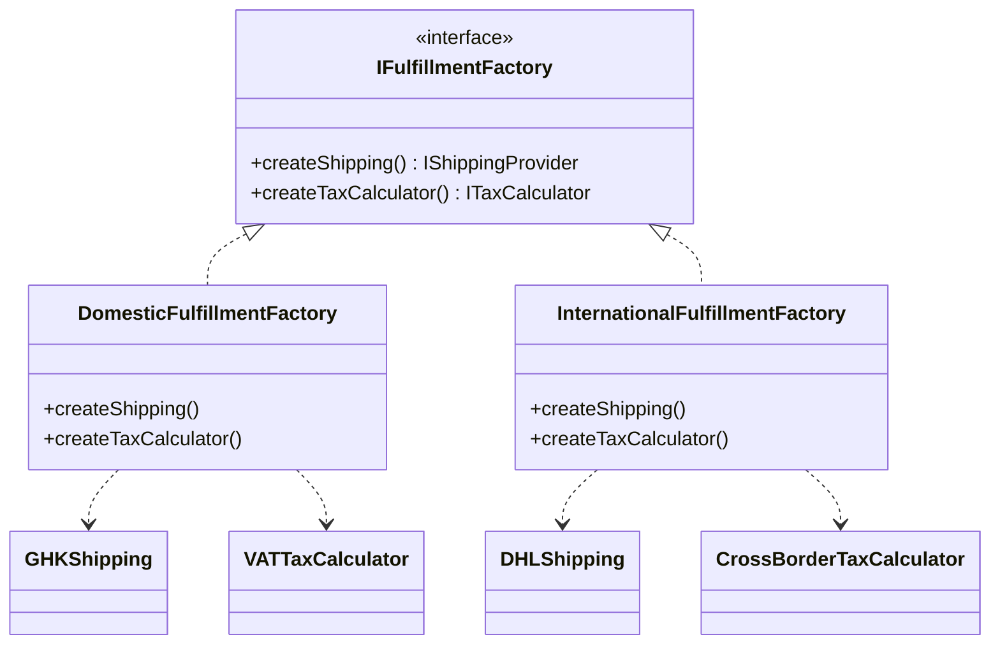

## Mô tả bài toán

Đơn hàng đã được thanh toán thành công. Bước cuối cùng là Hoàn tất đơn hàng (Fulfillment) bao gồm: Tính thuế và Lên lịch vận chuyển.
Phát sinh vấn đề: Hệ thống phục vụ cả đơn hàng **Nội địa (Domestic)** và **Quốc tế (International)**.

- Đơn Nội địa: Dùng Giao Hàng Tiết Kiệm (Shipping) + Tính thuế VAT (Tax).
- Đơn Quốc tế: Dùng DHL (Shipping) + Tính thuế Nhập khẩu xuyên biên giới (Tax).

Nếu khởi tạo lộn xộn (ví dụ Đơn nội địa nhưng lại gọi API DHL), hệ thống sẽ tính sai chi phí. Ta cần một cơ chế để khởi tạo theo "Gia đình" (Family of related objects). Đó là **Abstract Factory Pattern**.

## Abstract Factory Pattern là gì?

Cung cấp một interface để tạo ra các "họ" (families) hoặc nhóm các đối tượng có liên quan/phụ thuộc nhau mà không cần chỉ định rõ các lớp cụ thể (concrete classes) của chúng.

## Áp dụng vào Hệ thống

Chúng ta sẽ thiết kế một interface `IFulfillmentFactory` có 2 phương thức: `createShipping()` và `createTaxCalculator()`. Sẽ có 2 implementation: `DomesticFulfillmentFactory` và `InternationalFulfillmentFactory`.



## Cài đặt (Mã giả)

```typescript
// --- Product Interfaces ---
interface IShippingProvider {
  arrangeDelivery(): void;
}
interface ITaxCalculator {
  calculate(amount: number): number;
}

// --- Concrete Products: Domestic ---
class GHKShipping implements IShippingProvider {
  arrangeDelivery() {
    console.log("Giao qua GHTK");
  }
}
class VATTaxCalculator implements ITaxCalculator {
  calculate(amount: number) {
    return amount * 0.1;
  } // VAT 10%
}

// --- Concrete Products: International ---
class DHLShipping implements IShippingProvider {
  arrangeDelivery() {
    console.log("Giao qua DHL");
  }
}
class CrossBorderTaxCalculator implements ITaxCalculator {
  calculate(amount: number) {
    return amount * 0.15;
  } // Thuế nhập khẩu 15%
}

// --- Abstract Factory ---
interface IFulfillmentFactory {
  createShippingProvider(): IShippingProvider;
  createTaxCalculator(): ITaxCalculator;
}

// --- Concrete Factories ---
class DomesticFulfillmentFactory implements IFulfillmentFactory {
  createShippingProvider() {
    return new GHKShipping();
  }
  createTaxCalculator() {
    return new VATTaxCalculator();
  }
}

class InternationalFulfillmentFactory implements IFulfillmentFactory {
  createShippingProvider() {
    return new DHLShipping();
  }
  createTaxCalculator() {
    return new CrossBorderTaxCalculator();
  }
}

// Client Code (Service)
function processFulfillment(factory: IFulfillmentFactory, amount: number) {
  const taxCalc = factory.createTaxCalculator();
  const shipping = factory.createShippingProvider();

  console.log("Tax:", taxCalc.calculate(amount));
  shipping.arrangeDelivery();
}

// Sử dụng
const orderType = "international";
const factory =
  orderType === "domestic"
    ? new DomesticFulfillmentFactory()
    : new InternationalFulfillmentFactory();

processFulfillment(factory, 1000000);
// Đảm bảo shipping và tax luông đồng bộ theo đúng loại đơn.
```
