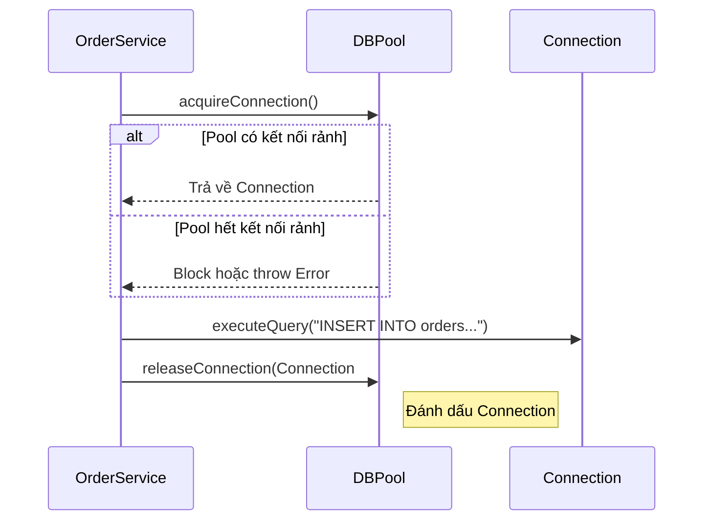

## Mô tả bài toán

Sau khi thiết lập cấu hình với Singleton, Hệ thống Xử lý Đơn hàng cần lưu dữ liệu vào Database. Vào các dịp Sale lớn, hàng nghìn đơn hàng được tạo mỗi giây. Việc mở và đóng kết nối TCP tới Database (như PostgreSQL hay MySQL) cho từng đơn hàng là một tác vụ cực kỳ tốn chi phí (Expensive Operation) và sẽ nhanh chóng làm sập hệ thống.

**Object Pool Pattern** là giải pháp tối ưu cho tình huống này.

## Object Pool Pattern là gì?

Thay vì tạo mới và hủy object liên tục, Object Pool duy trì một "hồ chứa" (pool) các object đã được khởi tạo sẵn. Khi cần, client mượn (borrow) một object từ pool, sử dụng xong thì trả lại (return) để client khác dùng tiếp.

## Áp dụng vào Hệ thống Xử lý Đơn hàng

Chúng ta sẽ xây dựng `DatabaseConnectionPool`. Pool này sẽ duy trì sẵn 10 kết nối DB. Khi `OrderRepository` cần lưu đơn hàng, nó lấy kết nối từ Pool, thực thi Query và trả lại.



## Cài đặt (Mã giả)

```typescript
class DatabaseConnection {
  public id: number;
  constructor(id: number) {
    this.id = id; /* Connect to DB */
  }
  public query(sql: string) {
    console.log(`Conn ${this.id} executing: ${sql}`);
  }
}

class DatabaseConnectionPool {
  private available: DatabaseConnection[] = [];
  private inUse: DatabaseConnection[] = [];

  constructor(size: number) {
    for (let i = 0; i < size; i++) {
      this.available.push(new DatabaseConnection(i));
    }
  }

  public acquire(): DatabaseConnection {
    if (this.available.length === 0) {
      throw new Error("No available connections!");
    }
    const conn = this.available.pop()!;
    this.inUse.push(conn);
    return conn;
  }

  public release(conn: DatabaseConnection) {
    this.inUse = this.inUse.filter((c) => c !== conn);
    this.available.push(conn);
  }
}

// Cách sử dụng
const pool = new DatabaseConnectionPool(5); // Khởi tạo pool 5 kết nối
const conn = pool.acquire(); // Mượn
conn.query("INSERT INTO orders (total) VALUES (500)");
pool.release(conn); // Trả lại
```

## Tổng kết

Object Pool giảm thiểu độ trễ đáng kể trong hệ thống backend. Ở bước tiếp theo, sau khi lưu trữ đơn hàng, khách hàng cần tiến hành thanh toán. Chúng ta sẽ dùng **Factory Method Pattern** để linh hoạt xử lý nhiều cổng thanh toán khác nhau (VNPay, Momo, Stripe).
