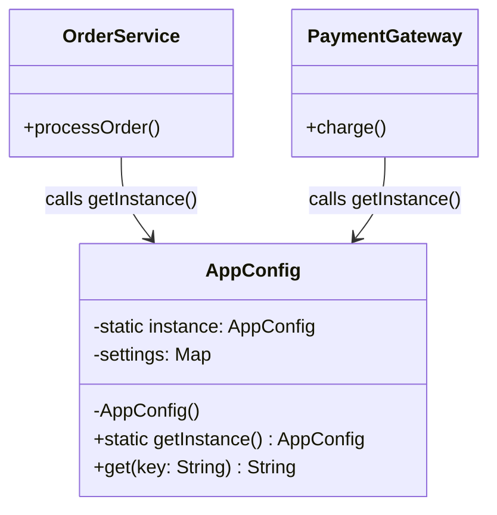

## Mô tả bài toán

Trong series này, chúng ta sẽ cùng xây dựng backend cho một **Hệ thống Xử lý Đơn hàng (Order Processing System)**. Bài toán đầu tiên khi khởi động hệ thống là quản lý các thông số cấu hình (Database credentials, API Keys của đối tác thanh toán, môi trường dev/prod).

Nếu mỗi module tự động đọc file `.env` hoặc query DB để lấy cấu hình, hệ thống sẽ lãng phí I/O và dễ dẫn đến trạng thái không đồng nhất. Đây là lúc **Singleton Pattern** phát huy tác dụng.

## Singleton Pattern là gì?

Singleton đảm bảo một class chỉ có **duy nhất một instance** được tạo ra trong suốt vòng đời của ứng dụng, đồng thời cung cấp một điểm truy cập toàn cục (global access point) tới instance đó.

## Áp dụng vào Hệ thống Xử lý Đơn hàng

Chúng ta sẽ tạo class `AppConfig` để nạp cấu hình hệ thống một lần duy nhất lúc khởi động. Bất kỳ service nào (Payment, Shipping, Database) cần cấu hình đều sẽ gọi đến instance này.



## Cài đặt (Mã giả - TypeScript)

```typescript
class AppConfig {
  private static instance: AppConfig;
  private settings: Map<string, string>;

  // Constructor luôn là private để ngăn tạo instance bằng từ khóa 'new'
  private constructor() {
    this.settings = new Map();
    this.loadConfiguration(); // Đọc từ file hoặc Secrets Manager
  }

  private loadConfiguration() {
    console.log("Loading system configurations...");
    this.settings.set("DB_HOST", "localhost");
    this.settings.set("PAYMENT_API_KEY", "secret_abc123");
  }

  public static getInstance(): AppConfig {
    if (!AppConfig.instance) {
      AppConfig.instance = new AppConfig();
    }
    return AppConfig.instance;
  }

  public get(key: string): string {
    return this.settings.get(key) || "";
  }
}

// Cách sử dụng
const config1 = AppConfig.getInstance();
const config2 = AppConfig.getInstance();

console.log(config1 === config2); // Output: true - Cùng trỏ về một vùng nhớ
```

## Điểm lưu ý

- **Thread-safe**: Trong môi trường đa luồng (Multi-threading), cần cơ chế lock (ví dụ: Mutex) ở hàm `getInstance()` để tránh hiện tượng Race Condition sinh ra nhiều instance cùng lúc.
- Ở bài viết tiếp theo, chúng ta sẽ dùng cấu hình từ `AppConfig` để khởi tạo kết nối cơ sở dữ liệu với **Object Pool Pattern**.
