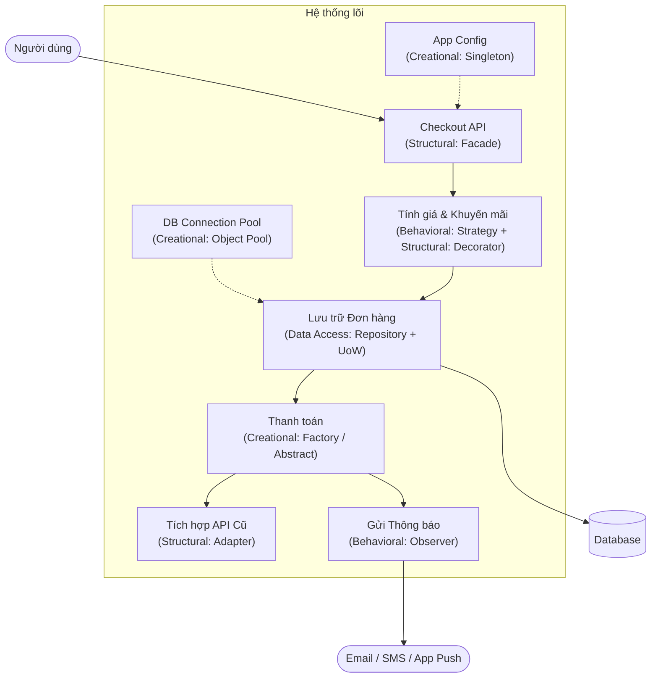

## Mô tả bài toán

Chào mừng bạn đến với chuỗi bài viết chuyên sâu về **Design Patterns (Mẫu thiết kế phần mềm)**.

Thông thường, khi học về Design Patterns, chúng ta hay gặp phải những ví dụ rời rạc như con vịt (Duck), hình học (Shape), hay các phương tiện (Vehicle). Mặc dù dễ hiểu về mặt khái niệm, nhưng khi áp dụng vào một dự án Backend thực tế với hàng nghìn dòng code, nhiều lập trình viên lại lúng túng không biết đặt pattern nào vào đâu cho hợp lý.

Để giải quyết vấn đề đó, series này được thiết kế với một cách tiếp cận hoàn toàn khác: **Học thông qua một Case Study duy nhất và xuyên suốt**.

## Case Study: Hệ thống Xử lý Đơn hàng (Order Processing System)

Xuyên suốt toàn bộ các bài viết, chúng ta sẽ đóng vai trò là những Kỹ sư phần mềm đang thiết kế backend cho một nền tảng Thương mại điện tử (E-commerce). Hệ thống này phải giải quyết các bài toán thực tế:

- Quản lý cấu hình tập trung.
- Chịu tải cao khi ghi dữ liệu.
- Tích hợp nhiều cổng thanh toán, đơn vị vận chuyển.
- Xử lý các quy tắc tính giá, mã giảm giá phức tạp.
- Thông báo cho người dùng khi trạng thái đơn hàng thay đổi.

Dưới đây là bức tranh tổng thể về kiến trúc hệ thống và những nơi chúng ta sẽ "lắp ráp" các Design Patterns:

Nhìn vào sơ đồ trên, bạn có thể thấy các vấn đề kỹ thuật không đứng độc lập mà liên kết chặt chẽ với nhau. Mỗi Pattern sẽ đóng vai trò như một "bánh răng" để cỗ máy vận hành trơn tru, dễ bảo trì và dễ mở rộng.

## Lộ trình của Series

Chuỗi bài viết được chia thành 4 nhóm mẫu thiết kế chính và 1 bài tổng kết, cụ thể như sau:

### Phần 1: Creational Patterns (Nhóm Khởi tạo)

Tập trung vào cách tạo ra các đối tượng một cách an toàn, linh hoạt và tối ưu hiệu suất.

- **Singleton Pattern:** Xây dựng trình quản lý cấu hình hệ thống (AppConfig).
- **Object Pool Pattern:** Tối ưu hóa tái sử dụng kết nối Cơ sở dữ liệu (Database Connection Pool).
- **Factory Method Pattern:** Mở rộng linh hoạt các cổng thanh toán (Momo, VNPay, Stripe).
- **Abstract Factory Pattern:** Đóng gói quy trình hoàn tất đơn hàng (Fulfillment) cho nội địa và quốc tế.
- **Phân tích Use case:** Tổng kết và tiêu chí chọn lựa Creational Patterns.

### Phần 2: Behavioral Patterns (Nhóm Hành vi)

Tập trung vào cách các đối tượng giao tiếp, phân chia trách nhiệm và kiểm soát luồng điều khiển.

- **Strategy Pattern:** Áp dụng các chiến lược tính phí vận chuyển và thuật toán xếp hạng khách hàng.
- **Observer Pattern:** Xây dựng hệ thống Event-driven, tự động gửi email/SMS thông báo khi đơn hàng thay đổi trạng thái.
- **Phân tích Use case:** Tiêu chí chọn lựa Behavioral Patterns.

### Phần 3: Structural Patterns (Nhóm Cấu trúc)

Tập trung vào cách lắp ráp các đối tượng và lớp thành các cấu trúc lớn hơn, nhưng vẫn giữ được sự linh hoạt.

- **Decorator Pattern:** Thiết kế hệ thống áp dụng mã giảm giá (Discount) xếp chồng lên nhau mà không làm phình to logic tính tiền.
- **Adapter Pattern:** Tích hợp hệ thống kiểm tra tồn kho (Inventory) của một đối tác cũ (Legacy System) vào chuẩn mới.
- **Facade Pattern:** Cung cấp một API Checkout duy nhất, che giấu sự phức tạp của toàn bộ hệ thống bên dưới.
- **Phân tích Use case:** Tiêu chí chọn lựa Structural Patterns.

### Phần 4: Data Access Patterns (Nhóm Truy xuất Dữ liệu)

Tập trung vào tầng giao tiếp với Cơ sở dữ liệu, tách biệt logic nghiệp vụ khỏi logic truy vấn.

- **Repository Pattern:** Xây dựng cầu nối chuẩn hóa giữa Domain Models và Database.
- **Unit Of Work Pattern:** Đảm bảo tính toàn vẹn dữ liệu (Transaction) khi lưu đơn hàng, lịch sử thanh toán và trừ tồn kho cùng lúc.
- **Phân tích Use case:** Tiêu chí chọn lựa Data Access Patterns.

### Phần 5: Tổng kết

- **Tổng hợp các pattern và ứng dụng vào thực tế:** Nhìn lại toàn bộ kiến trúc mã nguồn. Làm sao để kết hợp chúng lại mà không rơi vào bẫy "Over-engineering" (phức tạp hóa hệ thống quá mức).

Hãy chuẩn bị một tách cà phê, mở IDE lên và cùng bắt đầu cuộc hành trình thiết kế hệ thống với bài viết đầu tiên: **Creational Patterns - Singleton**.
