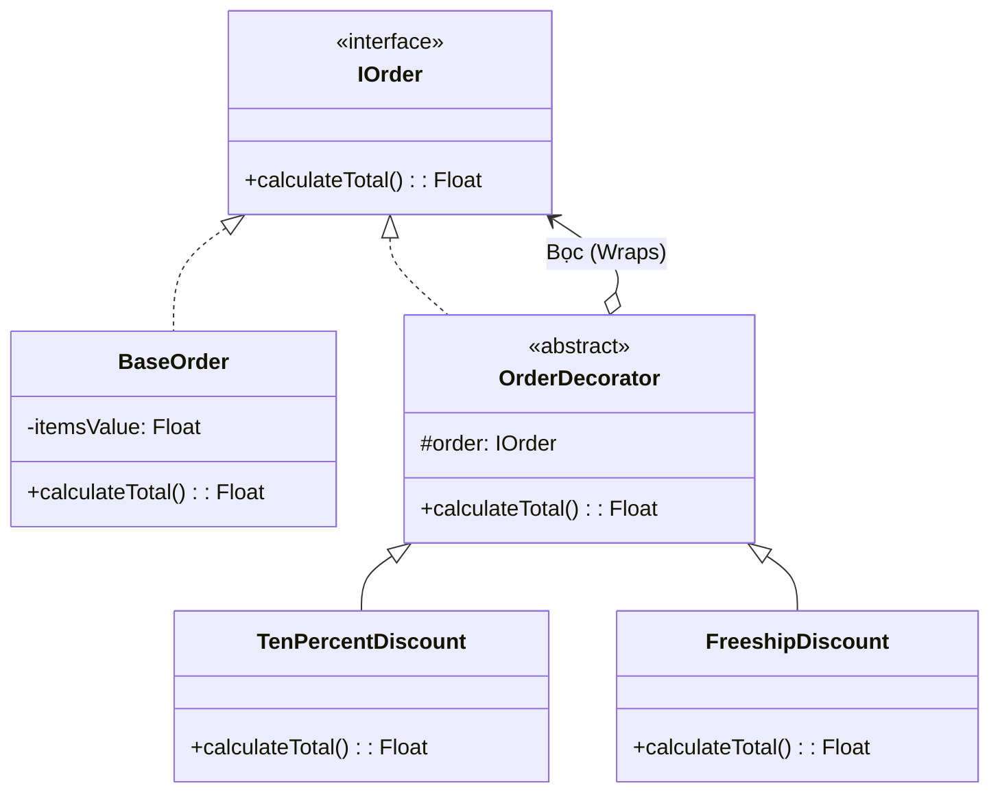

## Mô tả bài toán

Trong nền tảng E-commerce của chúng ta, tính năng Khuyến mãi (Promotion) là một trong những tính năng phức tạp nhất.
Giả sử một đơn hàng có thể được áp dụng: Voucher giảm 10%, Freeship, và Giảm trực tiếp 50k cho thành viên VIP. Người dùng có thể dùng 1, 2 hoặc cả 3 mã này **cùng lúc**.

Nếu dùng Kế thừa (Inheritance), bạn sẽ phải tạo ra hàng tá class như: `OrderWithFreeship`, `OrderWithDiscountAndFreeship`, `OrderWithVIPAndFreeship`... Điều này dẫn đến sự "bùng nổ class" (Class Explosion). **Decorator Pattern** chính là "liều thuốc đặc trị" cho bài toán này.

## Decorator Pattern là gì?

Decorator cho phép đính kèm các hành vi mới vào một đối tượng một cách linh hoạt (dynamically) bằng cách đặt đối tượng đó vào bên trong một đối tượng bao bọc (wrapper/decorator) chứa hành vi đó.

## Áp dụng vào Hệ thống Xử lý Đơn hàng

Chúng ta định nghĩa giao diện `IOrder` với hàm `calculateTotal()`. `BaseOrder` là đơn hàng gốc. Các Decorator (như `TenPercentDiscount`, `FreeShipDiscount`) sẽ bọc lấy `IOrder`, chỉnh sửa kết quả của `calculateTotal()` và trả về giá trị mới.



## Cài đặt (Mã giả - TypeScript)

```typescript
// 1. Component chung
interface IOrder {
  calculateTotal(): number;
}

// 2. Component cơ bản (Đơn hàng gốc)
class BaseOrder implements IOrder {
  private value: number;
  constructor(value: number) {
    this.value = value;
  }

  calculateTotal(): number {
    return this.value;
  }
}

// 3. Lớp Decorator trừu tượng
abstract class OrderDecorator implements IOrder {
  protected order: IOrder;
  constructor(order: IOrder) {
    this.order = order;
  }

  abstract calculateTotal(): number;
}

// 4. Các Concrete Decorators (Voucher cụ thể)
class TenPercentDiscount extends OrderDecorator {
  calculateTotal(): number {
    const currentTotal = this.order.calculateTotal();
    console.log("- Áp dụng giảm 10%");
    return currentTotal * 0.9;
  }
}

class FlatDiscount extends OrderDecorator {
  private discountAmount: number;
  constructor(order: IOrder, amount: number) {
    super(order);
    this.discountAmount = amount;
  }

  calculateTotal(): number {
    const currentTotal = this.order.calculateTotal();
    console.log(`- Áp dụng giảm thẳng ${this.discountAmount}`);
    return currentTotal - this.discountAmount;
  }
}

// 5. Cách sử dụng (Xếp chồng)
let myOrder: IOrder = new BaseOrder(1000000); // 1.000.000 VNĐ
console.log("Giá gốc:", myOrder.calculateTotal());

// Khách thêm mã giảm 10%
myOrder = new TenPercentDiscount(myOrder);

// Khách thêm mã giảm thẳng 50k
myOrder = new FlatDiscount(myOrder, 50000);

console.log("Giá cuối cùng:", myOrder.calculateTotal());
// Kết quả:
// - Áp dụng giảm thẳng 50000
// - Áp dụng giảm 10%
// -> Kết quả được tính toán lồng vào nhau qua các layer.
```

## Đánh giá Ưu / Nhược điểm

**Ưu điểm:**

- Vô cùng linh hoạt: Dễ dàng thêm/bớt tính năng (voucher) tại runtime mà không ảnh hưởng class gốc.
- Tuân thủ SRP (Single Responsibility): Mỗi decorator chỉ làm đúng 1 nhiệm vụ duy nhất (tính toán 1 loại khuyến mãi).
- Thay thế hoàn hảo cho kế thừa (Inheritance) khi cần phối hợp nhiều tính năng.

**Nhược điểm:**

- **Thứ tự bọc (Wrapping order) rất quan trọng:** Giảm 10% trước rồi trừ 50k sẽ khác kết quả với trừ 50k rồi mới giảm 10%. Developer cần cẩn thận quản lý thứ tự này.
- Tạo ra nhiều object nhỏ trong hệ thống, gây khó khăn cho việc debug vì phải trace qua nhiều layer (lớp bọc).
