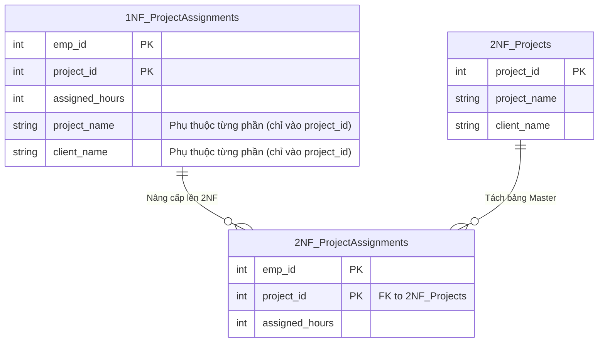

## Đề bài kinh doanh / Yêu cầu dữ liệu

Hệ thống ERP của chúng ta tiếp tục mở rộng thêm **Module Phân công dự án (Project Allocation)**.
Các kỹ sư đã tạo một bảng `Project_Assignments` lưu trữ việc nhân viên nào được phân vào dự án nào, số giờ làm việc (hours), cùng với `project_name` và `client_name` (tên đối tác).

Bảng này có khóa chính ghép (Composite Primary Key) là `(emp_id, project_id)`. Tuy nhiên, một ngày nọ đối tác đổi tên công ty (client_name). Hệ thống phải quét và UPDATE hàng ngàn dòng phân công của toàn bộ nhân viên tham gia dự án đó. Rõ ràng, `project_name` và `client_name` không phụ thuộc vào `emp_id`, chúng chỉ phụ thuộc vào `project_id`. Đây gọi là **Phụ thuộc từng phần (Partial Dependency)**.

## Mô hình hóa dữ liệu

Chuẩn 2NF yêu cầu: **Bảng phải đạt 1NF và KHÔNG có thuộc tính không-khóa nào phụ thuộc vào một phần của khóa chính.**



## Xây dựng Pipeline / Script xử lý

Chúng ta bóc tách thông tin Dự án thành một bảng Master độc lập (Projects) và giữ lại bảng Phân công (Assignments) làm bảng Transaction:

```sql
-- 1. Tạo bảng Projects (Master Data)
CREATE TABLE projects_2nf AS
SELECT DISTINCT project_id, project_name, client_name
FROM project_assignments_1nf;

ALTER TABLE projects_2nf ADD PRIMARY KEY (project_id);

-- 2. Tạo bảng Assignments chuẩn 2NF
CREATE TABLE project_assignments_2nf AS
SELECT emp_id, project_id, assigned_hours
FROM project_assignments_1nf;

ALTER TABLE project_assignments_2nf ADD PRIMARY KEY (emp_id, project_id);
ALTER TABLE project_assignments_2nf
ADD FOREIGN KEY (project_id) REFERENCES projects_2nf(project_id);
-- (Lưu ý: emp_id cũng nên có FK trỏ về bảng employees_1nf ở bài trước)
```

## Kiểm thử dữ liệu & Tối ưu hiệu năng

- **Kiểm thử Update:** Giờ đây, khi đối tác đổi tên, ta chỉ cần chạy duy nhất 1 lệnh Update: `UPDATE projects_2nf SET client_name = 'New Client' WHERE project_id = 101;`. Dữ liệu lập tức đồng bộ trên toàn bộ hệ thống phân công.
- **Tối ưu không gian:** Các chuỗi string dài (tên dự án, tên đối tác) không còn bị lặp lại hàng nghìn lần, giúp giảm dung lượng ổ cứng và tăng tốc độ scan.

## Tổng kết & Khuyến nghị

Chuẩn 2NF giải quyết dứt điểm rắc rối của các bảng có Khóa chính ghép (Composite Keys). Nguyên tắc cốt lõi trong ERP: Hãy luôn tách biệt dữ liệu Danh mục (Master Data - như Dự án, Khách hàng) khỏi dữ liệu Giao dịch/Sự kiện (Transaction Data - như Bảng phân công, Chấm công).
