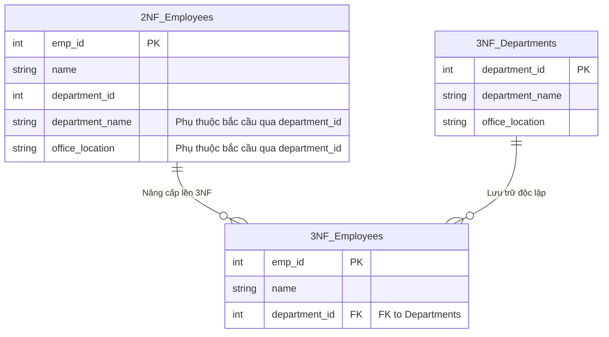

## Đề bài kinh doanh / Yêu cầu dữ liệu

Hệ thống ERP tiếp tục thêm **Module Quản trị Sơ đồ tổ chức**. Chúng ta cập nhật bảng `Employees` (từ bài 1) bằng cách thêm thông tin phòng ban: `department_id`, `department_name`, và `office_location`.

Khóa chính của bảng `Employees` là `emp_id` (đơn khóa). Do đó bảng này tự động thỏa mãn 2NF (vì không có khóa ghép nên không thể có phụ thuộc từng phần).
Thế nhưng, một bất thường (Anomaly) lại xuất hiện: Khi công ty dời văn phòng của "Phòng Kỹ thuật" từ Tầng 2 lên Tầng 5 (`office_location`), ta phải update cho hàng trăm nhân viên. Lý do là `office_location` phụ thuộc vào `department_id`, rồi `department_id` mới phụ thuộc vào khóa chính `emp_id`. Đây gọi là **Phụ thuộc bắc cầu (Transitive Dependency)**.

## Mô hình hóa dữ liệu

Chuẩn 3NF yêu cầu: **Đạt 2NF và KHÔNG tồn tại thuộc tính không-khóa nào phụ thuộc vào một thuộc tính không-khóa khác.**



## Xây dựng Pipeline / Script xử lý

```sql
-- 1. Tạo bảng Departments độc lập
CREATE TABLE departments_3nf AS
SELECT DISTINCT department_id, department_name, office_location
FROM employees_2nf;

ALTER TABLE departments_3nf ADD PRIMARY KEY (department_id);

-- 2. Refactor bảng Employees cho đạt 3NF
CREATE TABLE employees_3nf AS
SELECT emp_id, name, department_id
FROM employees_2nf;

ALTER TABLE employees_3nf ADD PRIMARY KEY (emp_id);
ALTER TABLE employees_3nf
ADD FOREIGN KEY (department_id) REFERENCES departments_3nf(department_id);
```

## Kiểm thử dữ liệu & Tối ưu hiệu năng

- **Kiểm thử Data Integrity:** Mọi thay đổi về phòng ban (đổi tên, chuyển văn phòng) giờ được cô lập (isolate) tại bảng `departments_3nf`.
- **Đạt chuẩn OLTP:** 3NF giúp loại bỏ tối đa Redundancy (dữ liệu dư thừa). Đây là thiết kế lý tưởng cho các core system của ERP (OLTP), giúp tối ưu tốc độ Write và cam kết chuẩn ACID.

## Tổng kết & Khuyến nghị

Đạt đến 3NF là mục tiêu bắt buộc cho mọi bảng dữ liệu chính trong kiến trúc ERP. Việc tuân thủ "không gì khác ngoài khóa" giúp hệ thống tránh được nợ kỹ thuật (Technical Debt) nghiêm trọng khi quy mô nhân sự và sơ đồ tổ chức của công ty ngày càng phức tạp.
