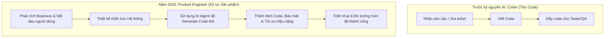
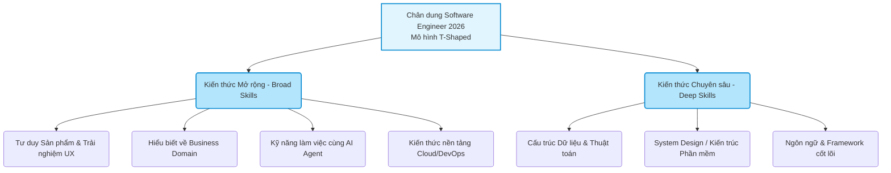

Thị trường lao động IT toàn cầu và tại Việt Nam đang trải qua một cuộc thanh lọc khắc nghiệt nhất trong vòng một thập kỷ qua. Thời kỳ hoàng kim của việc "chỉ cần biết code là có lương nghìn đô" đã chính thức khép lại. Dưới đây là góc nhìn cá nhân của tôi về những biến động đang diễn ra, nguyên nhân cốt lõi và cách chúng ta có thể định vị lại bản thân.

## Làn sóng Lay-off và AI: Kẻ chiếm sóng nhưng không thể thay thế kỹ sư phần mềm

Nhìn ra thế giới, dữ liệu từ Layoffs.fyi chỉ ra rằng tính đến giữa năm 2026, đã có hơn 150.000 nhân sự công nghệ bị sa thải, và đáng chú ý là 55% các đợt cắt giảm này trực tiếp chỉ đích danh nguyên nhân là do tái cấu trúc để đầu tư vào AI và tự động hóa. Tại Việt Nam, bức tranh cũng mang gam màu tương tự. Theo báo cáo của TopDev, thị trường Việt Nam hiện có khoảng 560.000 nhân sự IT, nhưng báo cáo khảo sát năm 2025-2026 của ITviec cho thấy một thực tế lạnh lùng: 38,7% doanh nghiệp IT dự kiến áp dụng chính sách "không tăng trưởng/giảm biên chế" – tỷ lệ cao nhất kể từ năm 2020 – với lý do chính là triển khai AI để tăng năng suất.

**Góc nhìn của tôi:** Làn sóng lay-off này là sự thật, và AI đang dần chiếm sóng nhờ khả năng tạo lập (Generative AI) quá tốt. Tuy nhiên, **AI tuyệt đối không thể thay thế công việc của một Software Engineer đích thực.**

Lý do nằm ở đặc thù cốt lõi của nghề: Software Engineering chưa bao giờ thuần túy là việc "gõ code". Nó là quá trình giải quyết vấn đề dựa trên những yêu cầu kinh doanh đầy tính mơ hồ của con người. Khảo sát Developer Survey 2025-2026 của Stack Overflow đã chứng minh điều này một cách thú vị: Dù 84% lập trình viên đang hoặc sẽ sử dụng AI trong công việc, nhưng chỉ có 29% thực sự tin tưởng vào độ chính xác của các kết quả do AI tạo ra.

AI có thể viết ra một hàm function hoàn hảo trong 3 giây, nhưng nó không thể chịu trách nhiệm khi hệ thống sập. Nó không hiểu được các ràng buộc về chi phí server (cloud cost), không biết cách giao tiếp với các phòng ban khác để chốt scope dự án, và không thể tự đưa ra các đánh đổi về mặt kiến trúc (architectural trade-offs). Kỹ sư phần mềm giờ đây đóng vai trò là "Người thẩm định" (Validator) và "Kiến trúc sư" (Architect) để lắp ráp các mảnh ghép do AI tạo ra thành một sản phẩm an toàn.

## Nghịch lý Tuyển dụng: Đòi hỏi "Siêu nhân" với ngân sách "Bình dân"

Nếu bạn dạo quanh các trang tuyển dụng hiện nay, sẽ không khó để bắt gặp những bản mô tả công việc (JD) tìm kiếm một Junior/Mid-level nhưng yêu cầu phải biết cả Frontend, Backend, thao tác mượt mà với Cloud (AWS/GCP), hiểu biết DevOps và thậm chí có tư duy Product. Mức lương đi kèm thường không tương xứng với khối lượng yêu cầu khổng lồ đó.

**Góc nhìn của tôi:** Nhà tuyển dụng luôn đòi hỏi nhiều hơn những gì họ có thể chi trả, nhưng nguyên nhân sâu xa không chỉ nằm ở bài toán "ép giá".

Trong bối cảnh dòng vốn đầu tư thắt chặt và các đợt sa thải từ 2022-2024 đã đẩy một lượng lớn nhân sự Senior ra thị trường, doanh nghiệp đang có quyền lựa chọn. Tuy nhiên, động cơ cốt lõi là **họ đang mua "năng lực thích ứng tương lai" của bạn chứ không chỉ là "kỹ năng hiện tại"**.

- **Về phía doanh nghiệp:** Họ mong muốn ứng viên có khả năng liên tục trau dồi kiến thức để tự động giải quyết các bài toán phát sinh mà không cần phải tuyển thêm người mới.
- **Về phía ứng viên:** Bạn bắt buộc phải có khả năng tự học vượt ra ngoài lĩnh vực chuyên môn (domain) đang làm. Nếu bạn là Frontend, bạn phải hiểu Backend hoạt động ra sao để tối ưu API call. Nếu bạn là Backend, bạn phải hiểu cách deploy để tự vận hành hệ thống. Sự "tham lam" của doanh nghiệp thực chất là một bộ lọc để tìm ra những cá nhân có khả năng sống sót trong môi trường công nghệ thay đổi mỗi ngày.

## Sự suy tàn của "Thợ Code" và Sự trỗi dậy của "Product Engineer"

Một góc nhìn khác mà tôi muốn bổ sung để hoàn thiện bức tranh này là sự dịch chuyển mạnh mẽ từ khái niệm "Coder" (Thợ gõ code) sang "Product Engineer" (Kỹ sư phát triển Sản phẩm).

Trước đây, giá trị của một lập trình viên được đo lường bằng việc họ code nhanh bao nhiêu, ít bug thế nào khi nhận một ticket. Ngày nay, AI đã làm tốt phần việc đó. Lợi thế cạnh tranh duy nhất còn lại của con người là **Business Context (Ngữ cảnh kinh doanh) và User Empathy (Thấu cảm người dùng).**

Một Product Engineer không bắt đầu bằng câu hỏi _"Dùng framework gì?"_ mà bằng câu hỏi _"Tính năng này mang lại giá trị gì cho người dùng và có đáng để công ty đầu tư nguồn lực không?"_.

## Đề xuất hành động trong thời điểm hiện tại

Thị trường không hề "chết", nó chỉ đang nâng tiêu chuẩn lên một tầm cao mới. Để tồn tại và bứt phá trong năm 2026, đây là những chiến lược hành động cụ thể:

- **Định hình lại bản thân theo mô hình "T-Shaped Engineer":** Đừng chỉ cắm đầu vào một ngôn ngữ lập trình. Hãy đào sâu vào một chuyên môn cốt lõi (chữ I) như cấu trúc dữ liệu, thuật toán, thiết kế kiến trúc, nhưng đồng thời mở rộng tầm hiểu biết (nét gạch ngang của chữ T) sang các mảng như DevOps, Cloud, Bảo mật và Tư duy Sản phẩm.
- **Biến AI thành "Đàn em" (Junior) của bạn:** Thay vì sợ hãi AI, hãy học cách quản lý nó. Kỹ năng quan trọng nhất hiện nay là "Review code của AI", phát hiện các lỗ hổng bảo mật hoặc logic ngớ ngẩn mà AI tạo ra do hiện tượng "ảo giác" (hallucination).
- **Tập trung vào "System Design" thay vì "Syntax":** Cú pháp (Syntax) có thể quên và nhờ AI nhắc, nhưng tư duy Thiết kế Hệ thống (System Design) – việc kết nối các microservices, thiết kế database chịu tải cao, giải quyết bài toán scale – là thứ AI hiện tại chưa thể làm thay con người trong một ngữ cảnh doanh nghiệp phức tạp.
- **Hiểu Business Domain:** Hãy chọn một ngách ngành nghề (Tài chính, Y tế, Logistics, E-commerce...) và tìm hiểu sâu về nó. Khi bạn hiểu quy trình nghiệp vụ của ngành, bạn sẽ tư vấn được giải pháp công nghệ mang lại tiền cho công ty. Đó là lúc bạn trở thành nhân sự không thể bị thay thế.

**Tóm lại:** Làn sóng hiện tại không phải là dấu chấm hết cho nghề Software Engineer, mà là một sự tiến hóa tất yếu. Việc doanh nghiệp đòi hỏi cao và sự gia nhập của AI thực chất đang giải phóng kỹ sư khỏi những dòng code nhàm chán, ép chúng ta phải bước lên làm những công việc có hàm lượng chất xám cao hơn: Thiết kế kiến trúc, thấu hiểu kinh doanh và giải quyết những bài toán mang giá trị thực tiễn.
