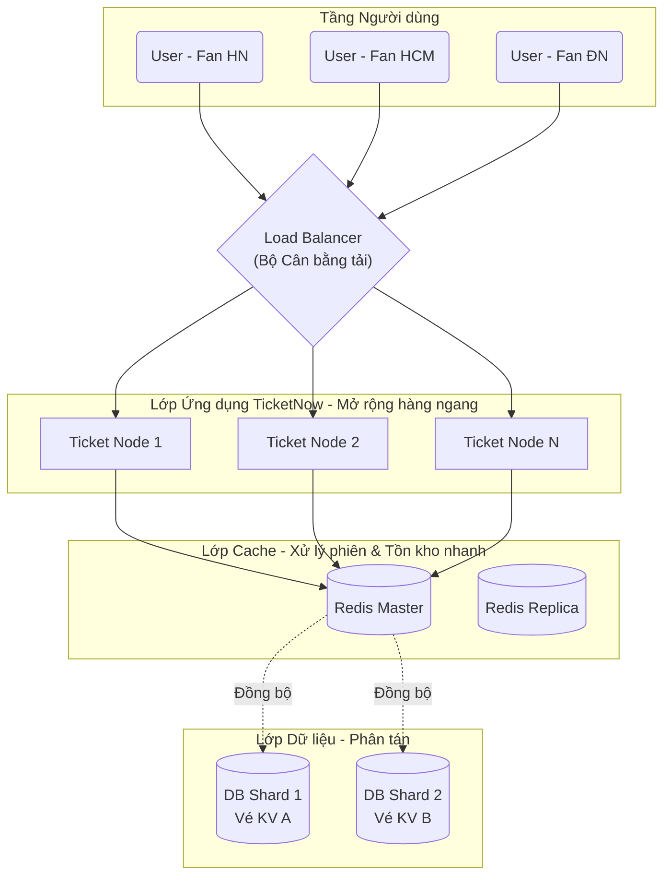

Điểm chung cốt lõi của kiến trúc này là bẻ gãy tính tập trung cục bộ, phân bổ tài nguyên và tải trọng dàn đều sang nhiều node (máy chủ) độc lập, hoạt động đồng cấp với nhau. Để hiểu rõ hơn, chúng ta hãy cùng đặt kiến trúc này vào bối cảnh xây dựng hệ thống **TicketNow** - một nền tảng bán vé concert, phim và sự kiện quy mô lớn.

## Bối cảnh & Vấn đề

Hãy tưởng tượng hệ thống TicketNow vừa giành được quyền phân phối độc quyền vé concert của show "Anh trai vượt ngàn chông gai 2026". Vào đúng 9h00 sáng ngày mở bán, có 500.000 người dùng đồng loạt F5 ứng dụng để tranh nhau 50.000 vé.

Nếu dùng kiến trúc cũ, giải pháp duy nhất là mua một chiếc máy chủ "siêu to khổng lồ". Nhưng sức mạnh phần cứng vật lý luôn có "mức trần", chi phí nâng cấp là phi lý. Tệ hơn nữa, nếu chiếc máy chủ duy nhất đó quá tải và sập (Single Point of Failure - SPOF), toàn bộ nền tảng TicketNow sẽ "chết đứng".

Điều này bắt buộc TicketNow phải áp dụng **Kiến trúc hàng ngang**: sử dụng hàng chục, hàng trăm máy chủ thông thường, giá hợp lý kết nối với nhau để cùng "gánh" lượng truy cập khổng lồ này. Vậy,

## Kiến trúc hàng ngang là gì?

Vào những năm 1980–1990, các hệ thống được xây dựng chủ yếu dựa trên các máy chủ Mainframe đắt đỏ. Khi hệ thống quá tải, giải pháp duy nhất là mua một chiếc máy chủ to hơn, mạnh hơn (Scale-up). Tuy nhiên, khi kỷ nguyên Internet bùng nổ vào đầu thập niên 2000 (với sự nổi lên của Google, Amazon), lượng dữ liệu và người dùng tăng theo cấp số nhân. Sức mạnh phần cứng vật lý nhanh chóng chạm đến "mức trần", chi phí nâng cấp trở nên phi lý và một máy chủ duy nhất chết (Single Point of Failure - SPOF) sẽ kéo theo toàn bộ nền tảng sập. Điều này thúc đẩy sự ra đời của Kiến trúc hàng ngang: sử dụng hàng ngàn máy chủ thông thường, giá rẻ (commodity hardware) kết nối với nhau để xử lý các bài toán khổng lồ

Đây là phương pháp thiết kế hệ thống mà ở đó, hiệu năng và sức mạnh xử lý được gia tăng bằng cách _lắp thêm nhiều máy chủ nhỏ (node)_ vào một mạng lưới để chúng cùng chia sẻ công việc, thay vì liên tục nâng cấp linh kiện (CPU, RAM) cho một máy chủ khổng lồ duy nhất. Trong cấu trúc này, các node có vai trò ngang hàng nhau, xử lý độc lập và có thể dễ dàng được thêm vào hoặc gỡ bỏ mà không làm gián đoạn dịch vụ.

## Mục đích của kiến trúc hàng ngang

Phá vỡ giới hạn vật lý của phần cứng đơn lẻ, đảm bảo hệ thống có thể xử lý lượng truy cập không giới hạn, đồng thời loại bỏ rủi ro sập toàn hệ thống khi một thành phần linh kiện gặp sự cố.

## Khi nào nên sử dụng kiến trúc hàng ngang?

- **Lưu lượng truy cập (Traffic) tăng đột biến (Burst traffic):** Điển hình như TicketNow vào những ngày "săn vé" concert
- **Yêu cầu tính sẵn sàng cao (High Availability):** Cam kết thời gian uptime lên tới 99.99%. Dù 2 trên 10 server của TicketNow bị cháy ổ cứng, người dùng vẫn có thể đặt vé bình thường ở 8 server còn lại.
- **Khối lượng dữ liệu cực lớn (Big Data):** Lịch sử giao dịch, log truy cập, thao tác chọn ghế của hàng triệu người vượt quá sức chứa của một ổ cứng truyền thống.
- **Hệ thống phân tán địa lý:** Cần đặt server ở cả Hà Nội, Đà Nẵng và TP.HCM để người dùng khu vực nào cũng có thể truy cập TicketNow với tốc độ nhanh nhất.

## Thiết kế kiến trúc

Trong mô hình kiến trúc hàng ngang hiện đại, một **Bộ cân bằng tải (Load Balancer)** sẽ đứng ở cửa ngõ để tiếp nhận toàn bộ yêu cầu, sau đó phân phối đều xuống nhiều máy chủ ứng dụng ngang hàng bên dưới.

**Nguyên lý hoạt động cơ bản tại TicketNow:**

1. Hàng trăm ngàn request "Chọn ghế" từ người dùng đổ về hệ thống sẽ gặp Load Balancer.
2. Load Balancer dùng các thuật toán (như Round Robin) để chuyển tiếp request tới một **Ticket Node** đang rảnh rỗi.
3. Vì các Ticket Node được thiết kế ngang hàng, bất kỳ Node nào cũng có thể xử lý việc đặt vé. Nếu Node 1 bị tràn RAM và sập, Load Balancer tự động cắt traffic và dồn sang Node 2, Node 3.
4. Ở tầng Database, thông tin sơ đồ ghế và vé cũng được băm nhỏ (Sharding) để tránh việc hàng trăm ngàn người cùng ghi (write) vào chung một ổ cứng gây nghẽn cổ chai.

## Phân tích đánh đổi

**So sánh với kiến trúc truyền thống (Mở rộng dọc - Scale Up):**

<table style="width:100%; border-collapse: collapse; margin-bottom: 20px;">
  <thead>
    <tr style="border-bottom: 2px solid #e2e8f0; text-align: left;">
      <th style="padding: 8px;">Tiêu chí</th>
      <th style="padding: 8px;">Mở rộng dọc (Một máy chủ siêu mạnh)</th>
      <th style="padding: 8px;">Kiến trúc hàng ngang (Mạng lưới máy chủ)</th>
    </tr>
  </thead>
  <tbody>
    <tr style="border-bottom: 1px solid #edf2f7;">
      <td style="padding: 8px;"><strong>Bản chất</strong></td>
      <td style="padding: 8px;">Nâng cấp CPU, RAM, Ổ cứng cho 1 máy chủ hiện tại.</td>
      <td style="padding: 8px;">Cắm thêm nhiều máy chủ mới vào cụm hệ thống.</td>
    </tr>
    <tr style="border-bottom: 1px solid #edf2f7;">
      <td style="padding: 8px;"><strong>Khả năng mở rộng</strong></td>
      <td style="padding: 8px;">Bị "chạm trần" bởi giới hạn phần cứng vật lý.</td>
      <td style="padding: 8px;">Gần như vô hạn.</td>
    </tr>
    <tr style="border-bottom: 1px solid #edf2f7;">
      <td style="padding: 8px;"><strong>Tính sẵn sàng (HA)</strong></td>
      <td style="padding: 8px;">Thấp. Máy chủ sập là TicketNow ngưng bán vé.</td>
      <td style="padding: 8px;">Rất cao. Vài node sập, hệ thống vẫn hoạt động.</td>
    </tr>
    <tr style="border-bottom: 1px solid #edf2f7;">
      <td style="padding: 8px;"><strong>Quản lý dữ liệu</strong></td>
      <td style="padding: 8px;">Dễ dàng. Đảm bảo tính nhất quán tuyệt đối (ACID).</td>
      <td style="padding: 8px;">Phức tạp. Dữ liệu phân tán phải đối mặt với bài toán đồng bộ.</td>
    </tr>
    <tr style="border-bottom: 1px solid #edf2f7;">
      <td style="padding: 8px;"><strong>Chi phí</strong></td>
      <td style="padding: 8px;">Rất đắt đỏ cho các dòng máy chuyên dụng/độc quyền.</td>
      <td style="padding: 8px;">Rẻ hơn trên từng đơn vị máy, nhưng tốn chi phí và công sức quản lý hạ tầng mạng.</td>
    </tr>
  </tbody>
</table>

**Nhược điểm & Bài toán hóc búa của Kiến trúc hàng ngang:**

1. **Sự phức tạp (Complexity):** Cấu hình, giám sát và deploy code lên 100 server TicketNow cùng lúc khó hơn rất nhiều so với 1 server.
2. **Độ trễ mạng (Network Latency):** Các server giao tiếp với nhau qua cáp mạng thay vì trên cùng một bo mạch chủ, gây ra độ trễ.
3. **Tính nhất quán dữ liệu (Data Consistency):** Đây là "tử huyệt" của ứng dụng bán vé. Nếu TicketNow phân tán dữ liệu ở 3 server, làm sao để chắc chắn **không có 2 người dùng khác nhau cùng mua chung 1 chiếc vé ở ghế A1**? (Bài toán Overselling và Định lý CAP - sẽ được bàn kỹ ở Bài 5).

## Bài học thực tế & Best Practices cho TicketNow

Để kiến trúc hàng ngang hoạt động trơn tru trong thực tế, TicketNow phải tuân thủ các nguyên tắc thiết kế bất biến sau:

- **Xây dựng ứng dụng phi trạng thái (Stateless):** Không lưu trữ bất kỳ trạng thái đăng nhập (session), giỏ hàng hay file ảnh vé trên RAM/ổ cứng của một Ticket Node cục bộ. Hãy đẩy mọi thứ vào một cụm Cache ngang hàng (như Redis) và lưu trữ Object (như AWS S3). Nếu người dùng A đang thao tác ở Node 1, và Node 1 sập, Load Balancer đẩy người dùng A sang Node 2, Node 2 vẫn lấy được trạng thái giỏ hàng của họ từ Redis để tiếp tục thanh toán.
- **Tự động hóa toàn diện (Auto-scaling):** Vào những ngày không có sự kiện, TicketNow chỉ cần 5 server để tiết kiệm tiền. Nhưng hệ thống phải có khả năng tự động theo dõi (Monitor): Nếu nhận thấy lượt truy cập bắt đầu tăng vọt lúc 8h45 sáng, hệ thống phải tự động "spin up" (bật thêm) 50 server mới trong vòng vài phút để chuẩn bị gánh tải cho đợt mở bán 9h00.
- **Cơ chế Retry & Circuit Breaker (Ngắt mạch):** Trong kiến trúc phân tán, việc 1-2 kết nối nội bộ bị timeout là bình thường. Nếu cổng thanh toán (Payment Gateway) đối tác bị quá tải, TicketNow cần cơ chế "ngắt mạch" (Circuit Breaker) để tạm ngưng gọi sang đó, tránh dồn cục traffic làm sập luôn toàn bộ luồng chọn vé của khách hàng khác.
- **Giám sát tập trung (Observability):** Khi có khách hàng phàn nàn "Tôi thanh toán bị trừ tiền nhưng không thấy vé", kỹ sư không thể mò mẫm truy cập SSH vào từng máy trong 50 máy chủ để tìm log. Bắt buộc phải có một công cụ thu thập Log, Metric và Trace tập trung (như ELK Stack, Datadog) để truy vết chính xác request của ID khách hàng đó đã chạy qua những node nào, và bị lỗi ở khâu nào.

> _Trong Bài 2, chúng ta sẽ đi sâu vào **"Cách thiết kế hệ thống theo kiến trúc hàng ngang"**, đi vào các pattern thiết kế cụ thể để chuẩn bị cho TicketNow một hạ tầng vững chắc nhất trước thềm các sự kiện triệu đô._
