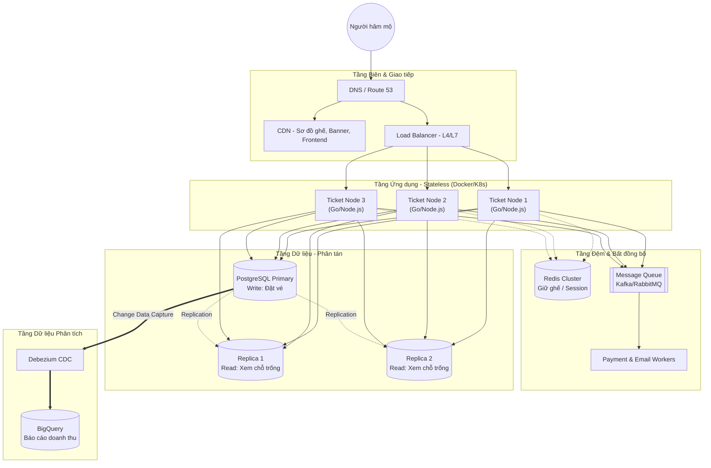

Với bài toán của **TicketNow** - nơi một sự kiện mở bán vé concert có thể thu hút 500.000 người truy cập đồng thời trong vỏn vẹn 5 phút - việc thiết kế sai một tầng duy nhất cũng có thể dẫn đến sập toàn hệ thống.

Dưới đây là bản thiết kế chi tiết (Deep Dive) cách phân rã và mở rộng từng tầng của TicketNow.

## Sơ đồ Tổng thể Hệ thống TicketNow

## Tầng Giao tiếp & Tối ưu Biên (Edge & Routing Layer)

Trước khi request chạm đến máy chủ ứng dụng (Ticket Node), nó cần được phân luồng tối ưu để giảm tải tối đa cho hệ thống phía sau. Tại đợt săn vé BlackPink, TicketNow không thể để server phải mệt mỏi xử lý việc tải hình ảnh sơ đồ sân vận động.

- **Content Delivery Network (CDN):** Toàn bộ tài nguyên tĩnh như hình ảnh nghệ sĩ, CSS, JS, sơ đồ ghế ngồi (seat map) dạng SVG, hay bộ source Frontend (Next.js/Vue) đều được đẩy ra các CDN toàn cầu. Việc này gánh bớt 30-50% lượng truy cập băng thông khổng lồ, chặn đứng các request không cần thiết chạm vào server chính.
- **Load Balancer đa tầng:**
  - **Layer 4 (Transport):** Xử lý định tuyến siêu tốc dựa trên IP/Port, dùng để cân bằng tải khối lượng lớn connection TCP/UDP khi hàng trăm ngàn người cùng F5 ứng dụng.
  - **Layer 7 (Application):** Cân bằng tải thông minh dựa trên nội dung HTTP/HTTPS. Ví dụ: TicketNow sẽ cấu hình Load Balancer định tuyến `/api/concerts` (chỉ xem thông tin) về cụm Server A (chuyên Read), và `/api/bookings` (đặt vé) về cụm Server B (chuyên Write, cấu hình mạnh hơn).

## Tầng Ứng dụng (Application Layer) - Nguyên tắc phi trạng thái

Đây là tầng dễ mở rộng nhất nếu thiết kế đúng. Trái tim của việc scale hàng ngang ở tầng này là: **Tuyệt đối không tin tưởng bất kỳ máy chủ nào.**

- **Stateless Containerization:** TicketNow đóng gói ứng dụng bằng Docker. Mỗi container khởi chạy là một bản sao giống hệt nhau. Dù sử dụng Go, Rust hay Node.js, ứng dụng không bao giờ lưu file tạm hay user session trên RAM hoặc ổ cứng cục bộ của server đó.
- **Externalize Session & State:** Chuyển toàn bộ "trạng thái" ra ngoài.
  - _Ví dụ thực tế:_ Khi User A bấm chọn ghế "VIP-A1", trạng thái "Ghế VIP-A1 đang bị khóa tạm thời 10 phút" phải được lưu vào **Redis Cluster**. Nếu Ticket Node 1 (đang phục vụ User A) đột ngột sập do nghẽn RAM, Load Balancer sẽ đá User A sang Ticket Node 2. Nhờ có Redis, Node 2 vẫn biết ghế VIP-A1 đang thuộc về User A và cho phép họ thanh toán tiếp, trải nghiệm người dùng không hề bị đứt đoạn.

## Tầng Dữ liệu (Data Layer) - Nút thắt cổ chai khó nhằn nhất

Mở rộng ứng dụng thì dễ (chỉ cần boot thêm Docker), nhưng mở rộng Database thì phức tạp hơn ngàn lần vì phải bảo đảm tính toàn vẹn (không để 2 người mua chung 1 vé).

- **Giai đoạn 1: Master-Slave Replication (Phân tách Đọc/Ghi)**
  - **Primary Node (Master):** Chỉ chuyên xử lý các lệnh `INSERT`, `UPDATE` (Thực hiện giao dịch thanh toán vé, khóa ghế).
  - **Replica Nodes (Slaves):** Chuyên xử lý các lệnh `SELECT`. Khi hàng trăm ngàn người liên tục load trang để xem "còn bao nhiêu ghế trống", truy vấn sẽ được ném vào các node Slave. Dữ liệu từ Master sẽ được đồng bộ (Replication) liên tục sang các Slaves với độ trễ tính bằng mili-giây.
- **Giai đoạn 2: Sharding / Partitioning (Băm dữ liệu)**
  Khi dữ liệu giao dịch quá lớn, TicketNow phải chia cắt cơ sở dữ liệu. Ví dụ: Dữ liệu đặt vé sự kiện ở Hà Nội lưu ở DB Shard 1, sự kiện ở TP.HCM lưu ở DB Shard 2.
- **Giai đoạn 3: Tách biệt hệ thống OLTP và OLAP**
  Tuyệt đối không chạy các câu query báo cáo phức tạp (như "Thống kê doanh thu theo từng hạng vé trong 1 giờ qua") trực tiếp trên Database chính đang bán vé (OLTP). TicketNow thiết lập **CDC (Change Data Capture)** để "hút" dữ liệu thô liên tục sang Data Warehouse (như BigQuery) phục vụ cho Ban tổ chức xem Dashboard (OLAP) mà không làm lag hệ thống bán vé.

## Tầng Xử lý Bất đồng bộ (Asynchronous & Event-Driven)

Khi hệ thống phải đối mặt với một lưu lượng "Spike" (tăng vọt đột biến lúc 9:00 sáng), kiến trúc hàng ngang truyền thống vẫn sẽ "chết ngợp" nếu bắt người dùng phải chờ hệ thống xử lý tuần tự (Synchronous).

- **Đưa Message Queue (Kafka/RabbitMQ) vào giữa các component:**
  - **Cách hoạt động tại TicketNow:** Khi người dùng bấm "Thanh toán", API không trực tiếp gọi sang cổng thanh toán VNPay, cũng không lập tức gọi API sinh file PDF vé và gửi Email (quá trình này có thể tốn 5-10s và rất dễ timeout).
  - Thay vào đó, API chỉ trả về `200 OK - Đang xử lý` (chưa tới 50ms) và ném một sự kiện `OrderPending` vào Kafka.
  - Ở phía sau, một đội quân **Background Workers** được scale hàng ngang sẽ liên tục hút các event từ Queue ra để xử lý từ từ (gọi VNPay, cập nhật DB, render PDF, gửi Email). Điều này giúp API luôn trống tải để đón nhận các luồng khách hàng tiếp theo.

## Triển khai & Tự động hoá (Automation & Orchestration)

Kiến trúc phân tán sẽ trở thành "ác mộng" vận hành nếu thao tác thủ công. Với hàng trăm node, bạn không thể SSH vào từng máy để gõ lệnh start.

- **Auto-Scaling (Tự động co giãn):** Hệ thống TicketNow được quản trị bởi Kubernetes (K8s). Khi Metric (Datadog/Prometheus) báo động CPU trung bình của cụm API vượt 75% vào lúc 8h50 sáng, K8s tự động boot thêm 50 Pods (container) mới và móc chúng vào Load Balancer. Khi sự kiện bán hết vé lúc 11:00, hệ thống tự động "kill" bớt các container thừa để tối ưu chi phí Cloud.
- **Service Discovery:** Khi số lượng node liên tục biến động, các dịch vụ tự động "tìm thấy" nhau thông qua các cơ chế nội bộ của K8s (hoặc Consul) thay vì phải hardcode địa chỉ IP tĩnh dễ sinh lỗi.

> Thiết kế hệ thống hàng ngang là nghệ thuật của việc **phân quyền và gỡ rối (Decoupling)**. Bằng cách chia nhỏ một khối khổng lồ thành nhiều tầng, tách bạch State khỏi Application, dùng Message Queue làm bộ đệm và phân tách luồng Đọc/Ghi của Database, TicketNow đã sở hữu một hạ tầng có sức chịu tải tiệm cận vô hạn.
