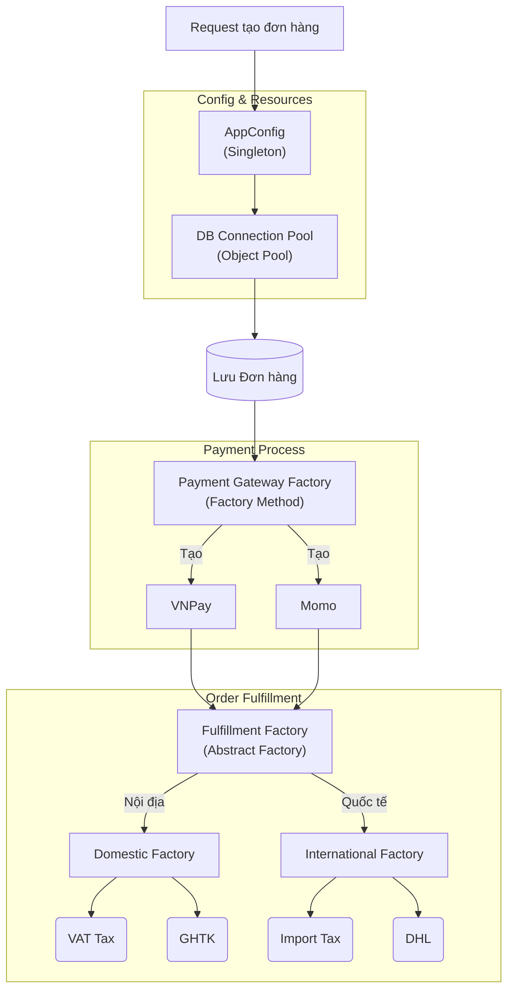

## Kiến trúc tổng thể với Creational Patterns

## Tiêu chí chọn lựa (Decision Matrix)

Khi đứng trước quyết định thiết kế cho một hệ thống lớn (ERP, E-commerce, Data Pipeline), hãy đặt các câu hỏi sau để chọn đúng Creational Pattern:

<table style="width:100%; border-collapse: collapse; margin-bottom: 20px;">
  <thead>
    <tr style="border-bottom: 2px solid #e2e8f0; text-align: left;">
      <th style="padding: 8px;">Đặc tả bài toán (Use Case)</th>
      <th style="padding: 8px;">Pattern</th>
      <th style="padding: 8px;">Ví dụ áp dụng thực tế (Backend)</th>
    </tr>
  </thead>
  <tbody>
    <tr style="border-bottom: 2px solid #e2e8f0; text-align: left;">
      <td style="padding: 8px">Cần kiểm soát chặt chẽ để <strong>chỉ có 1 instance</strong> duy nhất tồn tại toàn cục?</td>
      <td style="padding: 8px"><strong>Singleton</strong></td>
      <td style="padding: 8px">System Logger, Configuration Manager, State Manager.</td>
    </tr>
    <tr style="border-bottom: 2px solid #e2e8f0; text-align: left;">
      <td style="padding: 8px">Chi phí khởi tạo object (CPU, I/O, Network) <strong>rất đắt đỏ</strong>, cần cấp phát và thu hồi liên tục?</td>
      <td style="padding: 8px"><strong>Object Pool</strong></td>
      <td style="padding: 8px">Database/Redis Connection Pool, Thread Pool, Worker Pool.</td>
    </tr>
    <tr style="border-bottom: 2px solid #e2e8f0; text-align: left;">
      <td style="padding: 8px">Cần khởi tạo 1 object chung interface nhưng <strong>logic sinh ra cụ thể phụ thuộc vào subclass / param</strong>?</td>
      <td style="padding: 8px"><strong>Factory Method</strong></td>
      <td style="padding: 8px">Khởi tạo Data Exporter (PDF/CSV/Excel), Cổng thanh toán.</td>
    </tr>
    <tr style="border-bottom: 2px solid #e2e8f0; text-align: left;">
      <td style="padding: 8px">Cần sinh ra <strong>một lúc nhiều object phụ thuộc vào nhau</strong>, thuộc chung một họ (gia đình/family)?</td>
      <td style="padding: 8px"><strong>Abstract Factory</strong></td>
      <td style="padding: 8px">Tạo UI Component đa nền tảng, Infrastructure Provisioning đa Cloud (AWS/GCP), Module Xử lý theo vùng miền (Nội địa/Quốc tế).</td>
    </tr>
    <tr style="border-bottom: 2px solid #e2e8f0; text-align: left;">
      <td style="padding: 8px"><em>Bổ sung:</em> Object cấu tạo <strong>quá phức tạp</strong>, cần sinh ra qua nhiều bước tuần tự?</td>
      <td style="padding: 8px"><strong>Builder</strong> <em>(Tham khảo thêm)</em></td>
      <td style="padding: 8px">Tạo câu lệnh SQL động (Query Builder), Build HTTP Request phức tạp.</td>
    </tr>
  </tbody>
</table>

## Bài học rút ra

Lạm dụng Design Pattern là con đường ngắn nhất dẫn đến _Over-engineering_ (phức tạp hóa hệ thống không cần thiết).

- Đừng dùng Singleton nếu object đó không thực sự chia sẻ chung trạng thái (state).
- Đừng vội dùng Abstract Factory nếu hệ thống chỉ có một phương thức vận chuyển duy nhất; Factory Method hoặc Dependency Injection là đủ.
- Luôn ưu tiên tính dễ đọc và bảo trì (Maintainability) lên hàng đầu.

Thiết kế phần mềm không phải là áp đặt rập khuôn các Pattern, mà là **hiểu rõ nỗi đau của bài toán** để chọn công cụ giải quyết thanh lịch nhất.
