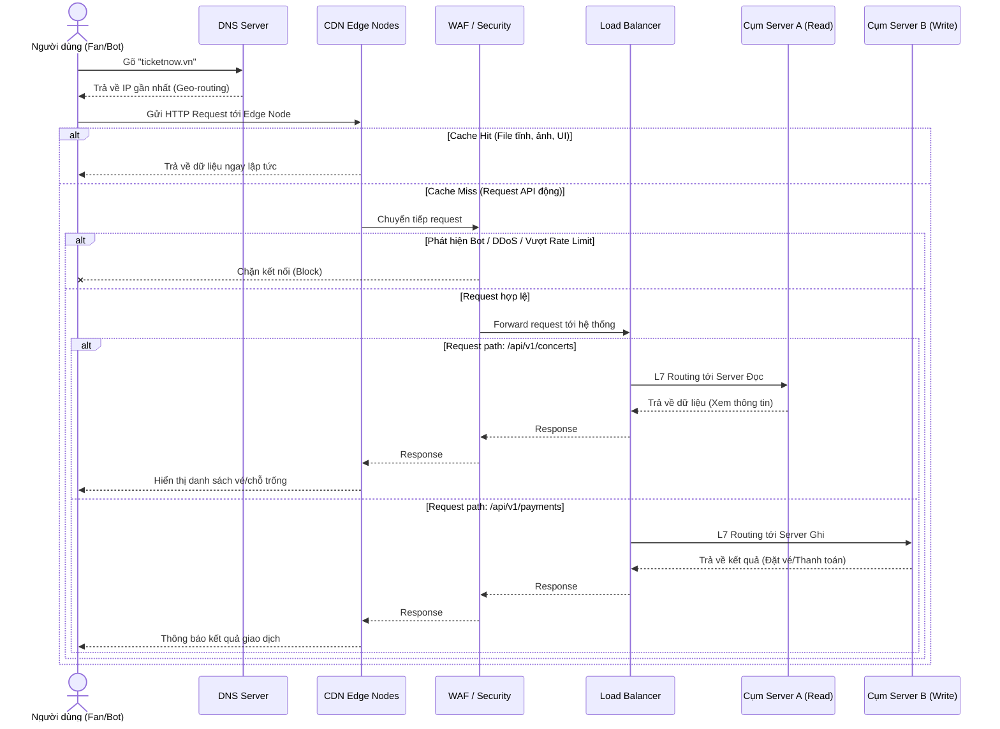

Hãy tưởng tượng đợt mở bán vé concert "Anh trai vượt ngàn chông gai 2026" trên TicketNow: có hàng trăm ngàn Fan chân chính liên tục F5 (làm mới trang) cùng với hàng ngàn con Bot của dân "đầu cơ" (scalper) rình rập. Nếu không có Tầng Biên tốt, các máy chủ ứng dụng bên trong sẽ sập ngay giây đầu tiên.

Dưới đây là phân tích chuyên sâu về Tầng Biên và hướng dẫn thực chiến triển khai cho TicketNow trên hai môi trường: VPS truyền thống và Google Cloud Platform (GCP).

## Phân tích Tầng Giao tiếp & Tối ưu Biên

Khi một người dùng gõ `ticketnow.vn` và nhấn Enter, request sẽ đi qua các lớp biên sau trước khi chạm tới các Node ứng dụng:



**1. Phân giải tên miền (DNS) và Định tuyến toàn cầu**

DNS không chỉ làm nhiệm vụ dịch tên miền sang IP. Trong kiến trúc hàng ngang, DNS được dùng để định tuyến theo vị trí địa lý (Geo-routing) hoặc độ trễ (Latency-based). Nếu TicketNow có cụm server ở Việt Nam và Singapore, DNS thông minh sẽ trả về IP của cụm Việt Nam cho người dùng truy cập từ TP.HCM để giảm thiểu tối đa độ trễ mạng khi "giật" vé.

**2. Mạng phân phối nội dung (CDN - Content Delivery Network)**

Hơn 60-80% dung lượng của một nền tảng bán vé là các file tĩnh: Hình ảnh nghệ sĩ (Banner, Poster), File SVG sơ đồ sân vận động siêu nét, và mã nguồn CSS/JS của Frontend (Next.js/Vue).

- **Offload Server:** CDN cache (lưu trữ tạm) lại các tài nguyên này ở hàng trăm máy chủ vật lý đặt tại các trung tâm dữ liệu (Edge nodes) trên toàn cầu.
- Khi người dùng tải trang TicketNow, CDN trả file tĩnh trực tiếp từ node gần họ nhất (ví dụ node tại trạm VNPT/FPT gần nhà) mà không cần request chạy về server gốc. Nhờ vậy, máy chủ ứng dụng TicketNow lúc này chỉ phải tập trung sức mạnh CPU để trả về dữ liệu API (JSON) cho việc giữ ghế và thanh toán.

**3. Reverse Proxy & Bộ Cân Bằng Tải (Load Balancer)**

Đây là "người điều phối giao thông" thực thụ.

- **SSL Termination (Gỡ bỏ gánh nặng mã hóa):** Quá trình giải mã HTTPS tốn rất nhiều tài nguyên tính toán. Load Balancer sẽ đứng ra nhận chứng chỉ SSL, giải mã các luồng HTTPS thành HTTP thông thường, sau đó mới đẩy luồng dữ liệu thô vào mạng nội bộ cho các Ticket Node xử lý.
- **Routing L7 (Application Layer):** Có khả năng đọc được đường dẫn (URL). Ví dụ: request vào `/api/v1/concerts` (xem thông tin) sẽ được đẩy sang cụm Server A (chuyên Read), request `/api/v1/payments` (thanh toán) đẩy sang cụm Server B (chuyên xử lý giao dịch bảo mật cao).
- **Health Check:** Liên tục "ping" các node bên dưới. Nếu một Ticket Node (Docker container) bị treo do tràn RAM, Load Balancer lập tức gạch tên nó khỏi danh sách chia tải cho đến khi node đó sống lại, đảm bảo không có user nào bị rớt vào "hố đen".

## Hướng dẫn thiết lập hệ thống

Thông thường, khi áp dụng kiến trúc hàng ngang, chúng ta sẽ có 2 lựa chọn: Tự triển khai (Self-managed) hoặc Sử dụng dịch vụ Cloud (Managed). Hầu hết các hệ thống hàng ngang lớn hiện này đều sử dụng Cloud do lợi ích mà nó mang lại. Tuy nhiên, hệ thống vẫn sẽ bắt đầu từ đâu đó, và điểm bắt đầu sẽ là Self-managed để có thể hiểu được cơ chế cơ bản nhất, sau đó scale up lên Cloud khi cần thiết.

Triển khai LB trên VPS (Nginx) đòi hỏi kỹ sư tự cấu hình thủ công mọi thứ và đối mặt với rủi ro Single Point of Failure. Ngược lại, kiến trúc Global Load Balancer trên Cloud cung cấp cho TicketNow khả năng chịu tải hàng triệu request/giây, băng thông toàn cầu, CDN và Tường lửa (WAF) mạnh mẽ chỉ bằng vài cú click chuột.

### Thiết lập trên VPS truyền thống (Self-managed)

Ở giai đoạn Startup hoặc test tải, môi trường VPS là lựa chọn tối ưu chi phí. Cấu trúc phổ biến nhất là kết hợp **Cloudflare (DNS/CDN)** với **Nginx (Load Balancer)**.

**Mô hình triển khai TicketNow (Quy mô nhỏ)**

- **Tầng 1 (Public Edge):** Sử dụng Cloudflare Proxy.
- **Tầng 2 (Load Balancer Node):** 1 VPS (Ubuntu 24.04) chạy Nginx đóng vai trò Reverse Proxy.
- **Tầng 3 (App Nodes):** 3 VPS chạy ứng dụng Ticket Backend (Go/Node.js) bằng Docker.

**Các bước cấu hình chi tiết**

**Bước 1: Ủy quyền DNS và Bật CDN trên Cloudflare**
Chuyển Nameserver của `ticketnow.vn` về Cloudflare. Trong bảng điều khiển, bật biểu tượng "Đám mây màu cam" (Proxied) cho bản ghi A trỏ về IP của VPS Load Balancer. Cloudflare sẽ kích hoạt CDN và tường lửa WAF (chặn Bot cơ bản, chống DDoS) miễn phí.

**Bước 2: Cài đặt và cấu hình Nginx làm Load Balancer**
SSH vào VPS Load Balancer, cài đặt Nginx:

```bash
sudo apt update && sudo apt install nginx -y
```

Mở file cấu hình Nginx (`/etc/nginx/sites-available/ticketnow`) và thiết lập upstream (cụm máy chủ phía sau):

```nginx
# Định nghĩa cụm server backend TicketNow (Horizontal scaling)
upstream ticket_api {
    # Dùng thuật toán least_conn để đẩy request đặt vé cho server đang ít kết nối nhất
    least_conn;

    # Danh sách các App Nodes nội bộ (Bắt buộc dùng Private IP mạng LAN)
    server 10.0.0.101:3000 max_fails=3 fail_timeout=5s;
    server 10.0.0.102:3000 max_fails=3 fail_timeout=5s;
    server 10.0.0.103:3000 max_fails=3 fail_timeout=5s;
}

server {
    listen 80;
    server_name api.ticketnow.vn;

    location / {
        # Đẩy traffic về cụm ticket_api
        proxy_pass http://ticket_api;

        # Chuyển tiếp các Header quan trọng để App Node biết IP thật của User
        proxy_set_header Host $host;
        proxy_set_header X-Real-IP $remote_addr;
        proxy_set_header X-Forwarded-For $proxy_add_x_forwarded_for;
        proxy_set_header X-Forwarded-Proto $scheme;
    }
}
```

> **Tử huyệt của kiến trúc:** Nhược điểm chí mạng của mô hình này là Nginx Node trở thành **Single Point of Failure (SPOF)**. Nếu VPS Nginx bị nghẽn mạng và sập, toàn bộ TicketNow sập dù 3 node backend vẫn sống. Kỹ sư thường dùng thêm Keepalived và Floating IP để chạy 2 VPS Nginx dự phòng chéo cho nhau.

### Thiết lập mạng lưới trên Cloud (Google Cloud Platform - GCP)

Khi TicketNow tổ chức sự kiện cho sao hạng A, mô hình VPS không còn an toàn. Chuyển sang kiến trúc Cloud-native trên GCP, toàn bộ điểm yếu SPOF của Nginx tự dựng bị loại bỏ. Dịch vụ Load Balancer của Google là hệ thống ảo hóa phân tán toàn cầu (công nghệ Anycast).

**Mô hình triển khai trên GCP**

- **DNS:** Google Cloud DNS.
- **Tầng Biên:** Google Cloud External HTTP(S) Load Balancer tích hợp Cloud CDN và Cloud Armor (WAF).
- **Tầng Ứng dụng:** Serverless Network Endpoint Groups (NEGs) kết hợp với Cloud Run.

**Các bước thiết lập kiến trúc trên GCP**

**Bước 1: Thiết lập Cloud DNS**
Vào GCP Console > Cloud DNS > Tạo Managed Zone. Khai báo tên miền `ticketnow.vn`. Việc phân giải nội bộ trong mạng lưới VPC của Google có độ trễ cực thấp.

**Bước 2: Chuẩn bị Nhóm máy chủ ứng dụng (Backend Service)**
TicketNow đóng gói mã nguồn thành Docker image và chạy trên **Cloud Run** (Serverless, có khả năng tự động scale ngang từ 0 lên hàng nghìn container trong chớp mắt khi 9h00 mở bán).
Tạo các Network Endpoint Groups (NEG) trỏ tới service Cloud Run này.

**Bước 3: Thiết lập Global HTTP(S) Load Balancer**
Vào _Network Services > Load balancing > Create Load Balancer_. Chọn Application Load Balancer (HTTP/S). Quá trình này gồm 3 phần cốt lõi:

1.  **Frontend Configuration:**
    - Cấp phát một IP tĩnh toàn cầu (Global Static IP).
    - Tạo chứng chỉ SSL do Google quản lý (Google-managed SSL) hoàn toàn miễn phí, tự động gia hạn. Load Balancer sẽ lo phần SSL Termination.
2.  **Backend Configuration:**
    - Tạo một Backend Service. Gắn NEG (Cloud Run) của TicketNow vào đây.
    - Tích chọn **Enable Cloud CDN**. Tức thì, Load Balancer trở thành một mạng lưới CDN siêu tốc, tự động cache các tài nguyên tĩnh ở Edge nodes của Google.
    - Cấu hình **Cloud Armor** (WAF) vào Backend Service này. Thiết lập rule: Chặn các IP có dấu hiệu cào dữ liệu (Rate Limiting), chặn các User-Agent từ hệ thống bot tự động để dành "đường truyền" cho người dùng thật.
3.  **Routing Rules (URL Map):**
    - Tạo luật định tuyến (L7): Path `/*` (Frontend) -> trỏ về Backend Bucket (Cloud Storage chứa file tĩnh). Path `/api/*` -> trỏ về Backend Service Cloud Run (Logic đặt vé).

> Trong kiến trúc phân tán, thiết kế tầng biên không chỉ là việc chia tải, mà là nghệ thuật 'Đẩy công việc ra xa trung tâm'. Một tầng biên tối ưu sẽ giảm tải triệt để cho máy chủ ứng dụng bằng cách lưu trữ tạm thời tài nguyên tĩnh (CDN), tự động đánh chặn rủi ro an ninh (WAF), và điều phối thông minh các luồng truy cập (Load Balancer). Nếu không có tầng biên này, mọi sức mạnh của kiến trúc hàng ngang bên trong đều trở nên vô nghĩa trước những cơn bão traffic đột biến. Trong bài tiếp theo, chúng ta đi vào phân tích Tầng Ứng dụng của TicketNow - Trái tim 'Phi trạng thái' của hệ thống.
