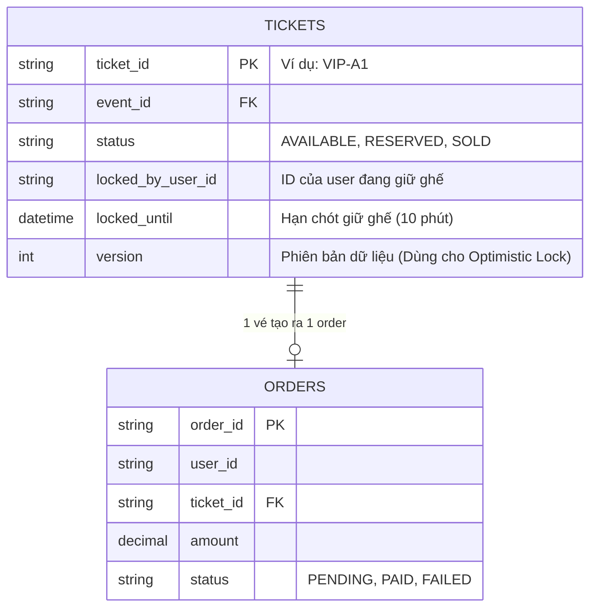
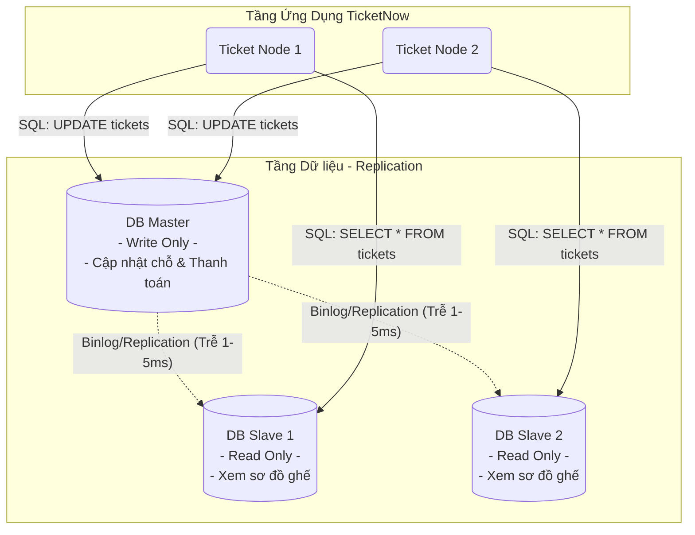
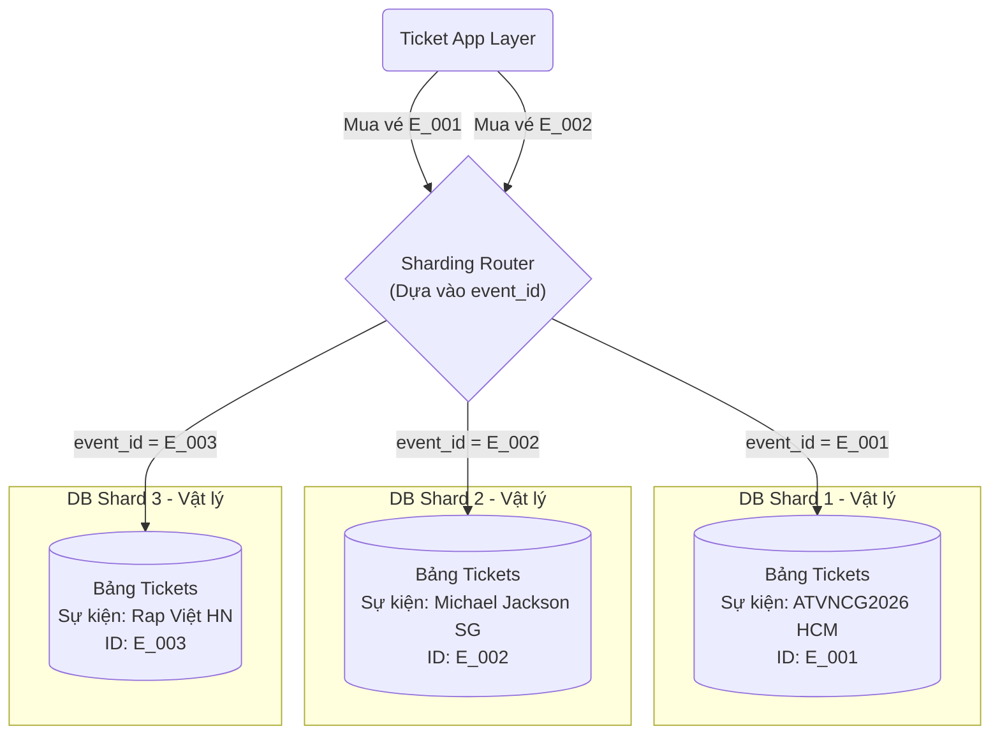
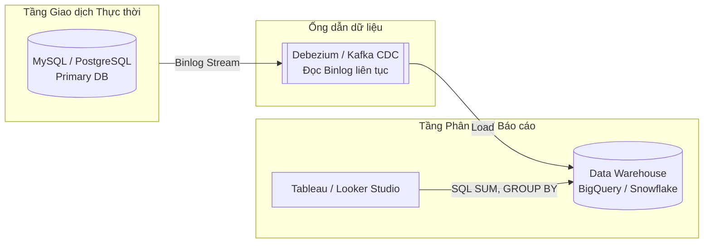

Trong kiến trúc hàng ngang, bạn có thể dễ dàng boot thêm 100 máy chủ ứng dụng chỉ bằng một cú click chuột, nhưng bạn **không thể** tự nhiên cắm thêm ổ cứng vào Database mà không làm hỏng tính toàn vẹn dữ liệu. Với TicketNow, một sai lầm ở tầng DB không chỉ làm hệ thống chậm đi, mà sẽ dẫn đến thảm họa truyền thông: **Hàng trăm người dùng thanh toán thành công cho cùng 1 chiếc vé VIP**.

Hãy cùng bóc tách từng giai đoạn tối ưu Database của TicketNow từ cơ bản đến siêu phân tán.

## Giai đoạn 1: Bài toán Đồng thời (Concurrency) & Chống bán vượt mức (Overselling)

Vào lúc 9:00 sáng, vé "Anh trai vượt ngàn chông gai 2026" (ATVNCG2026) mở bán. Ghế `VIP-A1` sáng đèn. Hệ thống ghi nhận có **5.000 người dùng** cùng click vào chiếc ghế đó tại cùng 1 phần nghìn giây.

Nếu code của bạn viết đơn giản là: `SELECT status FROM tickets WHERE id = 'VIP-A1'`, kiểm tra thấy trống thì `UPDATE status = 'SOLD'`, hiện tượng **Race Condition** sẽ xảy ra, và cả 5.000 người đều mua được vé.

**Giải pháp: Sử dụng Optimistic Locking (Khóa lạc quan) với trường Version.**

Thay vì khóa toàn bộ bảng (gây nghẽn hệ thống), TicketNow thiết kế bảng `tickets` thêm một cột `version`.



**Cách hoạt động:**

1. Khi User A và User B cùng đọc vé `VIP-A1`, hệ thống trả về: `status = AVAILABLE, version = 1`.
2. User A bấm "Thanh toán", câu lệnh SQL được Ticket Node đẩy xuống DB không phải là lệnh UPDATE bình thường, mà là:
   ```sql
   UPDATE tickets
   SET status = 'RESERVED', locked_by_user_id = 'UserA', version = 2
   WHERE ticket_id = 'VIP-A1' AND version = 1;
   ```
3. Lệnh của User A chạy xong, `version` của vé thành 2.
4. Một phần nghìn giây sau, lệnh của User B chạy tới: `... WHERE ticket_id = 'VIP-A1' AND version = 1`. Lệnh này sẽ **thất bại (0 row affected)** vì version hiện tại đã là 2. User B nhận được thông báo "Ghế đã có người nhanh tay hơn".
   _Bài toán mua trùng vé đã được giải quyết ở cấp độ Database!_

## Giai đoạn 2: Giảm tải Đọc/Ghi với Master-Slave Replication

Vấn đề tiếp theo: Trong 500.000 người online trên TicketNow, chỉ có khoảng 50.000 người thực sự mua được vé (Write). 450.000 người còn lại liên tục F5 để xem sơ đồ chỗ ngồi (Read).
Nếu tất cả cùng chọc vào DB chính, DB sẽ sập vì quá tải Connection.

**Giải pháp: Phân tách luồng Đọc/Ghi (Read/Write Splitting)**

TicketNow thiết lập kiến trúc **Master-Slave Replication**. Mọi giao dịch đặt vé (UPDATE/INSERT) sẽ trỏ về Master. Mọi thao tác lấy sơ đồ ghế, xem danh sách sự kiện (SELECT) sẽ được chia đều cho các Slaves.



**Đánh đổi (Trade-off): Bài toán Replication Lag.**
Khi User A vừa mua xong ghế `VIP-A1` (Ghi vào Master), nhưng Master chưa kịp đồng bộ sang Slave 1 (mất vài mili-giây). User C load trang, đọc từ Slave 1, vẫn thấy `VIP-A1` đang trống. Tuy nhiên, khi User C bấm mua, lệnh sẽ được đưa về Master, và nhờ cơ chế Optimistic Lock ở Giai đoạn 1, User C vẫn sẽ bị chặn lại an toàn. Tính nhất quán (Eventual Consistency) vẫn được đảm bảo.

## Giai đoạn 3: Băm dữ liệu (Sharding) khi dung lượng quá giới hạn

Vài năm trôi qua, TicketNow mở bán cho hàng ngàn sự kiện, lưu trữ hàng tỷ bản ghi giao dịch lịch sử. Dù DB Master có xịn đến mấy (64 Cores, 256GB RAM), việc ghi dữ liệu vào một ổ cứng duy nhất cũng sẽ "chạm trần" IOPS (Input/Output per Second).

**Giải pháp: Horizontal Partitioning (Sharding)**

TicketNow tiến hành "băm" cái bảng khổng lồ thành nhiều cơ sở dữ liệu vật lý riêng biệt. Key băm (Sharding Key) hợp lý nhất cho hệ thống này là `event_id` (hoặc khu vực địa lý).



Nhờ Sharding, nếu sự kiện ATVNCG2026 bị nghẽn tải, nó chỉ làm chậm Shard 1, trong khi khách hàng đang mua vé xem phim ở Shard 3 không hề bị ảnh hưởng. Tuy nhiên, Sharding khiến việc JOIN dữ liệu giữa 2 sự kiện khác nhau (Cross-shard JOIN) trở thành ác mộng, bắt buộc ứng dụng phải xử lý trên RAM.

## Giai đoạn 4: Tách bạch OLTP và OLAP

Ngay trong lúc 500.000 người đang giành giật vé (Giao dịch - OLTP), Giám đốc của TicketNow lại mở Dashboard BI (Business Intelligence) lên và ấn nút "Refresh" để xem biểu đồ: _"Tổng doanh thu của người dùng Nam giới, độ tuổi 18-24, mua vé khu vực VIP trong 30 ngày qua"_.

Câu lệnh SQL khổng lồ chứa hàm `SUM()`, `GROUP BY`, và `JOIN` 5-6 bảng này sẽ "Lock" (khóa) một lượng lớn row trong DB, làm sập hoàn toàn luồng mua vé của khách hàng.

**Giải pháp: Đẩy dữ liệu báo cáo ra Data Warehouse (OLAP)**

Tuyệt đối không phân tích dữ liệu trên DB phục vụ giao dịch. TicketNow triển khai cơ chế CDC (Change Data Capture) bằng công cụ như **Debezium**.



Mỗi khi có một vé bán ra, MySQL ghi vào Binlog. Debezium đọc Binlog này và đẩy ngay lập tức sang BigQuery. Lúc này, Giám đốc tha hồ "mổ xẻ" hàng tỷ dòng dữ liệu trên BigQuery mà hệ thống bán vé MySQL vẫn không hề bị tăng lấy 1% CPU.

> Để Tầng Dữ liệu của TicketNow sống sót qua các "cơn địa chấn" traffic, chúng ta đã ứng dụng một chuỗi nghệ thuật chia để trị: Dùng **Locking** để bảo vệ tính vẹn toàn từng chiếc ghế, dùng **Replication** để tách luồng Đọc/Ghi, dùng **Sharding** để chia nhỏ khối lượng vật lý, và dùng **CDC/OLAP** để tống khứ áp lực báo cáo phân tích ra khỏi luồng giao dịch cốt lõi.

Nhưng hãy khoan! Nếu khách hàng thanh toán thành công qua thẻ tín dụng, hệ thống cần gọi API để báo đối tác trừ tiền, sinh ra file PDF mã QR, và gửi hàng ngàn Email xác nhận. Nếu chúng ta bắt Request của khách hàng phải "chờ" (Synchronous) cho đến khi gửi xong Email, thì ngàn cái Database tối ưu cũng sẽ sập vì timeout.

> Để giải quyết bài toán này, mời bạn tiếp tục hành trình đến với **Bài 6: Tầng Xử lý Bất đồng bộ (Asynchronous Processing Tier)** - nơi chúng ta biến Message Queue thành "bộ đệm" ma thuật cứu rỗi hệ thống!
