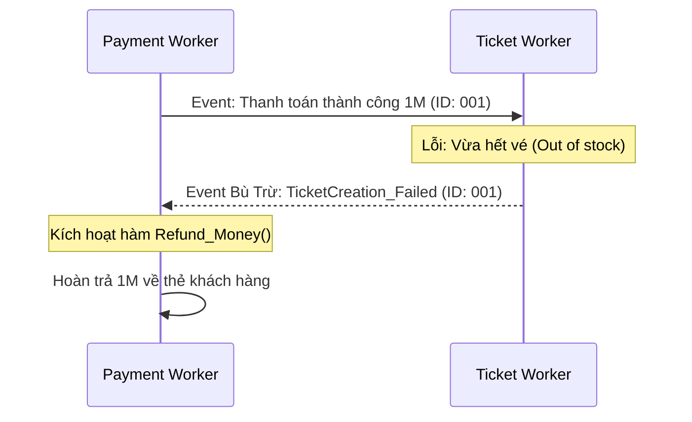

Nó hấp thụ các cú sốc về lưu lượng (traffic spikes) và luân chuyển các luồng sự kiện (events) giữa các microservices để hệ thống không bị "đứng hình" khi có quá nhiều tác vụ nặng cần xử lý cùng lúc.

Tuy nhiên, khi chúng ta đưa TicketNow vào trạng thái bất đồng bộ - đặc biệt là phân tán ở nhiều khu vực (Multi-Region) - chúng ta ngay lập tức phải đối mặt với một cơn ác mộng của khoa học máy tính: **Sự không nhất quán dữ liệu (Data Inconsistency)**.

## Bản chất của Tầng Xử lý Bất đồng bộ

Hãy xem xét luồng thanh toán vé trên TicketNow:

- **Trong kiến trúc đồng bộ (Synchronous):** Khi người dùng nhấn "Thanh toán", request sẽ đi thẳng qua API -> Gọi cổng VNPay -> Lưu Database -> Render file PDF vé -> Gửi Email xác nhận -> Trả kết quả cho web. Quá trình này mất khoảng 5-10 giây. Nếu hệ thống Gửi Email đột nhiên bị lỗi, toàn bộ giao dịch sập, khách hàng bị trừ tiền nhưng web báo lỗi 500.

- **Trong kiến trúc Bất đồng bộ (Event-Driven):**

```mermaid
sequenceDiagram
  actor User as Người dùng
  participant API as API Service
  participant VNPay as VNPay
  participant DB as Database
  participant Kafka as Message Queue
  participant WorkerPDF as PDF Worker
  participant S3 as AWS S3
  participant WorkerEmail as Email Worker

  User->>API: 1. Bấm Thanh toán

  activate API
  API->>VNPay: 2. Gọi Cổng Thanh Toán
  VNPay-->>API: 3. Trả kết quả: Thành công

  API->>DB: 4. Lưu DB (Trạng thái: Đang xử lý)
  API-XKafka: 5. Publish Event: TicketPaid

  API-->>User: 6. Trả về 200 OK (Chờ xuất vé)<br>Thời gian: &lt;200ms
  deactivate API

  par Xử lý nền (Background Workers)
    Kafka-)WorkerPDF: 7a. Consume Event (TicketPaid)
    activate WorkerPDF
    WorkerPDF->>WorkerPDF: Render file vé PDF
    WorkerPDF->>S3: Lưu file vé PDF
    deactivate WorkerPDF
  and
    Kafka-)WorkerEmail: 7b. Consume Event (TicketPaid)
    activate WorkerEmail
    WorkerEmail-->>User: Gửi email đính kèm vé cho khách
    deactivate WorkerEmail
  end
```

Nhờ Kafka (Message Queue), API lập tức trả về `200 OK` cho khách hàng chỉ sau vài trăm mili-giây. Các cụm **Background Workers** (PDF Worker, Email Worker) sẽ tự động hút thông điệp từ Queue ra để xử lý ngầm (Background processing).

Hệ thống được gỡ rối (Decoupled), nhưng đánh đổi lại, khách hàng phải chấp nhận màn hình web hiện chữ _"Đang xuất vé, vui lòng đợi 1-2 phút"_ trước khi vé thực sự gửi vào Email.

## Nguyên nhân cốt lõi gây ra Bất đồng bộ và Xung đột

Sự bất đồng bộ trong hệ thống hàng ngang không phải là "lỗi" (bug), nó là một **tính năng (feature)** do chúng ta chủ động thiết kế, nhưng bị chi phối bởi các quy luật vật lý:

**1. Giới hạn tốc độ ánh sáng và Độ trễ mạng (Network Latency)**

Dù dùng cáp quang xịn nhất, một gói tin đi từ Data Center tại Singapore sang Mỹ cũng mất từ 150ms - 250ms. Nếu TicketNow mở bán vé toàn cầu, một event "Giữ ghế" được bắn ra tại Singapore, Worker tại Mỹ sẽ luôn nhận được nó trễ. Trong 200ms đó, nếu có một khách ở Mỹ thao tác ghi đè lên chiếc ghế đó, xung đột (Race Condition) sẽ xảy ra.

**2. Định lý CAP (CAP Theorem)**

Trong hệ thống phân tán, bạn không thể có cả 3 yếu tố: Tính Nhất quán (**C**onsistency), Tính Sẵn sàng (**A**vailability), và Khả năng chịu chia cắt mạng (**P**artition Tolerance). Để TicketNow không bao giờ sập (High Availability), kỹ sư buộc phải hi sinh Tính nhất quán tức thời (Strict Consistency) và chấp nhận **Tính nhất quán cuối cùng (Eventual Consistency)**. Nghĩa là tại thời điểm hiện tại, số lượng vé tồn kho hiển thị có thể hơi sai lệch, nhưng cuối cùng chúng sẽ được đồng bộ chính xác.

## Giải pháp Xử lý Bất đồng bộ để đảm bảo Nhất quán

Để khống chế Eventual Consistency và đảm bảo không khách hàng nào bị trừ tiền oan, TicketNow phải áp dụng các Mẫu thiết kế (Patterns) nghiêm ngặt sau:

**1. Tính Luỹ Đẳng (Idempotency) - Tấm khiên bảo vệ cốt lõi**

Trong mạng lưới bất đồng bộ, mạng có thể chập chờn, khiến Message Queue lầm tưởng Worker chưa nhận được event và tự động gửi lại (Retry). Điều này dẫn đến việc Worker nhận được sự kiện `Deduct_1_Ticket` tới 2 lần.

- **Giải pháp:** Mọi API và Worker phải có tính Luỹ đẳng (Idempotency). Nghĩa là, dù sự kiện được chạy 1 lần hay 100 lần, kết quả cuối cùng trên Database chỉ thay đổi đúng 1 lần.
- **Thực hành tại TicketNow:** Sử dụng `Idempotency-Key` (một chuỗi UUID duy nhất, ví dụ: Mã giao dịch VNPay). Trước khi Worker tạo vé PDF và trừ tồn kho, nó phải kiểm tra trong DB xem cái `Key` này đã tồn tại chưa. Nếu có rồi, nó hiểu là event bị duplicate và bỏ qua.

**2. Mẫu Saga (Saga Pattern) thay cho Giao dịch 2 Pha**

Khi một giao dịch trải dài qua nhiều service độc lập: `Service Thanh toán -> Service Vé -> Service Email`. Nếu _Service Vé_ thất bại (vì một lý do nào đó mà hết vé), ta không thể dùng lệnh `ROLLBACK` SQL truyền thống vì các service dùng Database hoàn toàn khác nhau.

- **Giải pháp Saga:** Chia giao dịch thành chuỗi các event. Khi một bước thất bại, hệ thống kích hoạt **Compensating Transactions (Giao dịch bù trừ)** đi lùi lại để hoàn tác.



Mọi thứ hoàn toàn bất đồng bộ nhưng vẫn đảm bảo khách hàng không bao giờ bị mất tiền oan.

**3. Hàng đợi Thư Chết (Dead Letter Queue - DLQ)**

Sẽ luôn có những event bị lỗi không thể phục hồi (như API của hệ thống Email Mailgun bị sập dài hạn). Nếu Worker cứ cố gửi email và retry mãi, toàn bộ hàng đợi sẽ bị kẹt cứng.

- **Giải pháp:** Sau 5 lần retry thất bại, event "Gửi Email" đó phải tự động rơi vào một queue đặc biệt gọi là **Dead Letter Queue (DLQ)**. Kỹ sư của TicketNow sẽ thiết lập cảnh báo (Alert) cho DLQ, vào phân tích thủ công nguyên nhân. Khi Mailgun hoạt động lại, kỹ sư chỉ việc bấm nút "Replay" để đẩy các event từ DLQ vào lại hàng đợi chính.

**4. Chiến lược Đồng bộ Đa khu vực (Multi-Region)**

Đối phó với độ trễ địa lý khi bán vé toàn cầu:

- **Định tuyến theo Vị trí dữ liệu gốc (Data Locality Routing):** Tầng Biên (Edge Layer) định tuyến user về đúng khu vực Data Center chứa thông tin vé đó. User mua sự kiện ở VN sẽ luôn được chuyển về server VN để xử lý, loại bỏ khả năng có 2 lệnh ghi đồng thời từ 2 lục địa gây xung đột.
- **Global Event Sourcing:** Thay vì lưu "trạng thái ghế", hệ thống lưu toàn bộ "lịch sử hành động" vào Kafka làm Source of Truth. Kafka cluster ở Châu Á tự động nhân bản (replicate) sang Mỹ. Các DB ở mỗi khu vực đọc event và tự "xây dựng" lại sơ đồ ghế độc lập.

> Bước chân vào Tầng Xử lý Bất đồng bộ là bạn chấp nhận đánh đổi sự "đơn giản, dễ debug" của kiến trúc cũ để lấy "khả năng mở rộng và sức chịu tải vô hạn". Nhờ Message Queue làm "bộ đệm", Idempotency làm "tấm khiên" chặn lặp dữ liệu, và Saga Pattern làm "bảo hiểm" hoàn tiền, hệ thống TicketNow có thể vận hành trơn tru ngay cả khi bão traffic ập tới và vài service bên trong thỉnh thoảng bị ngắt quãng.
