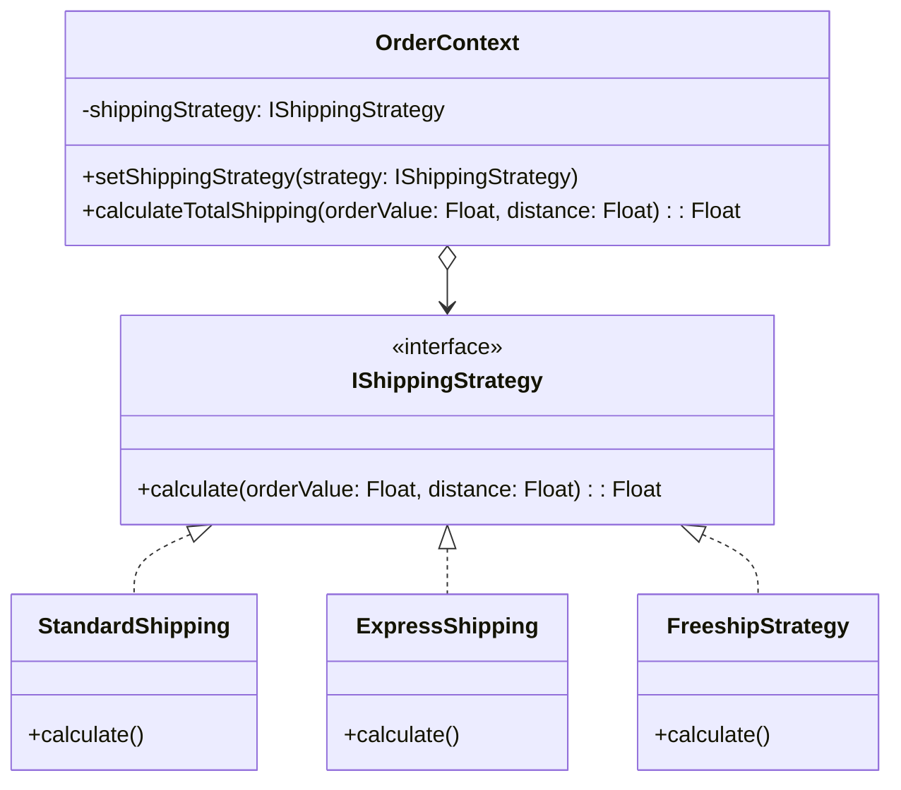

## Mô tả bài toán

Trong giai đoạn hoàn tất đơn hàng, hệ thống của chúng ta phải tính toán phí vận chuyển. Nhu cầu thực tế rất đa dạng: Vận chuyển tiêu chuẩn (Standard), Giao hàng hỏa tốc (Express), hoặc Giao trong ngày (Same-day). Thậm chí, trong các dịp Flash Sale, chúng ta có thể có thêm chiến lược "Miễn phí vận chuyển" (Freeship).

Nếu xử lý logic này bằng một hàm khổng lồ chứa hàng tá khối `if-else` hoặc `switch-case`, file `OrderService` sẽ nhanh chóng trở nên "bốc mùi" (code smell), khó test và cực kỳ rủi ro khi sửa đổi. **Strategy Pattern** sinh ra để giải quyết triệt để bài toán này.

## Strategy Pattern là gì?

Strategy Pattern là một mẫu thiết kế thuộc nhóm Hành vi (Behavioral). Nó cho phép bạn định nghĩa một tập hợp các thuật toán (các "chiến lược"), đóng gói từng thuật toán lại vào các lớp độc lập và làm cho chúng có thể thay thế lẫn nhau (interchangeable) khi runtime.

## Áp dụng vào Hệ thống Xử lý Đơn hàng

Chúng ta sẽ định nghĩa một giao diện chung `IShippingStrategy`. Các phương thức vận chuyển cụ thể sẽ là các lớp triển khai giao diện này. Class `Order` (đóng vai trò là Context) chỉ lưu một tham chiếu đến `IShippingStrategy` và gọi phương thức tính phí mà không cần biết logic bên trong.



## Cài đặt (Mã giả - TypeScript)

```typescript
// 1. Interface chung cho các chiến lược
interface IShippingStrategy {
  calculate(orderValue: number, distance: number): number;
}

// 2. Các Concrete Strategies
class StandardShipping implements IShippingStrategy {
  calculate(orderValue: number, distance: number): number {
    return distance * 15000; // 15k / km
  }
}

class ExpressShipping implements IShippingStrategy {
  calculate(orderValue: number, distance: number): number {
    return distance * 15000 + 30000; // Thêm phụ phí 30k
  }
}

class FreeshipStrategy implements IShippingStrategy {
  calculate(orderValue: number, distance: number): number {
    return 0; // Miễn phí vận chuyển
  }
}

// 3. Context
class OrderContext {
  private strategy: IShippingStrategy;

  constructor(strategy: IShippingStrategy) {
    this.strategy = strategy;
  }

  public setShippingStrategy(strategy: IShippingStrategy) {
    this.strategy = strategy;
  }

  public getShippingFee(orderValue: number, distance: number): number {
    return this.strategy.calculate(orderValue, distance);
  }
}

// Cách sử dụng
const distance = 10; // 10 km
const orderValue = 500000;

// Khách chọn giao tiêu chuẩn
let order = new OrderContext(new StandardShipping());
console.log("Phí Standard:", order.getShippingFee(orderValue, distance));

// Đổi ý, chuyển sang Hỏa tốc khi đang runtime
order.setShippingStrategy(new ExpressShipping());
console.log("Phí Express:", order.getShippingFee(orderValue, distance));
```

## Đánh giá Ưu / Nhược điểm

**Ưu điểm:**

- **Open/Closed Principle (OCP):** Thêm chiến lược mới (ví dụ: `HolidayShipping`) mà không cần sửa code cũ.
- **Tách biệt logic (Separation of Concerns):** Thuật toán tính phí bị tách hoàn toàn khỏi luồng xử lý đơn hàng cốt lõi.
- **Thay đổi linh hoạt khi Runtime:** Có thể dễ dàng "swap" (đổi) chiến lược dựa trên cấu hình hoặc lựa chọn của user ngay trong quá trình chạy.

**Nhược điểm:**

- Client (Controller/Service gọi đến Context) buộc phải biết sự tồn tại của các Concrete Strategy để chọn ra cái phù hợp.
- Tăng số lượng class trong hệ thống. Nếu chỉ có 1-2 thuật toán hiếm khi thay đổi, dùng Strategy là quá mức cần thiết (Overkill).

Sau khi tính phí và hoàn tất đơn hàng, hệ thống cần gửi thông báo cho khách hàng qua nhiều kênh khác nhau. Chúng ta sẽ cùng xem cách **Observer Pattern** giải quyết điều này ở bài tiếp theo.
