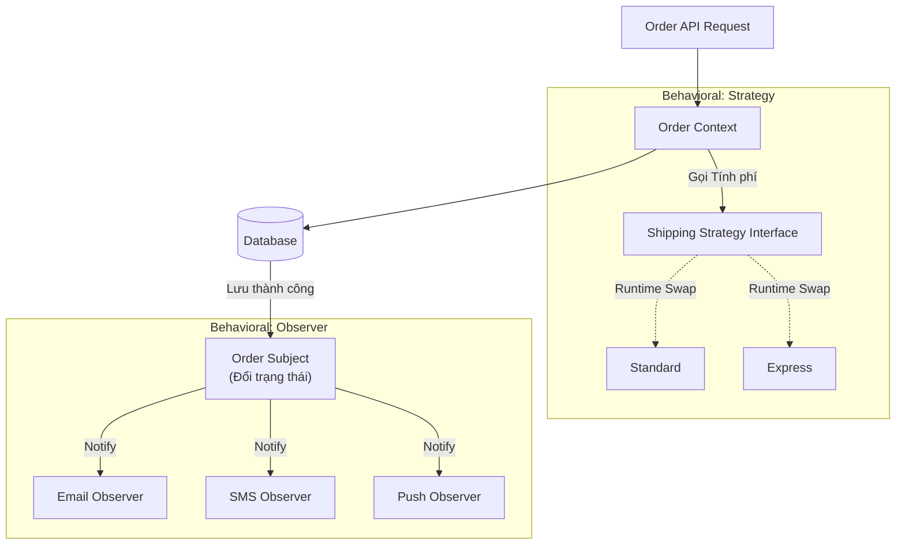

## Mô tả bài toán

Qua 2 bài viết về **Strategy** và **Observer**, chúng ta đã giải quyết được những bài toán phức tạp về sự thay đổi thuật toán và điều phối sự kiện trong **Hệ thống Xử lý Đơn hàng**. Nhóm Behavioral (Hành vi) không lo về việc khởi tạo đối tượng, mà tập trung vào **sự phân chia trách nhiệm** và **giao tiếp** giữa chúng.

## Tương tác hệ thống với Behavioral Patterns

Cùng nhìn lại luồng xử lý sau khi áp dụng cả Strategy và Observer:

Như bạn thấy, **Strategy** đóng vai trò "Kéo" (Pull) - Context chủ động gọi chiến lược để lấy kết quả tính phí. Trong khi đó, **Observer** đóng vai trò "Đẩy" (Push) - Subject tự động đẩy trạng thái mới tới các dịch vụ bị động chờ đợi.

## Tiêu chí chọn lựa (Decision Matrix)

Bên cạnh Strategy và Observer, nhóm Behavioral còn nhiều pattern khác. Hãy sử dụng bảng dưới đây để quyết định pattern phù hợp cho bài toán backend của bạn:

<table style="width:100%; border-collapse: collapse; margin-bottom: 20px;">
  <thead>
    <tr style="border-bottom: 2px solid #e2e8f0; text-align: left;">
      <th style="padding: 8px;">Đặc tả bài toán (Use Case)</th>
      <th style="padding: 8px;">Pattern</th>
      <th style="padding: 8px;">Ví dụ áp dụng thực tế (Backend)</th>
    </tr>
  </thead>
  <tbody>
    <tr style="border-bottom: 1px solid #edf2f7;">
      <td style="padding: 8px;">Hệ thống có <strong>nhiều thuật toán/quy tắc</strong> thay thế được cho nhau (VD: giảm giá, xếp hạng, tính thuế) và sinh ra một rừng <code>if-else</code>?</td>
      <td style="padding: 8px;"><strong>Strategy</strong></td>
      <td style="padding: 8px;">Tính phí ship, chọn phương thức nén file, áp dụng các thuật toán mã hóa (AES, DES).</td>
    </tr>
    <tr style="border-bottom: 1px solid #edf2f7;">
      <td style="padding: 8px;">Một sự kiện xảy ra ở module này cần <strong>kích hoạt hành động ở nhiều module khác</strong>, nhưng bạn không muốn chúng phụ thuộc chặt chẽ?</td>
      <td style="padding: 8px;"><strong>Observer</strong></td>
      <td style="padding: 8px;">Hệ thống Pub/Sub, Notification Engine, Cập nhật Cache khi DB thay đổi.</td>
    </tr>
    <tr style="border-bottom: 1px solid #edf2f7;">
      <td style="padding: 8px;">Object của bạn có <strong>quá nhiều trạng thái</strong> (Draft, Pending, Shipped, Cancelled) và hành vi thay đổi hoàn toàn tùy theo trạng thái đó?</td>
      <td style="padding: 8px;"><strong>State</strong> <em>(Mở rộng)</em></td>
      <td style="padding: 8px;">Máy bán hàng tự động, Luồng duyệt bài viết, Lifecycle của Đơn hàng.</td>
    </tr>
    <tr style="border-bottom: 1px solid #edf2f7;">
      <td style="padding: 8px;">Cần đóng gói một yêu cầu/hành động thành một object để có thể <strong>Lưu trữ, Hủy bỏ (Undo), hay xếp hàng (Queue)</strong>?</td>
      <td style="padding: 8px;"><strong>Command</strong> <em>(Mở rộng)</em></td>
      <td style="padding: 8px;">Hệ thống Task Scheduler (Job Queue), Undo/Redo operations, Macro recording.</td>
    </tr>
  </tbody>
</table>

## Best Practices (Bài học thực chiến)

1. **Với Strategy:** Đừng đưa state (trạng thái) vào bên trong Concrete Strategy. Các class chiến lược nên hoàn toàn vô trạng thái (Stateless), chỉ nhận input tính toán và trả về output.
2. **Với Observer trong Backend phân tán (Microservices):** Observer Pattern truyền thống (chạy trong cùng một Process) thường được thay thế bằng các kiến trúc **Message Broker / Event Bus** (RabbitMQ, Kafka). Nguyên lý không đổi (Publish / Subscribe), nhưng phạm vi mở rộng ra cấp độ hạ tầng (Infrastructure).
3. **Cẩn thận với độ trễ (Latency):** Bất cứ khi nào bạn thông báo đến nhiều Observers, hãy tự hỏi: _"Chúng có cần chạy đồng bộ không?"_. Nếu không, luôn ưu tiên xử lý bất đồng bộ (Async) để tránh làm nghẽn luồng chính.

Ở chương tiếp theo, chúng ta sẽ bước sang nhóm cuối cùng nhưng vô cùng thú vị: **Structural Patterns (Decorator, Adapter, Facade)**. Chúng ta sẽ giải quyết bài toán voucher giảm giá tầng tầng lớp lớp và kết nối với các đối tác vận chuyển đời cũ.
