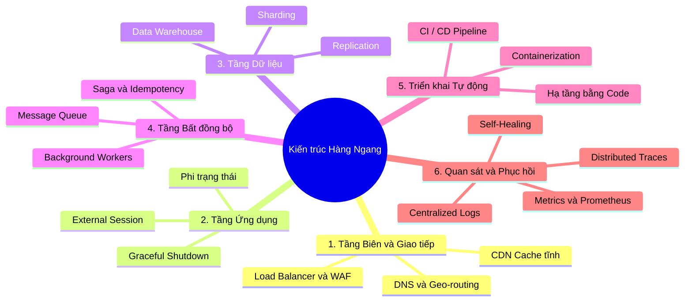

Ở bài viết cuối cùng này, chúng ta sẽ đúc kết lại toàn bộ triết lý cốt lõi của series, xác định chính xác "điểm bùng phát" buộc bạn phải tái cấu trúc hệ thống, và nhìn lại quá trình tiến hóa của một hệ thống thực tế từ số 0 đến quy mô hàng triệu người dùng qua lăng kính của TicketNow.

## Tóm tắt Triết lý Kiến trúc Hàng ngang (Horizontal Architecture)

Xuyên suốt 8 bài viết, chúng ta đã bóc tách kiến trúc hàng ngang thành 6 trụ cột chính. Hãy nhìn vào bản đồ tư duy dưới đây để thấy sự liên kết chặt chẽ của toàn bộ hệ thống:

**6 Trụ cột cốt lõi:**

1. **Tầng Giao tiếp & Tầng Biên (Edge):** Dùng DNS, CDN và Load Balancer làm khiên chắn. Đẩy tối đa tài nguyên tĩnh ra biên để giảm tải cho lõi hệ thống.
2. **Tầng Ứng dụng Phi trạng thái (Stateless App):** Các máy chủ (Node.js, Go, Rust) phải bị "mất trí nhớ", không lưu file, không lưu session cục bộ. Mọi trạng thái phải được đẩy ra Redis/S3 để các Node có thể tự do sinh ra và chết đi.
3. **Tầng Dữ liệu Phân tán (Data Layer):** Mở rộng bằng cách tách luồng Đọc/Ghi (Replication), sau đó chia nhỏ dữ liệu (Sharding). Không dùng DB Giao dịch (OLTP) để phân tích; phải dùng CDC đẩy về Data Warehouse.
4. **Tầng Xử lý Bất đồng bộ (Async Queue):** Hấp thụ các luồng traffic đột biến bằng Message Queue (Kafka/Pub/Sub). Áp dụng tính Luỹ đẳng (Idempotency) và mẫu Saga để xử lý xung đột đa khu vực.
5. **Triển khai Tự động (CI/CD & IaC):** Sử dụng hạ tầng bất biến (Docker). Không SSH vào server. Mọi tài nguyên hạ tầng phải được định nghĩa bằng Code (Terraform) và tự động triển khai (GitOps).
6. **Vận hành & Tự phục hồi (Observability):** Xây dựng hệ thống giám sát qua Metrics, Logs, Traces thay vì dò lỗi thủ công. Cấp quyền cho hạ tầng (K8s/Cloud Run) tự động "bắn bỏ" các node bệnh và thay thế bằng node mới.

## Khi nào CẦN thiết kế lại Kiến trúc? (Các chỉ số "Báo động đỏ")

Đừng vội vàng thiết kế kiến trúc hàng ngang (Over-engineering) ngay từ ngày đầu khi dự án mới có 1.000 người dùng. Kiến trúc vi dịch vụ và phân tán sẽ kéo theo chi phí và sự phức tạp khổng lồ.

Bạn chỉ nên bắt tay vào "phá" kiến trúc Monolithic để xây kiến trúc hàng ngang khi hệ thống chạm đến các chỉ số định lượng sau:

- **Chỉ số Tải trọng (Traffic):** Vượt ngưỡng **1.000 RPS (Requests Per Second)** tại thời điểm cao điểm, hoặc đạt mức **100.000 DAU (Daily Active Users)**.
- **Chỉ số Cơ sở dữ liệu (Database Bottlenecks):** CPU của máy chủ Database lớn nhất bạn có thể thuê (ví dụ: 64 vCPU, 256GB RAM) liên tục vượt mốc **75%**. Hoặc bảng dữ liệu cốt lõi (như `Orders`, `Transactions`) vượt qua con số **50 - 100 triệu dòng**, khiến các câu lệnh đánh INDEX bắt đầu mất tác dụng và chạy chậm dần.
- **Chỉ số Trải nghiệm Người dùng (Latency P99):** Theo dõi chỉ số P99 (thời gian phản hồi của 1% người dùng chậm nhất). Nếu P99 thường xuyên vượt mức **2-3 giây** (đặc biệt trong các tác vụ Write), hệ thống của bạn đang bị nghẽn cổ chai nội bộ nghiêm trọng.
- **Chỉ số Tổ chức (Team Scaling):** Khi đội ngũ kỹ sư vượt quá **20-30 người**. Việc tất cả cùng code trên một repo Monolithic gây ra xung đột (Merge Conflict) liên tục, mỗi lần Deploy mất 30 phút và phải chờ đợi nhau. Đây là lúc cần chia nhỏ thành Microservices để các team làm việc độc lập.

## Case Study: Sự tiến hóa của Hệ thống Đặt vé Sự kiện (TicketNow)

Để hình dung rõ nhất, hãy xem xét hành trình tiến hóa của hệ thống bán vé TicketNow, nơi traffic có thể tăng từ 100 req/s lên 50.000 req/s chỉ trong 1 phút khi mở bán vé concert của các ngôi sao lớn.

**Giai đoạn 1: Kiến trúc Truyền thống (Ngày đầu khởi nghiệp)**

- **Hạ tầng:** 1 chiếc VPS khổng lồ (Ubuntu) thuê của nhà cung cấp nội địa.
- **Cấu trúc:** Chạy Next.js cho Frontend, Node.js cho Backend API, và một cái PostgreSQL cài chung trên cùng một máy. Session lưu trong RAM của Node.js. Hình ảnh sự kiện lưu vào thư mục `/public/uploads`.
- **Khủng hoảng (Bùng phát):** Mở bán vé show diễn lớn. 10.000 người lao vào cùng lúc. CPU chạm 100%, VPS treo cứng. Node.js sập kéo theo mất toàn bộ giỏ hàng của khách (vì lưu trong RAM). Công ty thiệt hại hàng tỷ đồng và bị tẩy chay trên mạng xã hội.

**Giai đoạn 2: Trạng thái Phi trạng thái và Đám mây (Chữa cháy & Ổn định)**

Đội ngũ kỹ sư nhận ra vấn đề và bắt đầu chuyển dịch sang Google Cloud Platform (GCP).

- **Edge & Frontend:** Toàn bộ Frontend (Next.js SSG) và hình ảnh được đẩy lên CDN của Cloudflare và Google Cloud Storage. Server không còn phải phục vụ file tĩnh.
- **Database:** Tách PostgreSQL ra khỏi máy chủ ứng dụng, chuyển sang dùng Cloud SQL (Managed Service) để đảm bảo không bị sập phần cứng.
- **App Node (Stateless):** Viết lại backend bằng Go/Node.js theo chuẩn 12-Factor App. Session được đẩy vào **Redis**. Ứng dụng được đóng gói Docker và đẩy lên **Google Cloud Run**.
- **Kết quả:** Khi lượt truy cập tăng vọt, Cloud Run tự động scale từ 2 container lên 200 container trong 3 giây. Vì là Stateless, Load Balancer chia đều 10.000 người vào 200 container. Trải nghiệm bắt đầu mượt mà.

**Giai đoạn 3: Nghẽn cổ chai Database (Giải quyết Tầng Dữ liệu)**

App mở rộng được vô hạn, nhưng Cloud SQL (Database) thì không. 200 container cùng lúc mở hàng ngàn kết nối (Connection Pool) dội lệnh `INSERT` để tạo vé, làm Database bị "Lock" bảng và treo.

- **Giải pháp:** Tách biệt Đọc/Ghi. Mọi lệnh `SELECT` (Xem thông tin sự kiện) được trỏ vào 3 Node Replica của CSDL.
- **Tối ưu Ghi bằng Redis:** Khi tranh mua vé, hệ thống không ghi thẳng xuống SQL. Thay vào đó, tải danh sách 5.000 vé lên Redis (Memory). User click mua, Redis dùng lệnh `DECR` (giảm nguyên tử) để trừ vé trong RAM với tốc độ 1 mili-giây.

**Giai đoạn 4: Trưởng thành - Kiến trúc Hàng ngang Bất đồng bộ Toàn diện**

Hệ thống phát triển ra toàn Đông Nam Á, tích hợp thanh toán, hóa đơn điện tử, gửi email và đối soát tài chính.

- **Kiến trúc Event-Driven:** Khi mua vé thành công trên Redis, API trả kết quả ngay lập tức cho user. Đồng thời, API nén một event `TicketPurchased` đẩy vào **Pub/Sub (Message Queue)**.
- **Microservices ngang hàng:** Một cụm Worker viết bằng Rust (tối ưu hóa hiệu năng) âm thầm hút message từ Pub/Sub ra để từ từ chạy lệnh `INSERT` xuống Database, gửi Email, và xuất hóa đơn mà không làm nghẽn luồng chính của user.
- **Data Pipeline:** Dữ liệu từ PostgreSQL được các công cụ CDC (Change Data Capture) hút liên tục và đẩy về **BigQuery (Data Warehouse)**. Đội ngũ Data Engineer dùng các công cụ phân tích để xây dựng báo cáo thời gian thực mà không hề chạm một request nào vào DB Giao dịch đang phục vụ khách hàng.

**LỜI KẾT SERIES**

Từ một VPS thường xuyên sập nguồn, TicketNow đã biến thành một hệ sinh thái phân tán hoàn toàn, có thể tự động phình to ra để gánh 50.000 req/s và tự động thu nhỏ lại vào ban đêm để tiết kiệm chi phí, vận hành êm ái mà không cần bất kỳ sự can thiệp thủ công nào.

Kiến trúc hàng ngang đã hoàn thành sứ mệnh của nó. Cảm ơn bạn đã đồng hành cùng chuỗi 9 bài viết đồ sộ này. Hy vọng đây sẽ là cuốn cẩm nang thực chiến giúp bạn tự tin thiết kế và chinh phục những hệ thống quy mô lớn trong tương lai!
