Khi startup mới thành lập, vài nghìn giao dịch mỗi ngày không phải là vấn đề. Vài đoạn script Python đơn giản chạy qua đêm là đủ. Nhưng khi hệ thống scale lên, bán hàng đa kênh, chạy quảng cáo trên hàng loạt nền tảng và tích hợp cả chục cổng thanh toán, lượng dữ liệu sinh ra mỗi ngày đạt mức hàng triệu record. Các script truyền thống bắt đầu bộc lộ sự yếu kém, thời gian chạy kéo dài từ 2 tiếng lên 10 tiếng, và cuối cùng là "chết lâm sàng" không thể hoàn thành.

Mục tiêu của series này là cùng bạn đập đi xây lại toàn bộ Data Pipeline từ con số 0. Chúng ta sẽ giải quyết bài toán đối soát tài chính đa kênh (Omni-Reconciliation), thiết kế một kiến trúc mới với Rust, DuckDB và PostgreSQL để ép thời gian xử lý từ chục tiếng đồng hồ xuống chỉ còn vài phút.

Nhưng trước khi bốc thuốc, chúng ta cần bắt đúng bệnh.

## Bài toán Omni-Reconciliation và 3 Nút thắt cổ chai chết người

**Omni-Reconciliation (Đối soát đa kênh)** là bài toán sống còn của mọi doanh nghiệp thương mại điện tử, booking hay fintech. Nghiệp vụ cốt lõi rất dễ hiểu: Bạn có hàng triệu giao dịch ghi nhận trên hệ thống nội bộ (Website, App), và bạn có hàng triệu file/dữ liệu trả về từ các đối tác (VNPay, Momo, Facebook Ads, Google Ads...). Nhiệm vụ của hệ thống là "khớp" (match) hai nguồn dữ liệu này lại với nhau để trả lời 3 câu hỏi:

- Giao dịch nào khớp tiền hoàn hảo?
- Giao dịch nào lệch tiền (phí ẩn, sai tỷ giá)?
- Giao dịch nào bị sót (có trên hệ thống mình nhưng đối tác không ghi nhận, hoặc ngược lại)?

Nghe có vẻ đơn giản, nhưng khi đưa vào thực tế vận hành, các hệ thống cũ thường gục ngã tại 3 "điểm chết" sau:

**Điểm chết 1: Cơn ác mộng tràn RAM (OOM) khi xử lý file khổng lồ**

Các đối tác lớn (hoặc chính Data Warehouse của công ty bạn) thường trả về file đối soát cuối ngày dưới dạng CSV hoặc các file Avro xuất ra từ BigQuery nặng hàng GB.
Cách tiếp cận ngây thơ nhất của các kỹ sư là dùng thư viện như Pandas (Python) hoặc load toàn bộ array vào memory (Node.js/PHP) để xử lý. Kết quả? Một file dữ liệu 2GB khi bung vào RAM có thể phình to lên 8-10GB. Máy chủ không đủ RAM, swap đầy, tiến trình bị hệ điều hành "bắn bỏ" ngay lập tức để bảo vệ hệ thống.

**Điểm chết 2: "Tắc đường" ở cổng Ingestion**

Không phải đối tác nào cũng gửi file. Nhiều nền tảng yêu cầu bạn phải gọi API của họ để kéo dữ liệu về (ví dụ: kéo chi phí chiến dịch từ Facebook Business Manager API).
Vấn đề là các API này rất đỏng đảnh. Chúng phản hồi chậm, rớt gói tin liên tục và đặc biệt là có giới hạn số lần gọi (Rate Limit). Nếu script kéo dữ liệu của bạn chạy tuần tự (blocking I/O), nó sẽ bị treo ở những request chậm, khiến quá trình hút dữ liệu (Ingestion) thay vì mất 20 phút thì kéo dài lê thê đến nửa ngày trời.

**Điểm chết 3: Đánh sập Database chính bằng lệnh JOIN**

Sau khi chật vật lấy được dữ liệu về, sai lầm lớn nhất tiếp theo là đổ tắp lự toàn bộ dữ liệu thô (raw data) của đối tác vào chung một cơ sở dữ liệu quan hệ (như PostgreSQL hay MySQL) đang chạy ứng dụng chính.
Để tìm ra các giao dịch lệch tiền, bạn viết một câu `SELECT ... JOIN` chéo giữa bảng `internal_transactions` (vài triệu dòng) và bảng `partner_transactions` (vài triệu dòng). Khi câu query này chạy, nó ngốn toàn bộ CPU, tạo ra các lock trên bảng, khiến các request của user trên App/Web bị timeout đồng loạt. Bạn vừa tự tay tấn công từ chối dịch vụ (DDoS) chính hệ thống của mình.

Chúng ta không thể giải quyết 3 nút thắt này bằng cách ném thêm tiền mua server to hơn. Để trị bệnh tận gốc, hệ thống cần một "hệ tư tưởng" mới về kiến trúc dữ liệu và những công cụ hạng nặng sinh ra dành riêng cho tốc độ.

## Kiến trúc Medallion: Trật tự mới cho mớ hỗn độn

Để giải quyết triệt để các điểm chết trên, nguyên tắc đầu tiên là **tuyệt đối không để hệ thống cơ sở dữ liệu chính gánh vác việc tính toán và đối soát**. Chúng ta cần một không gian riêng, một "nhà máy tinh chế" dữ liệu. Đây là lúc **Kiến trúc Medallion (Medallion Architecture)** – khái niệm vốn làm mưa làm gió trong mảng Data Lake – được đưa vào ứng dụng cho hệ thống Backend/Data Engineering.

Kiến trúc này chia luồng dữ liệu thành 3 tầng rõ rệt, mỗi tầng chịu một trách nhiệm duy nhất:

- **Tầng Bronze (Landing / Raw):** Nơi tiếp nhận dữ liệu nguyên bản. File CSV tải về thế nào, JSON từ API trả ra sao, lưu y nguyên như vậy.
  - _Quy tắc vàng:_ Chỉ thêm mới (Append-only), không chỉnh sửa. Nếu quá trình xử lý phía sau bị lỗi, bạn chỉ cần lấy lại data từ tầng Bronze chạy lại, thay vì phải cắn răng gọi lại API đối tác và bị khóa token vì quá Rate Limit.
- **Tầng Silver (Cleaned / Standardized):** Nơi dữ liệu thô được "rửa" sạch. Các trường ngày tháng được parse về chung định dạng `ISO 8601`, dữ liệu rác/null bị loại bỏ, kiểu dữ liệu (data type) được ép kiểu chuẩn xác. Lúc này, data từ 10 đối tác khác nhau đã có chung một tiếng nói.
- **Tầng Gold (Business Level / Matched):** Nơi phép thuật thực sự diễn ra. Các logic nghiệp vụ phức tạp nhất (như join bảng nội bộ và đối tác, tìm giao dịch lệch tiền, tính toán phí ẩn) được thực hiện tại đây. Dữ liệu Gold là dữ liệu mang giá trị kinh doanh cao nhất, sẵn sàng để phục vụ API và đưa lên Dashboard.

## Tech Stack "Hạng nặng": Chọn mặt gửi vàng

Có kiến trúc tốt nhưng dùng sai công cụ thì hệ thống vẫn sẽ ì ạch. Để vận hành 3 tầng Medallion trên, chúng ta sẽ lắp ráp một chuỗi công cụ tối ưu nhất cho tốc độ và tài nguyên: **Rust + DuckDB + PostgreSQL**.

**Rust - "Người vận chuyển" không mệt mỏi cho Tầng Bronze**

Vì sao lại là Rust để làm luồng Ingestion (kéo API)?
Khác với Python hay Node.js, Rust không có Garbage Collector (bộ thu gom rác bộ nhớ), giúp hệ thống không bao giờ bị "khựng" lại một cách khó hiểu. Quan trọng hơn, mô hình xử lý bất đồng bộ (Async/Await) của Rust nhẹ và hiệu quả đến mức bạn có thể spawn hàng chục ngàn concurrent task (ví dụ: gọi API Facebook mỗi 20 phút cho hàng ngàn tài khoản quảng cáo) mà lượng RAM tiêu thụ chỉ loanh quanh vài chục MB. Rust xử lý Rate Limit và I/O bound cực kỳ thanh lịch.

**DuckDB - "Cỗ máy nghiền" dữ liệu (In-process OLAP)**

Đây chính là trái tim của hệ thống đối soát (Matching Engine) ở tầng Silver và Gold.
DuckDB là một database phân tích (OLAP) chạy ngay trong process của ứng dụng, tương tự như SQLite nhưng được thiết kế cho khối lượng dữ liệu khổng lồ.

- **Giải quyết OOM (Điểm chết 1):** DuckDB có khả năng xử lý **Out-of-core**. Nghĩa là bạn có thể ném cho nó một file Avro shard từ BigQuery nặng 10GB, nó vẫn query trơn tru trên một chiếc máy tính chỉ có 4GB RAM bằng cách tối ưu việc hoán vị dữ liệu xuống ổ cứng (SSD).
- **Giải quyết DB Lock (Điểm chết 3):** Tha cho DB chính đi! Chúng ta sẽ mang dữ liệu vào DuckDB, thực hiện các câu query `JOIN` hàng triệu dòng tại đây. DuckDB sinh ra để làm việc này với tốc độ Vectorized query nhanh gấp hàng chục lần PostgreSQL khi phân tích dữ liệu.

**PostgreSQL + JSONB - "Điểm tập kết" linh hoạt**

DuckDB làm việc nặng, còn PostgreSQL làm nơi lưu trữ kết quả cuối cùng ở tầng Gold.
Tại sao? Vì sau khi đối soát, chúng ta sẽ có hàng tá thông tin không đồng nhất (metadata khác nhau từ từng đối tác). Thay vì tạo ra hàng trăm cột trong bảng, ta sẽ tận dụng sức mạnh của kiểu dữ liệu **JSONB** trong PostgreSQL kết hợp với **GIN Index**. Dữ liệu được Rust "bắn" vào Postgres theo chiến lược **Batch Insert/Copy** (hàng ngàn dòng một lúc), đảm bảo Backend (ví dụ Node.js hay Go) có thể query báo cáo lên Vue 3 Dashboard trong tích tắc mà DB không mảy may suy suyển.

## Bức tranh toàn cảnh luồng dữ liệu (Data Flow)

Hãy hình dung hành trình của một giao dịch đi qua hệ thống Omni-Recon mới của chúng ta. Sự phân tách này mang lại một vòng đời hoàn hảo: **Ingestion (Rust) -> Processing (DuckDB) -> Serving (PostgreSQL).** Chậm ở đâu, ta scale ở đó mà không làm ảnh hưởng đến các thành phần còn lại.

```mermaid
flowchart LR
    %% Định nghĩa màu sắc (Styling) cho các công nghệ và layer
    classDef source fill:#e2e8f0,stroke:#64748b,stroke-width:1px,color:#0f172a
    classDef rust fill:#f4a261,stroke:#e76f51,stroke-width:2px,color:#fff,font-weight:bold
    classDef duckdb fill:#e9c46a,stroke:#e76f51,stroke-width:2px,color:#264653,font-weight:bold
    classDef postgres fill:#336791,stroke:#234a66,stroke-width:2px,color:#fff,font-weight:bold
    classDef vue fill:#41b883,stroke:#34495e,stroke-width:2px,color:#fff,font-weight:bold
    classDef bronze fill:#cd7f32,stroke:#8c5a24,stroke-width:2px,color:#fff
    classDef silver fill:#c0c0c0,stroke:#808080,stroke-width:2px,color:#000
    classDef gold fill:#ffd700,stroke:#b8860b,stroke-width:2px,color:#000

    %% 1. Nguồn dữ liệu
    subgraph Data_Sources ["1. Data Sources"]
        API["Partner APIs\n(Rate Limited)"]:::source
        BQ["BigQuery\n(Avro/CSV Shards)"]:::source
    end

    %% 2. Tầng Hút dữ liệu
    subgraph Ingestion ["2. Ingestion Phase"]
        RustWorker{"Rust Async\nWorkers"}:::rust
    end

    %% 3. Tầng Xử lý (Medallion)
    subgraph Medallion_Pipeline ["3. Medallion Architecture & Processing"]
        direction TB
        Bronze[("Bronze Layer\n(Raw JSON/Avro)")]:::bronze
        DuckDB_Parse(("DuckDB Engine\n(Clean & Cast)")):::duckdb
        Silver[("Silver Layer\n(Standardized Parquet)")]:::silver
        DuckDB_Match(("DuckDB Engine\n(Heavy JOIN/Match)")):::duckdb
        Gold[("Gold Layer\n(Matched Results)")]:::gold

        Bronze -. "Out-of-core Read" .-> DuckDB_Parse
        DuckDB_Parse -- "Transform" --> Silver
        Silver -. "Vectorized Read" .-> DuckDB_Match
        DuckDB_Match -- "Business Logic" --> Gold
    end

    %% 4. Tầng Lưu trữ & Hiển thị
    subgraph Serving ["4. Serving & UI"]
        PG[("PostgreSQL\n(JSONB + GIN Index)")]:::postgres
        API_Backend["API Service\n(Node.js / Go)"]:::source
        VueUI["Omni-Recon Dashboard\n(Vue 3)"]:::vue
    end

    %% Luồng đi của dữ liệu
    API -->|"Fetch Async"| RustWorker
    BQ -->|"Download"| RustWorker

    RustWorker -->|"Append-only"| Bronze

    Gold -->|"Batch Insert/Copy"| PG
    PG -->|"Query"| API_Backend
    API_Backend -->|"REST/GraphQL"| VueUI
```

## Tổng kết

Tối ưu hóa hệ thống dữ liệu không nằm ở việc mù quáng viết code phức tạp hơn hay vung tiền nâng cấp RAM. Nó nằm ở việc tổ chức lại kiến trúc (Medallion) và giao đúng việc cho đúng công cụ:

- Rust: Để kéo data I/O bound không mệt mỏi.
- DuckDB: Để "nhai" data CPU bound nhanh gấp hàng chục lần.
- PostgreSQL: Để lưu trữ dữ liệu Gold linh hoạt và an toàn.

> Bản vẽ thiết kế đã xong. Ở bài viết tiếp theo: [Data Thực Chiến #2] Tối ưu Ingestion Phase: Tự động hóa luồng kéo dữ liệu với Rust, chúng ta sẽ xắn tay áo lên, mở IDE và viết những dòng code Rust đầu tiên để xây dựng các worker hút dữ liệu đa nguồn mà không lo "tắc đường" hay chạm ngưỡng Rate Limit. Hẹn gặp lại các bạn ở phần 2!
