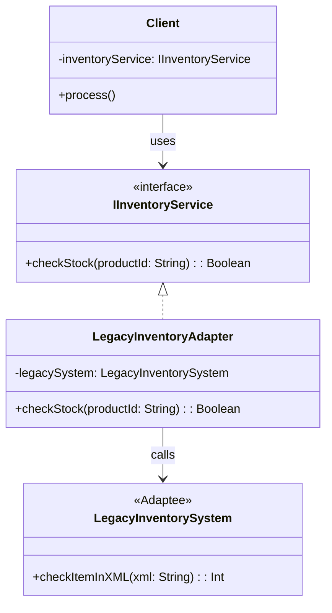

## Mô tả bài toán

Trong thực tế, không phải lúc nào hệ thống của chúng ta cũng được viết mới từ đầu. Giả sử công ty vừa sáp nhập với một đối tác vận tải cũ. Hệ thống Order của chúng ta giao tiếp hoàn toàn bằng **JSON**, nhưng hệ thống Kho bãi (Inventory System) của đối tác lại là một **Legacy System** chỉ nhận dữ liệu **XML** qua giao thức SOAP.

Chúng ta không thể bắt đối tác đập đi viết lại hệ thống của họ, nhưng cũng không thể làm bẩn logic Order của mình bằng các đoạn code parse XML lộn xộn. Ta cần một "bộ chuyển đổi" - **Adapter Pattern**.

## Adapter Pattern là gì?

Adapter (Người chuyển đổi / Phích cắm chuyển đổi) là một pattern thuộc nhóm Cấu trúc. Nó cho phép các interface (giao diện) không tương thích có thể làm việc được với nhau. Nó hoạt động giống như một bộ chuyển đổi ổ cắm điện 3 chấu sang 2 chấu.

## Áp dụng vào Hệ thống

Hệ thống lõi cần interface `IInventoryService` với hàm `checkStock(productId: string) : boolean`.
Hệ thống cũ có class `LegacyInventorySystem` với hàm `checkItemInXML(xmlPayload: string) : number`.
Chúng ta tạo ra `LegacyInventoryAdapter` để implement `IInventoryService`, bên trong nó sẽ gọi đến `LegacyInventorySystem` và làm nhiệm vụ convert dữ liệu.



## Cài đặt (Mã giả - TypeScript)

```typescript
// 1. Interface chuẩn của hệ thống chúng ta (Target)
interface IInventoryService {
  checkStock(productId: string): boolean;
}

// 2. Hệ thống cũ không tương thích (Adaptee)
class LegacyInventorySystem {
  public checkItemInXML(xmlPayload: string): number {
    console.log(`[Legacy] Nhận XML: ${xmlPayload}`);
    // Giả lập xử lý, trả về số lượng tồn kho (ví dụ: 10)
    return 10;
  }
}

// 3. Lớp chuyển đổi (Adapter)
class LegacyInventoryAdapter implements IInventoryService {
  private legacySystem: LegacyInventorySystem;

  constructor(legacySystem: LegacyInventorySystem) {
    this.legacySystem = legacySystem;
  }

  checkStock(productId: string): boolean {
    // Chuyển đổi JSON / Data chuẩn sang định dạng XML mà Adaptee hiểu
    const xmlPayload = `<request><itemId>${productId}</itemId></request>`;

    // Gọi hệ thống cũ
    const quantity = this.legacySystem.checkItemInXML(xmlPayload);

    // Chuyển đổi kết quả (Int) về định dạng hệ thống chúng ta cần (Boolean)
    return quantity > 0;
  }
}

// 4. Cách Client sử dụng
const legacyAPI = new LegacyInventorySystem();
const inventoryAdapter = new LegacyInventoryAdapter(legacyAPI);

// Client hoàn toàn không biết gì về XML hay Legacy System
const isAvailable = inventoryAdapter.checkStock("PROD-999");
console.log(`Sản phẩm có sẵn: ${isAvailable}`);
```

## Đánh giá Ưu / Nhược điểm

**Ưu điểm:**

- **Tái sử dụng (Reusability):** Tái sử dụng lại được các class cũ, thư viện bên thứ 3 (3rd-party libs) mà không cần can thiệp sửa đổi mã nguồn của chúng.
- **Tách biệt logic (Decoupling):** Code thao tác chuyển đổi dữ liệu (XML <-> JSON) được giấu kín trong Adapter, không làm bẩn Business Logic.

**Nhược điểm:**

- Có thể làm tăng độ phức tạp của code base vì sinh ra thêm các class/interface trung gian.
- Nếu Adaptee (hệ thống cũ) có quá nhiều hàm phức tạp, việc viết Adapter hoàn chỉnh sẽ tốn rất nhiều công sức (trong trường hợp đó, cân nhắc dùng _Facade_ thay thế).
