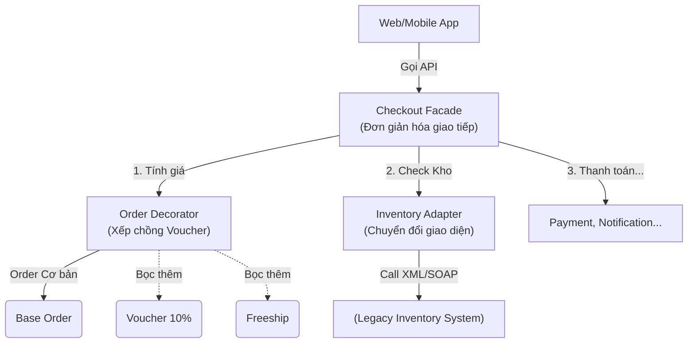

## Mô tả bài toán

Thông qua 3 bài viết về nhóm **Structural Patterns**, Hệ thống Xử lý Đơn hàng của chúng ta đã được hoàn thiện đáng kể về mặt kiến trúc. Nhóm này giải quyết bài toán: _"Làm thế nào để các lớp / module độc lập có thể làm việc chung dưới một cấu trúc tổng thể linh hoạt?"_

## Tương tác hệ thống với Structural Patterns

Hãy xem cách các pattern này kết nối toàn bộ hệ thống:

- **Facade:** Đóng vai trò là Cổng vào (Entry point), che giấu sự phức tạp.
- **Decorator:** Xử lý linh hoạt nghiệp vụ tính tiền ở tầng Business Logic.
- **Adapter:** Làm nhiệm vụ thông dịch viên ở tầng Infrastructure / Giao tiếp bên thứ 3.

## Tiêu chí chọn lựa (Decision Matrix)

Khi đối mặt với việc "lắp ráp" hệ thống, hãy dùng bảng sau để chọn Pattern phù hợp:

<table style="width:100%; border-collapse: collapse; margin-bottom: 20px;">
  <thead>
    <tr style="border-bottom: 2px solid #e2e8f0; text-align: left;">
      <th style="padding: 8px;">Đặc tả bài toán (Use Case)</th>
      <th style="padding: 8px;">Pattern</th>
      <th style="padding: 8px;">Ví dụ áp dụng thực tế (Backend)</th>
    </tr>
  </thead>
  <tbody>
    <tr style="border-bottom: 1px solid #edf2f7;">
      <td style="padding: 8px;">Bạn có 1 API/Thư viện cũ hoặc của bên thứ 3, <strong>giao diện không tương thích</strong> với chuẩn hệ thống hiện tại?</td>
      <td style="padding: 8px;"><strong>Adapter</strong></td>
      <td style="padding: 8px;">Bọc thư viện logger cũ, tích hợp cổng thanh toán có payload dị biệt, gộp XML vào JSON.</td>
    </tr>
    <tr style="border-bottom: 1px solid #edf2f7;">
      <td style="padding: 8px;">Bạn muốn cung cấp một <strong>API duy nhất, đơn giản</strong> để gọi một loạt các bước phức tạp bên dưới?</td>
      <td style="padding: 8px;"><strong>Facade</strong></td>
      <td style="padding: 8px;">Tạo API Checkout, System Bootstrapper, Module Entrypoint.</td>
    </tr>
    <tr style="border-bottom: 1px solid #edf2f7;">
      <td style="padding: 8px;">Bạn muốn <strong>thêm tính năng vào một object lúc runtime</strong>, có thể kết hợp nhiều tính năng mà không muốn dùng kế thừa (Inheritance)?</td>
      <td style="padding: 8px;"><strong>Decorator</strong></td>
      <td style="padding: 8px;">Middleware (Express/NestJS), Interceptors, Thêm mã giảm giá, Gắn tag vào log.</td>
    </tr>
    <tr style="border-bottom: 1px solid #edf2f7;">
      <td style="padding: 8px;">Bạn có các object tổ chức theo dạng <strong>Cây phân cấp (Tree structure)</strong> (Thư mục - File) và muốn xử lý chúng đồng nhất?</td>
      <td style="padding: 8px;"><strong>Composite</strong> <em>(Mở rộng)</em></td>
      <td style="padding: 8px;">Cấu trúc Danh mục sản phẩm đa cấp, Hệ thống Menu động, Org Chart.</td>
    </tr>
    <tr style="border-bottom: 1px solid #edf2f7;">
      <td style="padding: 8px;">Bạn cần một đối tượng "đại diện" để <strong>kiểm soát truy cập, lazy loading, hoặc logging</strong> trước khi gọi tới đối tượng thật?</td>
      <td style="padding: 8px;"><strong>Proxy</strong> <em>(Mở rộng)</em></td>
      <td style="padding: 8px;">Caching Database Query, API Rate Limiter, Auth Guard chặn truy cập.</td>
    </tr>
  </tbody>
</table>

## Bài học thực chiến

1.  **Facade vs Adapter:** Rất dễ nhầm lẫn.
    - _Adapter_ làm thay đổi một interface hiện có để nó tương thích với interface khác. Nó làm việc với 1 đối tượng duy nhất.
    - _Facade_ định nghĩa một interface mới, đơn giản hơn cho một hệ thống gồm NHIỀU đối tượng.
2.  **Decorator vs Kế thừa:** Hãy ưu tiên Decorator (Composition) hơn là Kế thừa (Inheritance) khi số lượng sự kết hợp (combinations) của các tính năng là rất lớn. Kế thừa là mối quan hệ tĩnh (Compile-time), trong khi Decorator là động (Run-time).
3.  **Hạn chế God Facade:** Một Facade tốt chỉ nên làm nhiệm vụ "ủy quyền" (delegate) cho các subsystem. Không viết Business logic, vòng lặp phức tạp hay thuật toán trực tiếp vào trong Facade.

Ở nhóm cuối cùng, **Data Access Patterns**, chúng ta sẽ tìm hiểu cách hệ thống giao tiếp với Database qua **Repository** và đảm bảo toàn vẹn dữ liệu với **Unit Of Work**.
