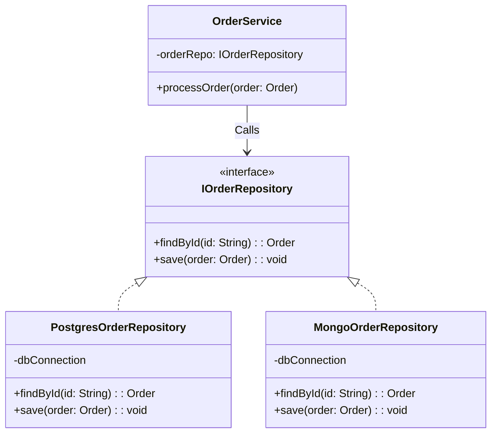

## Mô tả bài toán

Trong `OrderService` của chúng ta, sau khi xử lý xong các logic như áp dụng mã giảm giá và tính toán phí vận chuyển, bước tiếp theo là lưu trữ đơn hàng vào Database (ví dụ: PostgreSQL).

Nếu bạn nhúng trực tiếp các câu lệnh SQL hoặc ORM (như `SELECT`, `INSERT`) ngay bên trong `OrderService`, mã nguồn của bạn sẽ bị "dính chặt" (tightly coupled) với cấu trúc bảng trong Database. Nếu sau này công ty quyết định đổi sang MongoDB, bạn sẽ phải đập bỏ và viết lại toàn bộ `OrderService`. **Repository Pattern** chính là lớp bảo vệ giúp bạn tránh khỏi kịch bản đó.

## Repository Pattern là gì?

Repository đóng vai trò trung gian giữa tầng Business Logic (Service) và tầng Truy xuất dữ liệu (Data Access / Database). Nó hoạt động như một bộ sưu tập (collection) các đối tượng trong bộ nhớ, che giấu mọi chi tiết về cách dữ liệu được lưu trữ hay truy vấn bên dưới.

## Áp dụng vào Hệ thống Xử lý Đơn hàng

Chúng ta sẽ định nghĩa một giao diện `IOrderRepository`. `OrderService` chỉ giao tiếp với giao diện này. Phía dưới, ta triển khai `PostgresOrderRepository` chứa các câu lệnh SQL thực tế.



## Cài đặt (Mã giả - TypeScript)

```typescript
// 1. Domain Model
class Order {
  constructor(
    public id: string,
    public total: number,
    public status: string,
  ) {}
}

// 2. Repository Interface
interface IOrderRepository {
  findById(id: string): Order | null;
  save(order: Order): void;
}

// 3. Concrete Repository (Triển khai thực tế cho PostgreSQL)
class PostgresOrderRepository implements IOrderRepository {
  public findById(id: string): Order | null {
    console.log(`[Postgres] Thực thi: SELECT * FROM orders WHERE id = '${id}'`);
    return new Order(id, 100000, "Pending"); // Giả lập dữ liệu trả về
  }

  public save(order: Order): void {
    console.log(
      `[Postgres] Thực thi: INSERT INTO orders VALUES ('${order.id}', ${order.total})`,
    );
  }
}

// 4. Concrete Repository (Dùng cho Unit Test)
class MockOrderRepository implements IOrderRepository {
  private db: Map<string, Order> = new Map();

  public findById(id: string): Order | null {
    return this.db.get(id) || null;
  }

  public save(order: Order): void {
    this.db.set(order.id, order);
  }
}

// 5. Service (Chỉ phụ thuộc vào Interface)
class OrderService {
  private orderRepo: IOrderRepository;

  constructor(orderRepo: IOrderRepository) {
    this.orderRepo = orderRepo;
  }

  public createOrder(id: string, total: number) {
    const newOrder = new Order(id, total, "Pending");
    this.orderRepo.save(newOrder);
    console.log("Đã lưu đơn hàng thành công!");
  }
}

// Cách sử dụng
const dbRepo = new PostgresOrderRepository();
const service = new OrderService(dbRepo);
service.createOrder("ORD-001", 500000);
```

## Đánh giá Ưu / Nhược điểm

**Ưu điểm:**

- **Dễ dàng Unit Test:** Bạn có thể dễ dàng tạo `MockOrderRepository` lưu dữ liệu vào mảng/Map trên RAM để test `OrderService` mà không cần kết nối DB thật.
- **Tách biệt mối quan tâm (SoC):** Thay đổi cấu trúc database hoặc đổi ORM (từ Sequelize sang Prisma) chỉ ảnh hưởng tới file Repository, không làm vỡ logic của Service.
- Giúp code đọc giống ngôn ngữ tự nhiên (Domain-driven) hơn là các lệnh thao tác DB.

**Nhược điểm:**

- Tạo ra nhiều file boilerplate (interface, class implementation).
- Có thể bị coi là dư thừa (overhead) đối với các dự án nhỏ (CRUD cơ bản) hoặc khi sử dụng các ORM hiện đại vốn dĩ đã áp dụng sẵn mô hình Active Record hoặc Repository bên trong nó.

Tuy nhiên, nếu hệ thống phát sinh nhu cầu lưu dữ liệu vào 2, 3 bảng cùng lúc và yêu cầu phải thành công tất cả hoặc thất bại tất cả (Transaction), Repository đơn lẻ sẽ không giải quyết được. Chúng ta cần sự kết hợp của **Unit Of Work Pattern** ở bài tiếp theo.
