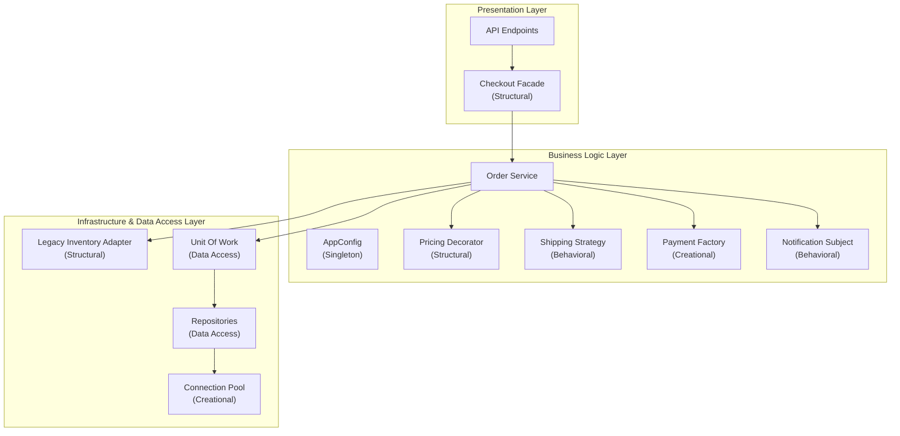

Chúng ta đã đi qua một chặng đường dài, từ việc khởi tạo những object đầu tiên cho đến khi kết nối thành công với Database. Ở bài viết này, chúng ta sẽ nhìn lại **Hệ thống Xử lý Đơn hàng (Order Processing System)** dưới góc độ toàn cảnh.

Thay vì các class rời rạc, giờ đây hệ thống của chúng ta là một tập hợp các module được chuẩn hóa thông qua Design Patterns.

## Sơ đồ Kiến trúc phân lớp (Layered Architecture)

Mỗi nhóm Pattern đã giải quyết xuất sắc nhiệm vụ ở đúng tầng (Layer) của nó:

## Ý nghĩa của sự phân chia

- **Creational (Sinh ra):** `Singleton`, `Object Pool`, `Factory` giúp việc tạo ra các công cụ (như kết nối DB, cổng thanh toán) trở nên an toàn, tiết kiệm RAM và tái sử dụng tốt.
- **Structural (Lắp ráp):** `Facade`, `Decorator`, `Adapter` bọc các object lại với nhau, giúp logic tính giá không bị phình to, và hệ thống mới nói chuyện được với hệ thống cũ.
- **Behavioral (Hành vi):** `Strategy` và `Observer` phân chia rõ ràng trách nhiệm ai làm việc nấy, ai tính phí thì tính, ai gửi email thì chờ lệnh (Event-driven).
- **Data Access (Lưu trữ):** `Repository` và `Unit of Work` tạo thành lá chắn bảo vệ Business Logic khỏi các câu lệnh SQL thô kệch.

Ở phần 2, chúng ta sẽ xem một Request từ người dùng sẽ đi xuyên qua các Pattern này như thế nào.
