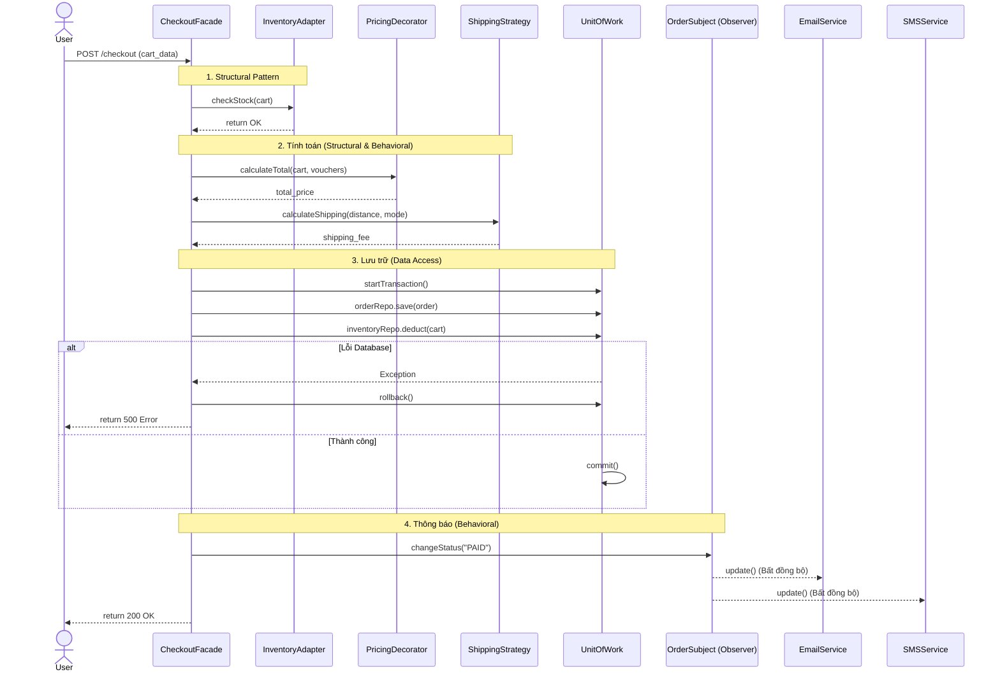

Kiến trúc tĩnh thì đẹp, nhưng khi hệ thống chạy (Runtime) thì các Pattern giao tiếp với nhau ra sao? Hãy theo chân một Request "Đặt hàng" (Place Order) để xem sự phối hợp nhịp nhàng của hệ thống.

## Sequence Diagram: Hành trình của một Đơn hàng

## Phân tích điểm chạm (Touchpoints)

1. **Vào cửa qua Facade:** Controller không cần biết bên trong có bao nhiêu bước, nó chỉ gọi `Facade.placeOrder()`.
2. **Kiểm tra với Adapter:** Facade hỏi Adapter xem kho còn hàng không. Adapter âm thầm dịch request sang XML gửi cho hệ thống kho cũ.
3. **Tính toán chồng chéo:** Các voucher giảm giá xếp chồng lên nhau nhờ `Decorator`. Phí ship được tính bằng 1 `Strategy` cụ thể (Ví dụ: Giao Hỏa tốc).
4. **Cam kết dữ liệu:** Ghi Order và trừ Stock phải diễn ra trong cùng một `Unit of Work` để đảm bảo ACID.
5. **Lan truyền sự kiện:** Đơn hàng lưu xong, trạng thái đổi thành PAID. `Observer` tự động đánh thức các dịch vụ Email/SMS mà luồng chính không cần chờ đợi.

Đây chính là sự khác biệt giữa "Code chạy được" và "Code chuẩn Software Engineering".
